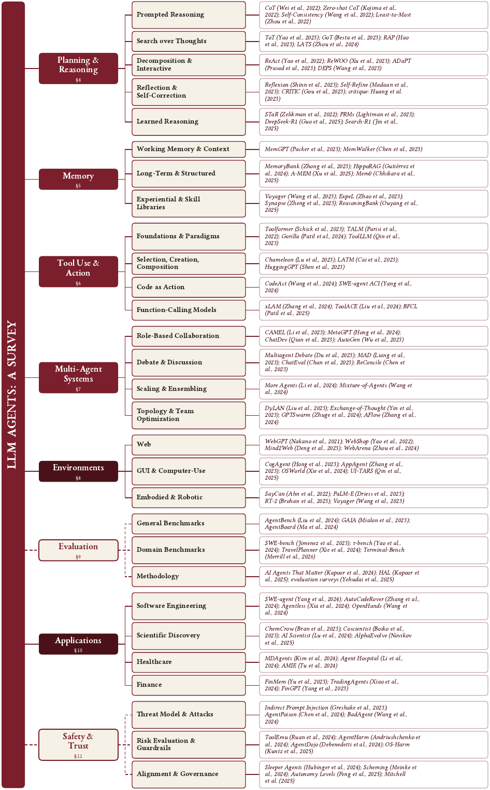

<h1 align="center">🤖 Awesome LLM Agent Papers</h1>

<p align="center">
<b>200+ must-read papers, continuously growing</b>: the annotated reading list for building<br>
LLM agents that plan, remember, use tools, and cooperate. Companion to the survey <i>“LLM Agents: A Survey.”</i>
</p>

<!-- Identity & credibility -->
<p align="center">
<a href="https://awesome.re"></a>

<a href="LICENSE"></a>
<a href="CONTRIBUTING.md"></a>
</p>

<!-- Star / fork snapshots (self-hosted so they render even when shields.io fails to load through GitHub's image proxy); the links go to the live counts. -->
<p align="center">
<a href="https://github.com/js-lee-AI/awesome-llm-agent-papers/stargazers"></a>
<a href="https://github.com/js-lee-AI/awesome-llm-agent-papers/network/members"></a>
</p>

<p align="center">
📄 <b><a href="#-citation">Cite the companion survey → “LLM Agents: A Survey”</a></b> &nbsp;·&nbsp; ⭐ <b><a href="#starter-kit">Start with the 10-paper Starter Kit</a></b>
</p>

<p align="center"><sub><i> LLM agents · LLM agent papers · autonomous agents · agentic AI · multi-agent systems · tool use · ReAct · planning · memory · agent benchmarks · agent safety &amp; prompt injection</i></sub></p>

<p align="center"></p>

## ✨ Highlights

| | What's here |
|---|---|
| 📚 **Companion to the survey** | The papers behind *“LLM Agents: A Survey,”* kept current as new work appears. |
| 🧭 **Organized by function** | 10 sections following the survey's structure: Surveys, Architectures, Planning, Memory, Tool Use, Multi-Agent, Environments, Applications, Evaluation, Safety. |
| ✍️ **Annotated** | Each entry has a one-line note on what it contributes, its venue and year, and a `[code]` link where an official implementation exists. |
| ⭐ **Starter Kit** | A [10-paper list](#starter-kit) for getting oriented, with a note on why each one is worth reading first. |
| 🔎 **Navigable** | A [Contents](#contents) index with per-section counts and collapsible sections. |

**Topics covered:** cognitive architectures · ReAct &amp; reasoning-and-acting · long-horizon planning · agent memory · tool-augmented LLMs · multi-agent collaboration · web / code / embodied agents · agent benchmarks &amp; evaluation · safety, alignment &amp; indirect prompt injection.

> 🔜 **Coming next**, a companion deep-dive: *The Agent Loop: A Survey of Control Strategies, Skills, and Harnesses for LLM Agents*, going below the components to the loop itself. ⭐ Star to be notified.

This repository collects must-read papers on **LLM-based agents**: language models equipped with planning, memory, tool use, and multi-agent coordination to pursue goals over long horizons. Papers follow the taxonomy of the accompanying survey, covering the core components of an agent, the environments and applications they are deployed in, and the cross-cutting concerns of evaluation and safety. Each entry links to the paper and, where an official implementation exists, to its code.

This is a **curated, continuously updated selection**; new work is added as the field moves. Sections are collapsed by default. Click **Show N papers** to expand.

> **Legend:** ⭐ = [Starter Kit](#starter-kit) pick (read these first) · `[code]` = link to an official implementation.

<a id="starter-kit"></a>
## ⭐ Starter Kit

New to the area? These ten papers are a good place to start.

| # | Paper | Area | Why start here |
|---|-------|------|----------------|
| 1 | [ReAct: Synergizing Reasoning and Acting](https://arxiv.org/abs/2210.03629) | Planning | The template for the modern agent loop: interleave reasoning with actions. |
| 2 | [Reflexion: Verbal Reinforcement Learning](https://arxiv.org/abs/2303.11366) | Planning | Self-reflection stored in memory as a gradient-free improvement loop. |
| 3 | [Toolformer: LMs Can Teach Themselves to Use Tools](https://arxiv.org/abs/2302.04761) | Tool Use | The seminal self-supervised tool-use paper. |
| 4 | [Generative Agents: Interactive Simulacra](https://arxiv.org/abs/2304.03442) | Multi-Agent | Memory + reflection at population scale; the canonical agent-memory design. |
| 5 | [Voyager: An Open-Ended Embodied Agent](https://arxiv.org/abs/2305.16291) | Memory / Env. | Lifelong learning via a growing library of executable skills. |
| 6 | [Cognitive Architectures for Language Agents (CoALA)](https://arxiv.org/abs/2309.02427) | Foundations | The vocabulary (memory, action space, decision loop) this list is organized around. |
| 7 | [A Survey on LLM-based Autonomous Agents](https://arxiv.org/abs/2308.11432) | Survey | The canonical general survey of the field. |
| 8 | [LLM-based Multi-Agents: A Survey](https://arxiv.org/abs/2402.01680) | Multi-Agent | The standard reference for the multi-agent branch. |
| 9 | [AgentBench: Evaluating LLMs as Agents](https://arxiv.org/abs/2308.03688) | Evaluation | The standard cross-environment agent benchmark. |
| 10 | [Not what you've signed up for (Indirect Prompt Injection)](https://arxiv.org/abs/2302.12173) | Safety | The founding paper of the agent-security threat model. |

<a id="to-watch"></a>
## 🔥 10 to Watch (2026)

Fresh 2026 work that is already drawing attention.

| Paper | Area | Stars |
|-------|------|-------|
| [GenericAgent: A Token-Efficient Self-Evolving LLM Agent via Contextual Information Density Maximization](https://arxiv.org/abs/2604.17091) | Architectures |  |
| [SimpleMem: Efficient Lifelong Memory for LLM Agents](https://arxiv.org/abs/2601.02553) | Memory |  |
| [AutoSci: A Memory-Centric Agentic System for the Full Scientific Research Lifecycle](https://arxiv.org/abs/2605.31468) | Applications |  |
| [Mobile-Agent-v3.5: Multi-platform Fundamental GUI Agents](https://arxiv.org/abs/2602.16855) | Environments |  |
| [AgentDoG: A Diagnostic Guardrail Framework for AI Agent Safety and Security](https://arxiv.org/abs/2601.18491) | Safety |  |
| [Agentic Reasoning for Large Language Models](https://arxiv.org/abs/2601.12538) | Surveys |  |
| [UniToolCall: Unifying Tool-Use Representation, Data, and Evaluation for LLM Agents](https://arxiv.org/abs/2604.11557) | Tool Use |  |
| [Graph-of-Agents: A Graph-based Framework for Multi-Agent LLM Collaboration](https://arxiv.org/abs/2604.17148) | Multi-Agent |  |
| [Can AI Agents Answer Your Data Questions? A Benchmark for Data Agents (DataAgentBench)](https://arxiv.org/abs/2603.20576) | Evaluation |  |
| [Harness Updating Is Not Harness Benefit: Disentangling Evolution Capabilities in Self-Evolving LLM Agents](https://arxiv.org/abs/2605.30621) | Planning |  |

<sub><a href="#contents">↑ Back to Contents</a></sub>

## Contents

- [⭐ Starter Kit](#starter-kit)
- [🔥 10 to Watch (2026)](#to-watch)
- **🧭 Background**
  - [📚 Surveys & Position Papers (42)](#surveys)
  - [🏗️ Agent Architectures & Frameworks (29)](#architectures)
- **🧱 Part I: Core Components**
  - [🧠 Planning & Reasoning (33)](#planning)
  - [💾 Memory (30)](#memory)
  - [🔧 Tool Use (27)](#tools)
  - [🤝 Multi-Agent Systems (34)](#multi-agent)
- **🌍 Part II: Agents in Context**
  - [🌐 Interactive Environments (34)](#environments)
  - [🚀 Applications (36)](#applications)
- **⚖️ Part III: Cross-Cutting Concerns**
  - [📊 Evaluation & Benchmarks (28)](#evaluation)
  - [🛡️ Safety & Alignment (40)](#safety)

## 🧭 Background

<a id="surveys"></a>
### 📚 Surveys & Position Papers (42)
*Corresponds to §1-§3 (Introduction, Background, Taxonomy).*

<details>
<summary><b>Show 42 papers</b></summary>

- **[A Survey on Large Language Model based Autonomous Agents](https://arxiv.org/abs/2308.11432)** (Wang et al., arXiv 2023) - *The canonical, most-cited general-purpose LLM-agent survey.* ⭐ [[code](https://github.com/Paitesanshi/LLM-Agent-Survey)]
- **[The Rise and Potential of Large Language Model Based Agents: A Survey](https://arxiv.org/abs/2309.07864)** (Xi et al., arXiv 2023) - *Co-foundational with Wang et al. 2023 as one of the two seminal general surveys.* [[code](https://github.com/WooooDyy/LLM-Agent-Paper-List)]
- **[Cognitive Architectures for Language Agents](https://arxiv.org/abs/2309.02427)** (Sumers et al., TMLR 2023) - *The most widely adopted conceptual/architectural vocabulary for describing LLM agents.* ⭐ [[code](https://github.com/ysymyth/awesome-language-agents)]
- **[ReAct: Synergizing Reasoning and Acting in Language Models](https://arxiv.org/abs/2210.03629)** (Yao et al., ICLR 2023) - *The single most-cited technical precursor of modern LLM agents.* ⭐ [[code](https://github.com/ysymyth/ReAct)]
- **[Reflexion: Language Agents with Verbal Reinforcement Learning](https://arxiv.org/abs/2303.11366)** (Shinn et al., NeurIPS 2023) - *Established the 'self-reflection + memory' loop as an alternative to gradient-based RL for agent self-improvement.* ⭐ [[code](https://github.com/noahshinn/reflexion)]
- **[Toolformer: Language Models Can Teach Themselves to Use Tools](https://arxiv.org/abs/2302.04761)** (Schick et al., NeurIPS 2023) - *Seminal tool-use paper anchoring the 'tool augmentation' pillar of LLM-agent taxonomies.* ⭐
- **[Generative Agents: Interactive Simulacra of Human Behavior](https://arxiv.org/abs/2304.03442)** (Park et al., arXiv 2023) - *Foundational demonstration of LLM-driven agent societies/simulation.* ⭐ [[code](https://github.com/joonspk-research/generative_agents)]
- **[Voyager: An Open-Ended Embodied Agent with Large Language Models](https://arxiv.org/abs/2305.16291)** (Wang et al., TMLR 2023) - *Seminal example of embodied, code-skill-based, lifelong-learning LLM agents.* ⭐ [[code](https://github.com/MineDojo/Voyager)]
- **[HuggingGPT: Solving AI Tasks with ChatGPT and its Friends in Hugging Face](https://arxiv.org/abs/2303.17580)** (Shen et al., NeurIPS 2023) - *Foundational example of the 'LLM-as-orchestrator-of-tools/models' agent pattern.* [[code](https://github.com/microsoft/JARVIS)]
- **[MRKL Systems: A Modular, Neuro-Symbolic Architecture that Combines Large Language Models, External Knowledge Sources and Discrete Reasoning](https://arxiv.org/abs/2205.00445)** (Karpas et al., arXiv 2022) - *Earliest widely-cited neuro-symbolic precursor to LLM tool-use/agent architectures.*
- **[Agent AI: Surveying the Horizons of Multimodal Interaction](https://arxiv.org/abs/2401.03568)** (Durante et al., arXiv 2024) - *Broadens the LLM-agent survey landscape to multimodal/embodied agent AI.*
- **[Igniting Language Intelligence: The Hitchhiker's Guide From Chain-of-Thought Reasoning to Language Agents](https://arxiv.org/abs/2311.11797)** (Zhang et al., arXiv 2023) - *Bridges the reasoning (CoT) literature and agent literature.* [[code](https://github.com/Zoeyyao27/CoT-Igniting-Agent)]
- **[Large Language Model based Multi-Agents: A Survey of Progress and Challenges](https://arxiv.org/abs/2402.01680)** (Guo et al., IJCAI 2024) - *The standard reference survey specifically for the multi-agent branch of LLM agents.* ⭐ [[code](https://github.com/taichengguo/LLM_MultiAgents_Survey_Papers)]
- **[Understanding the Planning of LLM Agents: A Survey](https://arxiv.org/abs/2402.02716)** (Huang et al., arXiv 2024) - *Fills the planning-specific gap in the foundational-survey landscape.*
- **[Tool Learning with Large Language Models: A Survey](https://arxiv.org/abs/2405.17935)** (Qu et al., arXiv 2024) - *The definitive survey for the tool-use pillar of LLM agents.* [[code](https://github.com/quchangle1/LLM-Tool-Survey)]
- **[A Survey on the Memory Mechanism of Large Language Model based Agents](https://arxiv.org/abs/2404.13501)** (Zhang et al., arXiv 2024) - *The standard survey for the memory subsystem of LLM agents.* [[code](https://github.com/nuster1128/LLM_Agent_Memory_Survey)]
- **[Agentic Large Language Models, a Survey](https://arxiv.org/abs/2503.23037)** (Plaat et al., arXiv 2025) - *A recent, widely-referenced general survey with a compact reasoning/acting/interacting taxonomy.*
- **[Large Language Model Agent: A Survey on Methodology, Applications and Challenges](https://arxiv.org/abs/2503.21460)** (Luo et al., arXiv 2025) - *One of the most comprehensive and recent (2025) general surveys.* [[code](https://github.com/luo-junyu/Awesome-Agent-Papers)]
- **[Fully Autonomous AI Agents Should Not Be Developed](https://arxiv.org/abs/2502.02649)** (Mitchell et al., arXiv 2025) - *A prominent, widely-discussed dissenting position paper on agent autonomy.*
- **[AI Agents vs. Agentic AI: A Conceptual Taxonomy, Applications and Challenges](https://arxiv.org/abs/2505.10468)** (Sapkota et al., arXiv 2025) - *Provides terminological/conceptual disambiguation increasingly cited given inconsistent usage in the field.*
- **[LLM-Based Human-Agent Collaboration and Interaction Systems: A Survey](https://arxiv.org/abs/2505.00753)** (Zou et al., arXiv 2025) - *Covers the human-agent cooperation branch identified in the earliest foundational surveys.* [[code](https://github.com/HenryPengZou/Awesome-Human-Agent-Collaboration-Interaction-Systems)]
- **[Levels of Autonomy for AI Agents](https://arxiv.org/abs/2506.12469)** (Feng et al., arXiv 2025) - *Offers a widely-cited operational framework for comparing autonomy across LLM-agent systems.*
- **[Advances and Challenges in Foundation Agents: From Brain-Inspired Intelligence to Evolutionary, Collaborative, and Safe Systems](https://arxiv.org/abs/2504.01990)** (Liu et al., arXiv 2025) - *A 48-author landmark survey organizing the field around brain-inspired cognitive modules, self-evolution, collective intelligence, and safety.*
- **[The Landscape of Agentic Reinforcement Learning for LLMs: A Survey](https://arxiv.org/abs/2509.02547)** (Zhang et al., arXiv 2025) - *The canonical survey of agentic RL: training LLMs as decision-making agents rather than passive generators.*
- **[A Comprehensive Survey of Self-Evolving AI Agents](https://arxiv.org/abs/2508.07407)** (Fang et al., arXiv 2025) - *Surveys techniques by which agents optimize their own components from interaction data, bridging foundation models and lifelong agentic systems.*
- **[Deep Research Agents: A Systematic Examination and Roadmap](https://arxiv.org/abs/2506.18096)** (Huang et al., arXiv 2025) - *First systematic survey of long-horizon autonomous research agents (search, tool use, report synthesis).*
- **[A Survey of AI Agent Protocols](https://arxiv.org/abs/2504.16736)** (Yang et al., arXiv 2025) - *Maps the emerging protocol layer (MCP, A2A, and successors) and proposes evaluation dimensions for agent interoperability standards.*

- **[Agentic Reasoning for Large Language Models](https://arxiv.org/abs/2601.12538)** (Wei et al., arXiv 2026) - *Survey organizing agentic reasoning into single-agent, self-evolving, and multi-agent layers, bridging in-context reasoning and post-training.* [[code](https://github.com/weitianxin/Awesome-Agentic-Reasoning)]
- **[Memory for Autonomous LLM Agents: Mechanisms, Evaluation, and Emerging Frontiers](https://arxiv.org/abs/2603.07670)** (Du et al., arXiv 2026) - *Frames agent memory as a write-manage-read loop with a taxonomy over mechanisms, benchmarks, and applications.*
- **[Anatomy of Agentic Memory: Taxonomy and Empirical Analysis of Evaluation and System Limitations](https://arxiv.org/abs/2602.19320)** (Jiang et al., arXiv 2026) - *Taxonomizes agent memory structures and empirically exposes benchmark saturation and metric-validity issues across systems.*
- **[Beyond Individual Intelligence: Surveying Collaboration, Failure Attribution, and Self-Evolution in LLM-based Multi-Agent Systems](https://arxiv.org/abs/2605.14892)** (Qi et al., arXiv 2026) - *Proposes a unified 'LIFE' framework (foundation, integrate, find faults, evolve) for multi-agent collaboration, failure attribution, and self-evolution.*
- **[A Technical Taxonomy of LLM Agent Communication Protocols](https://arxiv.org/abs/2606.19135)** (Sander et al., arXiv 2026) - *Analyzes nine open agent-to-agent protocols across five dimensions and predicts convergence toward a federated protocol stack.*
- **[Bridging the Agent-World Gap: Text World Models for LLM-based Agents](https://arxiv.org/abs/2606.09032)** (Li et al., arXiv 2026) - *Systematizes text world models (LLM-as-WM vs code-as-WM) that give agents explicit environment prediction for planning and verification.* [[code](https://github.com/sustech-nlp/awesome-text-world-models)]
- **[Agents That Know Too Much: A Data-Centric Survey of Privacy in LLM Agents](https://arxiv.org/abs/2606.26627)** (Lahjouji et al., arXiv 2026) - *Data-centric survey organizing agent-privacy research by data surface rather than attack type, mapping governance gaps.*
- **[Self-Improvements in Modern Agentic Systems: A Survey](https://arxiv.org/abs/2607.13104)** (Ren et al., arXiv 2026) - *Frames a modern agent as a foundation model plus an operational scaffold, and organizes self-improvement by what gets updated (weights or scaffold) and which signal drives the change.* [[code](https://github.com/selfimproving-agent/awesome-Self-Improving-Agents)]
- **[Dynamic Agent Skills: A Lifecycle Survey and Taxonomy of Evolving Skill Libraries](https://arxiv.org/abs/2607.10113)** (Li et al., arXiv 2026) - *Surveys 124 papers on evolving skill libraries as lifecycle-managed artifact stores, arguing that admission and repair, not acquisition, are the decisive stages.*
- **[From Question Answering to Task Completion: A Survey on Agent System and Harness Design](https://arxiv.org/abs/2606.20683)** (Guo et al., arXiv 2026) - *Reads agents through a model-versus-harness lens, decomposing the harness into six runtime responsibilities and asking where the performance bottleneck actually sits.* [[code](https://github.com/ggjy/Awesome-Agent-Engineering)]
- **[Isolation as a First-Class Principle for LLM-Agent System Safety: Concepts, Taxonomy, Challenges and Future Directions](https://arxiv.org/abs/2607.12406)** (Jing et al., arXiv 2026) - *Position paper recasting prompt injection, tool misuse, and memory poisoning as one structural problem: missing isolation boundaries across five agent interfaces.*
- **[Always-On Agents: A Survey of Persistent Memory, State, and Governance in LLM Agents](https://arxiv.org/abs/2606.30306)** (Ding et al., arXiv 2026) - *Surveys 435 works on agents with durable cross-session state, finding the literature favours accumulation and retrieval while neglecting governance and recovery.*
- **[Externalization in LLM Agents: A Unified Review of Memory, Skills, Protocols and Harness Engineering](https://arxiv.org/abs/2604.08224)** (Zhou et al., arXiv 2026) - *Frames the progression of agents as externalization, with capability migrating out of weights into memory, skills, protocols, and harness infrastructure.*
- **[SoK: Agentic Skills -- Beyond Tool Use in LLM Agents](https://arxiv.org/abs/2602.20867)** (Jiang et al., arXiv 2026) - *Systematization of agentic skills as reusable callable procedures, drawing the line between a skill and an atomic tool call.*
- **[From Storage to Experience: A Survey on the Evolution of LLM Agent Memory Mechanisms](https://arxiv.org/abs/2605.06716)** (Luo et al., arXiv 2026) - *Surveys agent memory through a three-stage evolution from storage to reflection to experience, driven by consistency, dynamics, and continual learning.* [[code](https://github.com/FeishuLuo/Evolving-LLM-Agent-Memory-Survey)]
</details>

<sub><a href="#contents">↑ Back to Contents</a></sub>

<a id="architectures"></a>
### 🏗️ Agent Architectures & Frameworks (29)
*Corresponds to §2 (Background) and the running examples throughout.*

<details>
<summary><b>Show 29 papers</b></summary>

- **[Auto-GPT for Online Decision Making: Benchmarks and Additional Opinions](https://arxiv.org/abs/2306.02224)** (Yang et al., arXiv 2023) - *Only peer-reviewed-adjacent empirical study of the widely-influential (but paper-less) AutoGPT autonomous-agent design pattern.* [[code](https://github.com/younghuman/LLMAgent)]
- **[AgentBench: Evaluating LLMs as Agents](https://arxiv.org/abs/2308.03688)** (Liu et al., ICLR 2024) - *The standard reference benchmark for measuring general single-agent capability across heterogeneous environments.* ⭐ [[code](https://github.com/THUDM/AgentBench)]
- **[WebArena: A Realistic Web Environment for Building Autonomous Agents](https://arxiv.org/abs/2307.13854)** (Zhou et al., ICLR 2024) - *The de facto standard testbed for web-browsing single-agent architectures.* [[code](https://github.com/web-arena-x/webarena)]
- **[Gorilla: Large Language Model Connected with Massive APIs](https://arxiv.org/abs/2305.15334)** (Patil et al., NeurIPS 2024) - *Key single-agent tool-use paper demonstrating that fine-tuning plus retrieval can make an agent reliably invoke large real-world API catalogs.* [[code](https://github.com/ShishirPatil/gorilla)]
- **[ReWOO: Decoupling Reasoning from Observations for Efficient Augmented Language Models](https://arxiv.org/abs/2305.18323)** (Xu et al., arXiv 2023) - *Influential efficiency-oriented alternative to the ReAct loop, illustrating the plan-then-execute vs. interleaved architectural design axis.* [[code](https://github.com/billxbf/ReWOO)]
- **[Tree of Thoughts: Deliberate Problem Solving with Large Language Models](https://arxiv.org/abs/2305.10601)** (Yao et al., NeurIPS 2023) - *A core deliberate-search reasoning architecture underpinning later single-agent planning/search frameworks like LATS.* [[code](https://github.com/princeton-nlp/tree-of-thought-llm)]
- **[WebGPT: Browser-assisted question-answering with human feedback](https://arxiv.org/abs/2112.09332)** (Nakano et al., arXiv 2021) - *Early pre-ChatGPT precursor to modern LLM web agents, establishing the browsing-tool-use-plus-human-feedback pattern.*
- **[SELF-REFINE: Iterative Refinement with Self-Feedback](https://arxiv.org/abs/2303.17651)** (Madaan et al., NeurIPS 2023) - *A minimal, widely-adopted single-agent self-improvement loop that is reused as a subroutine inside many larger agent architectures.* [[code](https://github.com/madaan/self-refine)]
- **[SWE-agent: Agent-Computer Interfaces Enable Automated Software Engineering](https://arxiv.org/abs/2405.15793)** (Yang et al., NeurIPS 2024) - *Demonstrates how interface design materially changes single-agent capability, now standard in coding-agent design.* [[code](https://github.com/princeton-nlp/SWE-agent)]
- **[Language Agent Tree Search Unifies Reasoning, Acting, and Planning in Language Models](https://arxiv.org/abs/2310.04406)** (Zhou et al., ICML 2024) - *Represents the state-of-the-art convergence of search-based planning with the ReAct/Reflexion lineage.* [[code](https://github.com/lapisrocks/LanguageAgentTreeSearch)]
- **[Executable Code Actions Elicit Better LLM Agents](https://arxiv.org/abs/2402.01030)** (Wang et al., ICML 2024) - *Established 'code-as-action' as a leading alternative action-space design for single agents.* [[code](https://github.com/xingyaoww/code-act)]
- **[Describe, Explain, Plan and Select: Interactive Planning with Large Language Models Enables Open-World Multi-Task Agents](https://arxiv.org/abs/2302.01560)** (Wang et al., NeurIPS 2023) - *Key single-agent planning architecture for open-world/embodied tasks.* [[code](https://github.com/CraftJarvis/MC-Planner)]
- **[OS-Copilot: Towards Generalist Computer Agents with Self-Improvement](https://arxiv.org/abs/2402.07456)** (Wu et al., arXiv 2024) - *A leading recent example of a general-purpose, self-improving OS-level single agent, extending AutoGPT-style autonomy to real computer environments.* [[code](https://github.com/OS-Copilot/OS-Copilot)]
- **[AppAgent: Multimodal Agents as Smartphone Users](https://arxiv.org/abs/2312.13771)** (Zhang et al., CHI 2025) - *Representative recent single-agent architecture extending the ReAct/tool-use paradigm to GUI/mobile control.* [[code](https://github.com/TencentQQGYLab/AppAgent)]
- **[The Landscape of Emerging AI Agent Architectures for Reasoning, Planning, and Tool Calling: A Survey](https://arxiv.org/abs/2404.11584)** (Masterman et al., arXiv 2024) - *A survey specifically scoped to agent architecture design patterns, directly relevant to categorizing single-agent frameworks.*
- **[MetaGPT: Meta Programming for A Multi-Agent Collaborative Framework](https://arxiv.org/abs/2308.00352)** (Hong et al., ICLR 2024) - *Widely cited framework showing how single-agent role/procedure templates improve reliability, marking the transition point between single- and multi-agent framework design.* [[code](https://github.com/geekan/MetaGPT)]
- **[Gemini 2.5: Pushing the Frontier with Advanced Reasoning, Multimodality, Long Context, and Next Generation Agentic Capabilities](https://arxiv.org/abs/2507.06261)** (Comanici et al., arXiv 2025) - *Frontier model report that treats agentic tool use and computer operation as headline capabilities.*
- **[Kimi K2: Open Agentic Intelligence](https://arxiv.org/abs/2507.20534)** (Kimi Team, arXiv 2025) - *Flagship open model built explicitly around agentic post-training at scale.* [[code](https://github.com/MoonshotAI/Kimi-K2)]

- **[GenericAgent: A Token-Efficient Self-Evolving LLM Agent via Contextual Information Density Maximization](https://arxiv.org/abs/2604.17091)** (Liang et al., arXiv 2026) - *Token-efficient self-evolving agent that accumulates contextual experience; one of the most-starred 2026 agent frameworks.* [[code](https://github.com/lsdefine/GenericAgent)]
- **[Orchestral AI: A Framework for Agent Orchestration](https://arxiv.org/abs/2601.02577)** (Roman et al., arXiv 2026) - *Framework for composing and orchestrating specialized agents behind a single interface.* [[code](https://github.com/orchestralAI/orchestral-ai)]
- **[AgentArk: Distilling Multi-Agent Intelligence into a Single LLM Agent](https://arxiv.org/abs/2602.03955)** (Luo et al., arXiv 2026) - *Distills multi-agent intelligence into a single LLM agent, retaining collaboration gains at lower cost.* [[code](https://github.com/AIFrontierLab/AgentArk)]
- **[The Interplay of Harness Design and Post-Training in LLM Agents](https://arxiv.org/abs/2606.25447)** (Kim et al., arXiv 2026) - *Shows harness design and post-training interact, so harness-aware post-training improves both in-distribution and out-of-distribution performance.*
- **[Next-Generation Agentic Reinforcement Learning Systems Enable Self-Evolving Agents](https://arxiv.org/abs/2607.01120)** (Ran Yan et al., arXiv 2026) - *Argues the agentic RL systems stack, not the algorithm, is what enables agents that revise their own components rather than only their weights.*
- **[From Atomic Actions to Standard Operating Procedures: Iterative Tool Optimization for Self-Evolving LLM Agents](https://arxiv.org/abs/2607.07321)** (Ding et al., arXiv 2026) - *Synthesizes recurring action sequences from execution traces into callable higher-order procedures, then merges, evaluates, and prunes the resulting toolset.*
- **[Self-Evolving World Models for LLM Agent Planning](https://arxiv.org/abs/2606.30639)** (Zhang et al., arXiv 2026) - *Refines the agent's internal world model at test time while holding the executor fixed, tightening the plan-and-simulate loop.*
- **[Scaling Self-Evolving Agents via Parametric Memory](https://arxiv.org/abs/2606.04536)** (Ren et al., arXiv 2026) - *Moves self-evolution out of the context window and into parameters, so accumulated experience scales without growing the prompt.*
- **[Inside the Scaffold: A Source-Code Taxonomy of Coding Agent Architectures](https://arxiv.org/abs/2604.03515)** (Rombaut et al., arXiv 2026) - *Derives a source-code taxonomy of 13 open coding-agent scaffolds, identifying five composable loop primitives that systems recombine.*
- **[Agentic Harness Engineering: Observability-Driven Automatic Evolution of Coding-Agent Harnesses](https://arxiv.org/abs/2604.25850)** (Lin et al., arXiv 2026) - *Automatically evolves a coding-agent harness from observability signals, raising Terminal-Bench 2 from 69.7 to 77.0.*
- **[AgentFactory: A Self-Evolving Framework Through Executable Subagent Accumulation and Reuse](https://arxiv.org/abs/2603.18000)** (Zhang et al., arXiv 2026) - *Accumulates capability by saving successful solutions as reusable executable subagent code rather than textual prompts, refined by execution feedback.* [[code](https://github.com/zzatpku/AgentFactory)]
</details>

<sub><a href="#contents">↑ Back to Contents</a></sub>

## 🧱 Part I: Core Components

<a id="planning"></a>
### 🧠 Planning & Reasoning (33)
*Corresponds to §4 (Planning and Reasoning).*

<details>
<summary><b>Show 33 papers</b></summary>

- **[Chain-of-Thought Prompting Elicits Reasoning in Large Language Models](https://arxiv.org/abs/2201.11903)** (Wei et al., NeurIPS 2022) - *The foundational technique underlying virtually all LLM-agent reasoning/planning modules; the starting point for the whole CoT/ToT/ReAct lineage.*
- **[Self-Consistency Improves Chain of Thought Reasoning in Language Models](https://arxiv.org/abs/2203.11171)** (Wang et al., ICLR 2023) - *Standard inference-time ensembling/verification strategy widely reused inside agent reasoning and planning pipelines.*
- **[Large Language Models are Zero-Shot Reasoners](https://arxiv.org/abs/2205.11916)** (Kojima et al., NeurIPS 2022) - *Established that reasoning behavior is latent and promptable zero-shot, a key enabler for general-purpose agent prompting templates.* [[code](https://github.com/kojima-takeshi188/zero_shot_cot)]
- **[Least-to-Most Prompting Enables Complex Reasoning in Large Language Models](https://arxiv.org/abs/2205.10625)** (Zhou et al., ICLR 2023) - *Early formalization of task decomposition, a core planning primitive reused by nearly all subsequent LLM-agent task planners.*
- **[STaR: Bootstrapping Reasoning With Reasoning](https://arxiv.org/abs/2203.14465)** (Zelikman et al., NeurIPS 2022) - *Precursor to the RL-based reasoning-model training paradigm (e.g., DeepSeek-R1, o1) used to instill self-generated reasoning in agents.* [[code](https://github.com/ezelikman/STaR)]
- **[Graph of Thoughts: Solving Elaborate Problems with Large Language Models](https://arxiv.org/abs/2308.09687)** (Besta et al., AAAI 2024) - *Extends structured-reasoning/search frameworks used by agents beyond trees, improving quality and cost on complex multi-step tasks.* [[code](https://github.com/spcl/graph-of-thoughts)]
- **[Reasoning with Language Model is Planning with World Model](https://arxiv.org/abs/2305.14992)** (Hao et al., EMNLP 2023) - *Connects classical planning-as-search (MCTS, world models) with LLM reasoning, directly relevant to agent planning under uncertainty.* [[code](https://github.com/maitrix-org/llm-reasoners)]
- **[CRITIC: Large Language Models Can Self-Correct with Tool-Interactive Critiquing](https://arxiv.org/abs/2305.11738)** (Gou et al., ICLR 2024) - *Bridges self-critique with tool-augmented verification, a key mechanism in modern agent frameworks that ground reflection in external feedback.* [[code](https://github.com/microsoft/ProphetNet/tree/master/CRITIC)]
- **[Plan-and-Solve Prompting: Improving Zero-Shot Chain-of-Thought Reasoning by Large Language Models](https://arxiv.org/abs/2305.04091)** (Wang et al., ACL 2023) - *Widely-used lightweight plan-then-execute template that many LLM agent planning modules adopt directly.* [[code](https://github.com/AGI-Edgerunners/Plan-and-Solve-Prompting)]
- **[ADaPT: As-Needed Decomposition and Planning with Language Models](https://arxiv.org/abs/2311.05772)** (Prasad et al., ACL 2024) - *Demonstrates adaptive, execution-conditioned planning that balances plan granularity against agent capability, an important refinement over static plan-and-execute agents.* [[code](https://github.com/archiki/ADaPT)]
- **[Self-Discover: Large Language Models Self-Compose Reasoning Structures](https://arxiv.org/abs/2402.03620)** (Zhou et al., NeurIPS 2024) - *Shows LLMs can self-select their own reasoning strategy per task, a meta-reasoning capability central to adaptive agent planning.*
- **[Buffer of Thoughts: Thought-Augmented Reasoning with Large Language Models](https://arxiv.org/abs/2406.04271)** (Yang et al., NeurIPS 2024) - *Represents reusable, memory-augmented reasoning-structure retrieval, connecting reasoning strategies with agent long-term memory design.* [[code](https://github.com/YangLing0818/buffer-of-thought-llm)]
- **[Large Language Models Cannot Self-Correct Reasoning Yet](https://arxiv.org/abs/2310.01798)** (Huang et al., ICLR 2024) - *A widely-cited cautionary/critical result that tempers over-reliance on self-critique loops in agent design, motivating external-feedback-grounded methods.*
- **[Training Language Models to Self-Correct via Reinforcement Learning](https://arxiv.org/abs/2409.12917)** (Kumar et al., ICLR 2025) - *Shows self-correction can be made genuinely effective via RL rather than prompting alone, directly informing reasoning-model post-training used in modern agents.*
- **[Let's Verify Step by Step](https://arxiv.org/abs/2305.20050)** (Lightman et al., ICLR 2024) - *Establishes process reward models/step-level verification, now a standard component for guiding search and self-critique in reasoning agents.* [[code](https://github.com/openai/prm800k)]
- **[DeepSeek-R1: Incentivizing Reasoning Capability in LLMs via Reinforcement Learning](https://arxiv.org/abs/2501.12948)** (Guo et al., Nature 2025) - *Landmark open reasoning-model release demonstrating RL-induced emergent planning/reflection behaviors now underpinning next-generation reasoning agents.* [[code](https://github.com/deepseek-ai/DeepSeek-R1)]
- **[Towards Reasoning in Large Language Models: A Survey](https://arxiv.org/abs/2212.10403)** (Huang et al., ACL 2023) - *One of the earliest and most-cited surveys specifically on LLM reasoning, a natural anchor citation for any LLM-agent survey's reasoning section.* [[code](https://github.com/jeffhj/LM-reasoning)]
- **[Large Language Models for Planning: A Comprehensive and Systematic Survey](https://arxiv.org/abs/2505.19683)** (Cao et al., arXiv 2025) - *A dedicated, up-to-date survey covering exactly the planning-strategies portion of this sub-topic, ideal for anchoring taxonomy claims.* [[code](https://github.com/Quester-one/Awesome-LLM-Planning)]
- **[When Can LLMs Actually Correct Their Own Mistakes? A Critical Survey of Self-Correction of LLMs](https://arxiv.org/abs/2406.01297)** (Kamoi et al., ACL 2024) - *The key critical survey specific to self-critique/self-correction, essential for a balanced, rigorous treatment of reflection methods in an agent survey.* [[code](https://github.com/ryokamoi/llm-self-correction-papers)]
- **[Search-R1: Training LLMs to Reason and Leverage Search Engines with Reinforcement Learning](https://arxiv.org/abs/2503.09516)** (Jin et al., arXiv 2025) - *Canonical agentic-RL result: the model learns to interleave search-engine calls with its own reasoning from outcome rewards alone.* [[code](https://github.com/PeterGriffinJin/Search-R1)]
- **[ReTool: Reinforcement Learning for Strategic Tool Use in LLMs](https://arxiv.org/abs/2504.11536)** (Feng et al., arXiv 2025) - *RL that teaches a reasoning model when and how to invoke a code interpreter mid-derivation.*

- **[Harness Updating Is Not Harness Benefit: Disentangling Evolution Capabilities in Self-Evolving LLM Agents](https://arxiv.org/abs/2605.30621)** (Lin et al., arXiv 2026) - *Separates 'harness-updating' from 'harness-benefit' in self-evolving agents, finding a non-monotonic benefit curve across model tiers.* [[code](https://github.com/A-EVO-Lab/a-evolve)]
- **[Demystifying Reinforcement Learning for Long-Horizon Tool-Using Agents: A Comprehensive Recipe](https://arxiv.org/abs/2603.21972)** (Wu et al., arXiv 2026) - *Empirical recipe over reward shaping, model scale, data, and algorithm choices for agentic RL, reaching SOTA on TravelPlanner.* [[code](https://github.com/WxxShirley/Agent-STAR)]
- **[StraTA: Incentivizing Agentic Reinforcement Learning with Strategic Trajectory Abstraction](https://arxiv.org/abs/2605.06642)** (Xue et al., arXiv 2026) - *Jointly trains strategy generation and action execution via sampled trajectory abstractions, improving agentic RL on ALFWorld/WebShop/SciWorld.*
- **[The Self-Correction Illusion: LLMs Correct Others but Not Themselves](https://arxiv.org/abs/2606.05976)** (Chen et al., arXiv 2026) - *Shows LLMs correct external claims but not identical self-authored errors, an artifact of chat-template role labels rather than a capability gap.*
- **[Recursive Self-Improvement in AI: From Bounded Self-Refinement to Autonomous Research Loops](https://arxiv.org/abs/2607.07663)** (Chen et al., arXiv 2026) - *Maps the spectrum from bounded self-refinement to autonomous research loops, and where each step of recursive self-improvement currently breaks.*
- **[SIRI: Self-Internalizing Reinforcement Learning with Intrinsic Skills for LLM Agent Training](https://arxiv.org/abs/2606.02355)** (He et al., arXiv 2026) - *Reinforcement learning that internalizes discovered skills into the policy rather than leaving them in an external library.* [[code](https://github.com/kirito618/SIRI)]
- **[Agentic Chain-of-Thought Steering for Efficient and Controllable LLM Reasoning](https://arxiv.org/abs/2606.03965)** (Xia et al., arXiv 2026) - *Steers agentic chain-of-thought at inference for controllable reasoning length, trading compute against accuracy without retraining.* [[code](https://github.com/Andree-9/ACTS)]
- **[ECHO: Prune To Act, Trace To Learn With Selective Turn Memory In Agentic RL](https://arxiv.org/abs/2606.31650)** (Xie et al., arXiv 2026) - *Selective turn memory for agentic RL: prunes the trajectory to act, keeps the trace to learn from.*
- **[AgentTether: Graph-Guided Diagnosis and Runtime Intervention for Reliable LLM Agent Operation](https://arxiv.org/abs/2607.06273)** (Zhao et al., arXiv 2026) - *Diagnoses agent failures on a graph of the run and intervenes at runtime, rather than only post-hoc.*
- **[Reasoning as Gradient: Scaling MLE Agents Beyond Tree Search](https://arxiv.org/abs/2603.01692)** (Zhang et al., arXiv 2026) - *Replaces tree search in an MLE agent with a gradient-style optimization framework, mapping reasoning to gradients and success memory to momentum.* [[code](https://github.com/microsoft/RD-Agent)]
- **[MAP: A Map-then-Act Paradigm for Long-Horizon Interactive Agent Reasoning](https://arxiv.org/abs/2605.13037)** (Liu et al., arXiv 2026) - *Builds a cognitive map of the environment before acting, separating mapping from action for long-horizon interactive reasoning.*
- **[Learning from Trials and Errors: Reflective Test-Time Planning for Embodied LLMs](https://arxiv.org/abs/2602.21198)** (Hong et al., arXiv 2026) - *Reflective test-time planning for embodied agents that learns from its own trials and errors within a single episode.* [[code](https://github.com/Reflective-Test-Time-Planning/Reflective-Test-Time-Planning)]
</details>

<sub><a href="#contents">↑ Back to Contents</a></sub>

<a id="memory"></a>
### 💾 Memory (30)
*Corresponds to §5 (Memory).*

<details>
<summary><b>Show 30 papers</b></summary>

- **[RET-LLM: Towards a General Read-Write Memory for Large Language Models](https://arxiv.org/abs/2305.14322)** (Modarressi et al., arXiv 2023) - *Early and influential structured/triplet-based read-write memory design, a precursor to graph- and KG-based agent memory systems.*
- **[MemoryBank: Enhancing Large Language Models with Long-Term Memory](https://arxiv.org/abs/2305.10250)** (Zhong et al., AAAI 2024) - *One of the first systems to bring a psychologically grounded (human-memory-inspired) forgetting/consolidation mechanism into LLM agent memory.* [[code](https://github.com/zhongwanjun/MemoryBank-SiliconFriend)]
- **[Augmenting Language Models with Long-Term Memory](https://arxiv.org/abs/2306.07174)** (Wang et al., NeurIPS 2023) - *Key architectural approach to giving the underlying language model itself (not just an agent scaffold) a trainable long-term memory retrieval mechanism.* [[code](https://github.com/Victorwz/LongMem)]
- **[Synapse: Trajectory-as-Exemplar Prompting with Memory for Computer Control](https://arxiv.org/abs/2306.07863)** (Zheng et al., ICLR 2024) - *Demonstrates retrieval-augmented episodic-trajectory memory for grounding agent decision-making in complex GUI/computer-control tasks.* [[code](https://github.com/ltzheng/Synapse)]
- **[ExpeL: LLM Agents Are Experiential Learners](https://arxiv.org/abs/2308.10144)** (Zhao et al., AAAI 2024) - *Influential paradigm for extracting reusable, transferable 'experience' knowledge from an agent's own memory rather than raw episodic replay.* [[code](https://github.com/LeapLabTHU/ExpeL)]
- **[Walking Down the Memory Maze: Beyond Context Limit through Interactive Reading (MemWalker)](https://arxiv.org/abs/2310.05029)** (Chen et al., arXiv 2023) - *Influential tree-structured (hierarchical) memory-navigation approach bridging long-context modeling and agentic memory retrieval.*
- **[MemGPT: Towards LLMs as Operating Systems](https://arxiv.org/abs/2310.08560)** (Packer et al., COLM 2024) - *One of the most widely cited and productized (Letta) architectures for tiered, self-managed long-term memory in LLM agents.* [[code](https://github.com/cpacker/MemGPT)]
- **[Think-in-Memory: Recalling and Post-thinking Enable LLMs with Long-Term Memory](https://arxiv.org/abs/2311.08719)** (Liu et al., arXiv 2023) - *Addresses inconsistent-reasoning pitfalls of naive memory recall by storing reasoning traces rather than raw text, influencing later 'reflective retrieval' memory designs.*
- **[Evaluating Very Long-Term Conversational Memory of LLM Agents](https://arxiv.org/abs/2402.17753)** (Maharana et al., ACL 2024) - *The standard benchmark used to evaluate and compare long-term conversational memory systems for LLM agents (used by Mem0, MIRIX, A-MEM, etc.).* [[code](https://github.com/snap-research/locomo)]
- **[Larimar: Large Language Models with Episodic Memory Control](https://arxiv.org/abs/2403.11901)** (Das et al., ICML 2024) - *Representative of the architecture-level (rather than prompt-level) approach to giving LLMs an editable, fast-updating episodic memory.* [[code](https://github.com/IBM/larimar)]
- **[HippoRAG: Neurobiologically Inspired Long-Term Memory for Large Language Models](https://arxiv.org/abs/2405.14831)** (Gutiérrez et al., NeurIPS 2024) - *A highly influential neuro-inspired long-term memory/RAG framework bridging knowledge-graph retrieval and agent memory, widely adopted as a strong baseline.* [[code](https://github.com/OSU-NLP-Group/HippoRAG)]
- **[On the Structural Memory of LLM Agents](https://arxiv.org/abs/2412.15266)** (Zeng et al., arXiv 2024) - *Provides a controlled empirical comparison of memory-structuring choices, useful evidence base for a survey's discussion of design trade-offs in agent memory.*
- **[A-MEM: Agentic Memory for LLM Agents](https://arxiv.org/abs/2502.12110)** (Xu et al., arXiv 2025) - *Representative of the newest generation of dynamically self-organizing (graph/note-linking) long-term memory systems for LLM agents.* [[code](https://github.com/WujiangXu/A-mem)]
- **[From Human Memory to AI Memory: A Survey on Memory Mechanisms in the Era of LLMs](https://arxiv.org/abs/2504.15965)** (Wu et al., arXiv 2025) - *A recent, comprehensive sub-topic survey giving a psychology-grounded taxonomy that a broader LLM-agent survey can cite for organizing the memory literature.*
- **[Mem0: Building Production-Ready AI Agents with Scalable Long-Term Memory](https://arxiv.org/abs/2504.19413)** (Chhikara et al., arXiv 2025) - *A leading production-oriented, widely-deployed long-term memory system for LLM agents, frequently used as a state-of-the-art comparison point.* [[code](https://github.com/mem0ai/mem0)]
- **[MIRIX: Multi-Agent Memory System for LLM-Based Agents](https://arxiv.org/abs/2507.07957)** (Wang et al., arXiv 2025) - *Illustrates the current frontier trend of multi-agent, multi-type (multimodal) memory architectures for LLM-based agents.* [[code](https://github.com/Mirix-AI/MIRIX)]
- **[LongMemEval: Benchmarking Chat Assistants on Long-Term Interactive Memory](https://arxiv.org/abs/2410.10813)** (Wu et al., ICLR 2025) - *Decomposes long-term interactive memory into five separately testable abilities.* [[code](https://github.com/xiaowu0162/LongMemEval)]
- **[ReasoningBank: Scaling Agent Self-Evolving with Reasoning Memory](https://arxiv.org/abs/2509.25140)** (Ouyang et al., arXiv 2025) - *Distills strategy-level memory from both successful and failed trajectories so an agent self-evolves over a task stream.*

- **[SimpleMem: Efficient Lifelong Memory for LLM Agents](https://arxiv.org/abs/2601.02553)** (Liu et al., arXiv 2026) - *Semantic-compression lifelong memory (structured compression, online synthesis, intent-aware retrieval) cutting inference tokens up to 30x.* [[code](https://github.com/aiming-lab/SimpleMem)]
- **[PlugMem: A Task-Agnostic Plugin Memory Module for LLM Agents](https://arxiv.org/abs/2603.03296)** (Yang et al., arXiv 2026) - *Cognitive-science-inspired knowledge-graph memory pluggable across tasks without redesign.* [[code](https://github.com/TIMAN-group/PlugMem)]
- **[Memanto: Typed Semantic Memory with Information-Theoretic Retrieval for Long-Horizon Agents](https://arxiv.org/abs/2604.22085)** (Abtahi et al., arXiv 2026) - *Typed 13-category memory schema with information-theoretic single-query retrieval, SOTA on LongMemEval and LoCoMo.*
- **[MINTEval: Evaluating Memory under Multi-Target Interference in Long-Horizon Agent Systems](https://arxiv.org/abs/2605.18565)** (Lee et al., arXiv 2026) - *15.6K-QA benchmark (up to 1.8M-token contexts) showing memory agents struggle under interfering, frequently-updated facts.* [[code](https://github.com/amy-hyunji/MINTEval)]
- **[What to Keep, What to Forget: A Rate-Distortion View of Memory Compaction in LLMs and Agents](https://arxiv.org/abs/2607.08032)** (Colaco et al., arXiv 2026) - *Gives context compaction a rate-distortion formulation, making what to keep and what to forget an explicit distortion budget rather than a heuristic.*
- **[AutoMem: Automated Learning of Memory as a Cognitive Skill](https://arxiv.org/abs/2607.01224)** (Wu et al., arXiv 2026) - *Treats memory management itself as a skill the agent learns, instead of a fixed retrieval policy written by the harness.* [[code](https://github.com/autoLearnMem/AutoMem)]
- **[TokenPilot: Cache-Efficient Context Management for LLM Agents](https://arxiv.org/abs/2606.17016)** (Xu et al., arXiv 2026) - *Manages context with the prompt cache in mind, preserving cache continuity under eviction to cut cost.* [[code](https://github.com/zjunlp/LightMem2)]
- **[Self-GC: Self-Governing Context for Long-Horizon LLM Agents](https://arxiv.org/abs/2607.00692)** (Hao et al., arXiv 2026) - *Lets the agent govern its own context over long horizons, deciding when to compact rather than compacting on a fixed schedule.*
- **[MemSyco-Bench: Benchmarking Sycophancy in Agent Memory](https://arxiv.org/abs/2607.01071)** (Xiang et al., arXiv 2026) - *Benchmarks sycophancy in agent memory: whether stored beliefs bend to user pressure across sessions.* [[code](https://github.com/XMUDeepLIT/MemSyco-Bench)]
- **[Remember the Decision, Not the Description: A Rate-Distortion Framework for Agent Memory](https://arxiv.org/abs/2605.10870)** (Zou et al., arXiv 2026) - *Gives agent memory a rate-distortion formulation, keeping the decision rather than the description under an explicit distortion budget.*
- **[LongMemEval-V2: Evaluating Long-Term Agent Memory Toward Experienced Colleagues](https://arxiv.org/abs/2605.12493)** (Wu et al., arXiv 2026) - *Long-term agent memory benchmark aimed at the experienced-colleague setting, past short-context question answering.*
- **[Experience Compression Spectrum: Unifying Memory, Skills, and Rules in LLM Agents](https://arxiv.org/abs/2604.15877)** (Zhang et al., arXiv 2026) - *Unifies memory, skills, and rules as points on one experience-compression spectrum rather than separate mechanisms.*
</details>

<sub><a href="#contents">↑ Back to Contents</a></sub>

<a id="tools"></a>
### 🔧 Tool Use (27)
*Corresponds to §6 (Tool Use and Action Execution).*

<details>
<summary><b>Show 27 papers</b></summary>

- **[TALM: Tool Augmented Language Models](https://arxiv.org/abs/2205.12255)** (Parisi et al., arXiv 2022) - *Early, influential formulation of self-supervised bootstrapping for tool use in LMs, directly anticipating Toolformer's self-supervised approach.*
- **[API-Bank: A Comprehensive Benchmark for Tool-Augmented LLMs](https://arxiv.org/abs/2304.08244)** (Li et al., EMNLP 2023) - *One of the earliest and most cited dedicated benchmarks for evaluating and training tool-augmented dialogue LLMs.* [[code](https://github.com/AlibabaResearch/DAMO-ConvAI)]
- **[Chameleon: Plug-and-Play Compositional Reasoning with Large Language Models](https://arxiv.org/abs/2304.09842)** (Lu et al., NeurIPS 2023) - *Prominent example of natural-language-planned tool composition/orchestration across heterogeneous tool types, widely cited in tool-use and compositional-reasoning literature.* [[code](https://github.com/lupantech/chameleon-llm)]
- **[Large Language Models as Tool Makers](https://arxiv.org/abs/2305.17126)** (Cai et al., arXiv 2023) - *Foundational for the tool-creation (as opposed to tool-use) direction, showing LLMs can author their own reusable tools rather than only calling pre-existing ones.* [[code](https://github.com/ctlllll/LLM-ToolMaker)]
- **[GPT4Tools: Teaching Large Language Model to Use Tools via Self-instruction](https://arxiv.org/abs/2305.18752)** (Yang et al., NeurIPS 2023) - *Widely used reference for open-source instruction-tuning approaches to multimodal tool use, complementing proprietary-model tool-use papers.* [[code](https://github.com/StevenGrove/GPT4Tools)]
- **[ToolkenGPT: Augmenting Frozen Language Models with Massive Tools via Tool Embeddings](https://arxiv.org/abs/2305.11554)** (Hao et al., NeurIPS 2023) - *An influential alternative architecture for scalable tool selection that avoids the context-length bottleneck of prompt-based tool listing.* [[code](https://github.com/Ber666/ToolkenGPT)]
- **[ToolAlpaca: Generalized Tool Learning for Language Models with 3000 Simulated Cases](https://arxiv.org/abs/2306.05301)** (Tang et al., arXiv 2023) - *Key evidence that generalized tool-use capability is achievable in small open models via automatically synthesized tool-use corpora, influential for later synthetic-data tool-training pipelines.* [[code](https://github.com/tangqiaoyu/ToolAlpaca)]
- **[RestGPT: Connecting Large Language Models with Real-World RESTful APIs](https://arxiv.org/abs/2306.06624)** (Song et al., arXiv 2023) - *Demonstrates tool-use extended to complex, stateful real-world REST APIs beyond toy tool sets, with a benchmark still used for API-grounded agent evaluation.* [[code](https://github.com/Yifan-Song793/RestGPT)]
- **[ToolLLM: Facilitating Large Language Models to Master 16000+ Real-world APIs](https://arxiv.org/abs/2307.16789)** (Qin et al., ICLR 2024) - *One of the largest and most cited tool-use datasets/frameworks, establishing ToolBench as a standard training/evaluation resource for open-source tool-use LLMs.* [[code](https://github.com/OpenBMB/ToolBench)]
- **[Tool Documentation Enables Zero-Shot Tool-Usage with Large Language Models](https://arxiv.org/abs/2308.00675)** (Hsieh et al., arXiv 2023) - *Reframes tool-use elicitation around documentation rather than demonstrations, an important and frequently cited methodological insight for scaling to many tools.*
- **[Small LLMs Are Weak Tool Learners: A Multi-LLM Agent](https://arxiv.org/abs/2401.07324)** (Shen et al., EMNLP 2024) - *Influential for the multi-agent/role-decomposition approach to tool learning, especially relevant to efficiently deploying tool-use in smaller open models.* [[code](https://github.com/X-PLUG/Multi-LLM-Agent)]
- **[StableToolBench: Towards Stable Large-Scale Benchmarking on Tool Learning of Large Language Models](https://arxiv.org/abs/2403.07714)** (Guo et al., ACL 2024) - *Widely used evaluation infrastructure paper that fixed reproducibility problems plaguing large-scale real-API tool-learning benchmarks.* [[code](https://github.com/THUNLP-MT/StableToolBench)]
- **[What Are Tools Anyway? A Survey from the Language Model Perspective](https://arxiv.org/abs/2403.15452)** (Wang et al., COLM 2024) - *A dedicated, LM-centric survey of tool use that is directly citable as a sub-topic survey reference for a broader LLM-agent survey.*
- **[ToolACE: Winning the Points of LLM Function Calling](https://arxiv.org/abs/2409.00920)** (Liu et al., arXiv 2024) - *Represents the state-of-the-art synthetic-data pipeline approach to training small open models for accurate function calling, rivaling GPT-4.*
- **[xLAM: A Family of Large Action Models to Empower AI Agent Systems](https://arxiv.org/abs/2409.03215)** (Zhang et al., arXiv 2024) - *Prominent industrial (Salesforce) effort establishing 'large action models' as a distinct model class optimized for agentic tool use, widely benchmarked against.* [[code](https://github.com/SalesforceAIResearch/xLAM)]
- **[The Berkeley Function Calling Leaderboard (BFCL): From Tool Use to Agentic Evaluation of Large Language Models](https://openreview.net/forum?id=2GmDdhBdDk)** (Patil et al., ICML 2025) - *The de facto standard leaderboard/benchmark for comparing LLM function-calling and tool-use performance, referenced by nearly all subsequent function-calling papers.* [[code](https://github.com/ShishirPatil/gorilla)]
- **[Model Context Protocol (MCP): Landscape, Security Threats, and Future Research Directions](https://arxiv.org/abs/2503.23278)** (Hou et al., arXiv 2025) - *Security analysis of the MCP ecosystem across the server lifecycle; the reference for protocol-layer supply-chain risk.*

- **[UniToolCall: Unifying Tool-Use Representation, Data, and Evaluation for LLM Agents](https://arxiv.org/abs/2604.11557)** (Liang et al., arXiv 2026) - *Unifies tool-calling representation, a 22K+ tool / 390K+ instance corpus, and seven standardized benchmarks into one framework.* [[code](https://github.com/EIT-NLP/UniToolCall)]
- **[Skill Retrieval Augmentation for Agentic AI](https://arxiv.org/abs/2604.24594)** (Su et al., arXiv 2026) - *Lets agents retrieve and apply skills on demand from large libraries; introduces SRA-Bench with ~26K skills.*
- **[ToolFailBench: Diagnosing Tool-Use Failures in LLM Agents](https://arxiv.org/abs/2607.04686)** (Soni et al., arXiv 2026) - *Diagnostic benchmark separating the ways tool use fails, rather than scoring only end-task success.* [[code](https://github.com/SoHarshh/ToolFailBench)]
- **[Why Multi-Step Tool-Use Reinforcement Learning Collapses and How Supervisory Signals Fix It](https://arxiv.org/abs/2606.26027)** (Hao et al., arXiv 2026) - *Identifies why multi-turn tool-use RL collapses and which supervisory signals prevent it.* [[code](https://github.com/hypasd-art/Tool-RL-Box)]
- **[When Does Restricting a Coding Agent to execute_code Help? A Regime × Agent-Design Ablation](https://arxiv.org/abs/2607.10569)** (Yang et al., arXiv 2026) - *Ablation asking when narrowing a coding agent to a single execute_code action helps, and in which regimes it hurts.* [[code](https://github.com/hyang0129/onlycodes)]
- **[PACT: Privileged Trace Co-Training for Multi-Turn Tool-Use Agents](https://arxiv.org/abs/2606.16215)** (Du et al., arXiv 2026) - *Co-trains multi-turn tool-use agents on privileged traces, transferring information available at training but not at inference.* [[code](https://github.com/ZhenbangDu/PACT)]
- **[PlanBench-XL: Evaluating Long-Horizon Planning of LLM Tool-Use Agents in Large-Scale Tool Ecosystems](https://arxiv.org/abs/2606.22388)** (Liu et al., arXiv 2026) - *Long-horizon planning benchmark for tool-use agents in large tool ecosystems, where retrieval and selection dominate.* [[code](https://github.com/JiayuJeff/PlanBench-XL)]
- **[MCP-Atlas: A Large-Scale Benchmark for Tool-Use Competency with Real MCP Servers](https://arxiv.org/abs/2602.00933)** (Bandi et al., arXiv 2026) - *Large-scale tool-use benchmark built on real Model Context Protocol servers rather than synthetic tool stubs.* [[code](https://github.com/scaleapi/mcp-atlas)]
- **[Model Context Protocol (MCP) Tool Descriptions Are Smelly! Towards Improving AI Agent Efficiency with Augmented MCP Tool Descriptions](https://arxiv.org/abs/2602.14878)** (Hasan et al., arXiv 2026) - *Shows MCP tool descriptions carry recurring quality smells and that fixing them measurably improves agent tool-use.*
- **[LLM Agents Already Know When to Call Tools -- Even Without Reasoning](https://arxiv.org/abs/2605.09252)** (Sun et al., arXiv 2026) - *Finds agents already encode when to call a tool without an explicit reasoning trace, questioning the need for reason-before-call.* [[code](https://github.com/Trustworthy-ML-Lab/when2tool)]
</details>

<sub><a href="#contents">↑ Back to Contents</a></sub>

<a id="multi-agent"></a>
### 🤝 Multi-Agent Systems (34)
*Corresponds to §7 (Multi-Agent Systems).*

<details>
<summary><b>Show 34 papers</b></summary>

- **[CAMEL: Communicative Agents for "Mind" Exploration of Large Language Model Society](https://arxiv.org/abs/2303.17760)** (Li et al., NeurIPS 2023) - *One of the earliest and most cited frameworks establishing autonomous agent-to-agent cooperation via role-play.* [[code](https://github.com/camel-ai/camel)]
- **[Improving Factuality and Reasoning in Language Models through Multiagent Debate](https://arxiv.org/abs/2305.14325)** (Du et al., ICML 2024) - *Seminal multi-agent debate paper popularizing 'society of minds'-style debate as a test-time technique.* [[code](https://github.com/composable-models/llm_multiagent_debate)]
- **[Encouraging Divergent Thinking in Large Language Models through Multi-Agent Debate](https://arxiv.org/abs/2305.19118)** (Liang et al., EMNLP 2024) - *Diagnoses a core failure mode motivating why multi-agent debate helps beyond self-consistency.* [[code](https://github.com/Skytliang/Multi-Agents-Debate)]
- **[ChatEval: Towards Better LLM-based Evaluators through Multi-Agent Debate](https://arxiv.org/abs/2308.07201)** (Chan et al., ICLR 2024) - *Shows multi-agent debate improves reliability of LLM-as-judge evaluation.* [[code](https://github.com/chanchimin/ChatEval)]
- **[AutoGen: Enabling Next-Gen LLM Applications via Multi-Agent Conversation](https://arxiv.org/abs/2308.08155)** (Wu et al., arXiv 2023) - *Widely adopted industrial multi-agent orchestration framework (Microsoft).* [[code](https://github.com/microsoft/autogen)]
- **[ChatDev: Communicative Agents for Software Development](https://arxiv.org/abs/2307.07924)** (Qian et al., ACL 2024) - *Widely cited demonstration of end-to-end multi-agent collaboration for a complex real-world workflow.* [[code](https://github.com/OpenBMB/ChatDev)]
- **[AgentVerse: Facilitating Multi-Agent Collaboration and Exploring Emergent Behaviors in Agents](https://arxiv.org/abs/2308.10848)** (Chen et al., ICLR 2024) - *General-purpose, dynamically-composed multi-agent collaboration framework and study of emergent social dynamics.* [[code](https://github.com/OpenBMB/AgentVerse)]
- **[Building Cooperative Embodied Agents Modularly with Large Language Models](https://arxiv.org/abs/2307.02485)** (Zhang et al., ICLR 2024) - *Extends multi-agent collaboration and communication to embodied/physically-grounded settings.* [[code](https://github.com/UMass-Embodied-AGI/CoELA)]
- **[ReConcile: Round-Table Conference Improves Reasoning via Consensus among Diverse LLMs](https://arxiv.org/abs/2309.13007)** (Chen et al., ACL 2024) - *Combines heterogeneous LLM backbones with confidence-weighted persuasion/voting in agent debate/consensus.* [[code](https://github.com/dinobby/ReConcile)]
- **[Dynamic LLM-Agent Network: An LLM-Agent Collaboration Framework with Agent Team Optimization (v2 retitled: A Dynamic LLM-Powered Agent Network for Task-Oriented Agent Collaboration)](https://arxiv.org/abs/2310.02170)** (Liu et al., arXiv 2023) - *Introduces dynamic agent-team composition/topology optimization for multi-agent collaboration.* [[code](https://github.com/SALT-NLP/DyLAN)]
- **[Exchange-of-Thought: Enhancing Large Language Model Capabilities through Cross-Model Communication](https://arxiv.org/abs/2312.01823)** (Yin et al., EMNLP 2023) - *Provides a taxonomy of inter-agent communication paradigms, useful for surveying communication mechanisms.* [[code](https://github.com/yinzhangyue/EoT)]
- **[LLM-Deliberation: Evaluating LLMs with Interactive Multi-Agent Negotiation Games (v2 retitled: Cooperation, Competition, and Maliciousness: LLM-Stakeholders Interactive Negotiation)](https://arxiv.org/abs/2309.17234)** (Abdelnabi et al., arXiv 2023) - *Extends multi-agent LLM research into strategic/competitive communication (negotiation).* [[code](https://github.com/S-Abdelnabi/LLM-Deliberation)]
- **[Unleashing the Emergent Cognitive Synergy in Large Language Models: A Task-Solving Agent through Multi-Persona Self-Collaboration](https://arxiv.org/abs/2307.05300)** (Wang et al., ACL 2024) - *Boundary case showing multi-agent-style collaboration can be simulated within a single model via personas.* [[code](https://github.com/MikeWangWZHL/Solo-Performance-Prompting)]
- **[Should we be going MAD? A Look at Multi-Agent Debate Strategies for LLMs](https://arxiv.org/abs/2311.17371)** (Smit et al., ICML 2024) - *Important critical/empirical counterpoint on when multi-agent debate actually helps.* [[code](https://github.com/instadeepai/DebateLLM)]
- **[Debating with More Persuasive LLMs Leads to More Truthful Answers](https://arxiv.org/abs/2402.06782)** (Khan et al., ICML 2024) - *Connects multi-agent debate to AI-safety scalable oversight.* [[code](https://github.com/ucl-dark/llm_debate)]
- **[Mixture-of-Agents Enhances Large Language Model Capabilities](https://arxiv.org/abs/2406.04692)** (Wang et al., ICLR 2025) - *Influential architecture showing structured multi-agent aggregation can outperform any single strong proprietary model.* [[code](https://github.com/togethercomputer/MoA)]
- **[More Agents Is All You Need](https://arxiv.org/abs/2402.05120)** (Li et al., TMLR 2024) - *Crucial baseline showing much of multi-agent benefit can come from ensemble scaling rather than communication.* [[code](https://github.com/MoreAgentsIsAllYouNeed/AgentForest)]
- **[Beyond Self-Talk: A Communication-Centric Survey of LLM-Based Multi-Agent Systems](https://arxiv.org/abs/2502.14321)** (Yan et al., arXiv 2025) - *Most directly on-topic recent survey for communication within multi-agent LLM systems.*
- **[Multi-Agent Collaboration Mechanisms: A Survey of LLMs](https://arxiv.org/abs/2501.06322)** (Tran et al., arXiv 2025) - *Recent dedicated survey providing a structured taxonomy of collaboration mechanisms.*
- **[Language Agents as Optimizable Graphs](https://arxiv.org/abs/2402.16823)** (Zhuge et al., ICML 2024) - *GPTSwarm: formalizes multi-agent systems as computational graphs whose prompts and edges are jointly learned.* [[code](https://github.com/metauto-ai/GPTSwarm)]
- **[Scaling Large Language Model-based Multi-Agent Collaboration](https://arxiv.org/abs/2406.07155)** (Qian et al., arXiv 2024) - *Scales collaboration to 1000+ agents in explicit topologies; irregular graphs outperform regular ones (a collaborative scaling result).*
- **[AFlow: Automating Agentic Workflow Generation](https://arxiv.org/abs/2410.10762)** (Zhang et al., ICLR 2025) - *Searches over code-represented workflows to discover agentic pipelines automatically.*

- **[Graph-of-Agents: A Graph-based Framework for Multi-Agent LLM Collaboration](https://arxiv.org/abs/2604.17148)** (Yun et al., arXiv 2026) - *Graph-based agent selection with directed/reverse message passing that outperforms Mixture-of-Agents using fewer agents.* [[code](https://github.com/UNITES-Lab/GoA)]
- **[Latent Agents: A Post-Training Procedure for Internalized Multi-Agent Debate](https://arxiv.org/abs/2604.24881)** (Yi et al., arXiv 2026) - *Distills multi-agent debate into a single model via two-stage fine-tuning, cutting tokens up to 93% while preserving steerable perspectives.* [[code](https://github.com/johnsk95/latent_agents)]
- **[Uno-Orchestra: Parsimonious Agent Routing via Selective Delegation](https://arxiv.org/abs/2605.05007)** (Cui et al., arXiv 2026) - *Unified RL policy jointly deciding decomposition depth and worker delegation, beating workflow baselines at 10x lower cost.*
- **[Competition and Cooperation of LLM Agents in Games](https://arxiv.org/abs/2604.00487)** (Yao et al., arXiv 2026) - *Finds LLM agents cooperate rather than reach Nash equilibria in resource-allocation and Cournot games, driven by fairness-based reasoning.*
- **[Multi-Agent LLMs Fail to Explore Each Other](https://arxiv.org/abs/2607.11250)** (Choi et al., arXiv 2026) - *Finds multi-agent LLM systems fail to explore each other, undercutting the diversity argument for multi-agent designs.* [[code](https://github.com/deeplearning-wisc/mace)]
- **[Who Broke the System? Failure Localization in LLM-Based Multi-Agent Systems](https://arxiv.org/abs/2607.07989)** (Xia et al., arXiv 2026) - *Localizes which agent broke a multi-agent run, a prerequisite for debugging that aggregate success rates hide.*
- **[When is Routing Meaningful? Diversity and Robustness in Language Model Societies](https://arxiv.org/abs/2607.09197)** (Huot et al., arXiv 2026) - *Asks when routing across a society of models is meaningful, and when diversity buys robustness rather than noise.*
- **[What LLM Agents Say When No One Is Watching: Social Structure and Latent Objective Emergence in Multi-Agent Debates](https://arxiv.org/abs/2607.02507)** (Ghaffarizadeh et al., arXiv 2026) - *Observes what agents say with no audience, surfacing latent objectives and social structure that task metrics miss.*
- **[Decision Protocols in Multi-Agent Large Language Model Conversations](https://arxiv.org/abs/2607.05477)** (Kaesberg et al., arXiv 2026) - *Compares decision protocols in multi-agent conversations, treating the voting or consensus rule as a design variable.*
- **[The Long-Horizon Task Mirage? Diagnosing Where and Why Agentic Systems Break](https://arxiv.org/abs/2604.11978)** (Wang et al., arXiv 2026) - *Diagnoses where and why agentic systems break on long-horizon tasks, arguing much apparent long-horizon competence is a mirage.*
- **[GoAgent: Group-of-Agents Communication Topology Generation for LLM-based Multi-Agent Systems](https://arxiv.org/abs/2603.19677)** (Chen et al., arXiv 2026) - *Generates the communication topology of a multi-agent system as a group-of-agents graph rather than fixing it by hand.*
- **[Reinforcement Learning for LLM-based Multi-Agent Systems through Orchestration Traces](https://arxiv.org/abs/2605.02801)** (Zhang et al., arXiv 2026) - *Trains a multi-agent system end to end from orchestration traces with reinforcement learning.*
</details>

<sub><a href="#contents">↑ Back to Contents</a></sub>

## 🌍 Part II: Agents in Context

<a id="environments"></a>
### 🌐 Interactive Environments (34)
*Corresponds to §8 (Agents in Interactive Environments).*

<details>
<summary><b>Show 34 papers</b></summary>

- **[Do As I Can, Not As I Say: Grounding Language in Robotic Affordances](https://arxiv.org/abs/2204.01691)** (al., CoRL 2022) - *Foundational demonstration of LLM-as-planner grounded by real-world affordances for embodied robotic agents.* [[code](https://github.com/google-research/google-research/tree/master/saycan)]
- **[Inner Monologue: Embodied Reasoning through Planning with Language Models](https://arxiv.org/abs/2207.05608)** (al., CoRL 2022) - *Established the closed-loop, feedback-grounded planning pattern underlying subsequent embodied/GUI agent architectures.*
- **[ALFWorld: Aligning Text and Embodied Environments for Interactive Learning](https://arxiv.org/abs/2010.03768)** (Shridhar et al., ICLR 2021) - *Widely used benchmark for evaluating LLM-based embodied/household agents (ReAct, Reflexion), bridging text reasoning and embodied execution.* [[code](https://github.com/alfworld/alfworld)]
- **[RT-1: Robotics Transformer for Real-World Control at Scale](https://arxiv.org/abs/2212.06817)** (al., RSS 2023) - *Foundational large-scale robot-transformer model establishing the recipe later extended by RT-2 and OpenVLA.* [[code](https://github.com/google-research/robotics_transformer)]
- **[PaLM-E: An Embodied Multimodal Language Model](https://arxiv.org/abs/2303.03378)** (al., ICML 2023) - *Seminal embodied multimodal LLM showing internet-scale vision-language pretraining transfers to embodied robotic reasoning, inspiring RT-2 and VLA models.*
- **[RT-2: Vision-Language-Action Models Transfer Web Knowledge to Robotic Control](https://arxiv.org/abs/2307.15818)** (al., CoRL 2023) - *Established the vision-language-action (VLA) modeling paradigm central to embodied/robotics agent research.*
- **[OpenVLA: An Open-Source Vision-Language-Action Model](https://arxiv.org/abs/2406.09246)** (al., CoRL 2024) - *Open-source counterpart to closed VLA models, democratizing research on LLM-driven robotic control.* [[code](https://github.com/openvla/openvla)]
- **[WebShop: Towards Scalable Real-World Web Interaction with Grounded Language Agents](https://arxiv.org/abs/2207.01206)** (Yao et al., NeurIPS 2022) - *Foundational, widely-used benchmark for grounded language web agents, predating and motivating later LLM-based web-navigation research.* [[code](https://github.com/princeton-nlp/WebShop)]
- **[Mind2Web: Towards a Generalist Agent for the Web](https://arxiv.org/abs/2306.06070)** (Deng et al., NeurIPS 2023) - *First benchmark and LLM-based agent explicitly designed for generalist web navigation on real websites; standard reference cited by subsequent web/GUI agent papers.* [[code](https://github.com/OSU-NLP-Group/Mind2Web)]
- **[GPT-4V(ision) is a Generalist Web Agent, if Grounded](https://arxiv.org/abs/2401.01614)** (Zheng et al., ICML 2024) - *First systematic demonstration that multimodal LLMs can act as generalist visual web agents, catalyzing the shift to vision-grounded web/GUI agents.* [[code](https://github.com/OSU-NLP-Group/SeeAct)]
- **[WebVoyager: Building an End-to-End Web Agent with Large Multimodal Models](https://arxiv.org/abs/2401.13919)** (He et al., ACL 2024) - *Key demonstration and benchmark for real-world, multimodal browser agents widely used to evaluate subsequent web-agent systems.* [[code](https://github.com/MinorJerry/WebVoyager)]
- **[CogAgent: A Visual Language Model for GUI Agents](https://arxiv.org/abs/2312.08914)** (Hong et al., arXiv 2023) - *One of the first large VLMs purpose-built for screenshot-only GUI grounding, establishing the high-resolution visual GUI agent architecture line.* [[code](https://github.com/zai-org/CogAgent)]
- **[SeeClick: Harnessing GUI Grounding for Advanced Visual GUI Agents](https://arxiv.org/abs/2401.10935)** (Cheng et al., ACL 2024) - *Established GUI grounding as a core sub-problem for visual GUI agents and introduced ScreenSpot, a standard grounding benchmark.* [[code](https://github.com/njucckevin/SeeClick)]
- **[Mobile-Agent: Autonomous Multi-Modal Mobile Device Agent with Visual Perception](https://arxiv.org/abs/2401.16158)** (Wang et al., arXiv 2024) - *Representative vision-centric mobile GUI agent design demonstrating cross-app, metadata-free operation.* [[code](https://github.com/X-PLUG/MobileAgent)]
- **[OSWorld: Benchmarking Multimodal Agents for Open-Ended Tasks in Real Computer Environments](https://arxiv.org/abs/2404.07972)** (Xie et al., NeurIPS 2024) - *Standard benchmark for evaluating 'computer-use' agents, used to evaluate essentially every major computer-use agent since 2024.* [[code](https://github.com/xlang-ai/OSWorld)]
- **[AndroidWorld: A Dynamic Benchmarking Environment for Autonomous Agents](https://arxiv.org/abs/2405.14573)** (al., ICLR 2025) - *Dominant reproducible benchmark for mobile GUI agents enabling dynamic task variation.* [[code](https://github.com/google-research/android_world)]
- **[UI-TARS: Pioneering Automated GUI Interaction with Native Agents](https://arxiv.org/abs/2501.12326)** (al., arXiv 2025) - *State-of-the-art open 'native' GUI/computer-use agent model showing the field's shift toward end-to-end trained GUI action models.* [[code](https://github.com/bytedance/UI-TARS)]
- **[GUI Agents: A Survey](https://arxiv.org/abs/2412.13501)** (al., ACL 2025) - *Direct, up-to-date survey specifically on GUI agents for structuring the GUI/computer-use agent sub-area and taxonomy.*
- **[Large Language Model-Brained GUI Agents: A Survey](https://arxiv.org/abs/2411.18279)** (Zhang et al., arXiv 2024) - *Complementary GUI-agent-specific survey valuable for comprehensive coverage of the LLM-driven GUI agent literature.* [[code](https://github.com/vyokky/LLM-Brained-GUI-Agents-Survey)]
- **[A Survey of WebAgents: Towards Next-Generation AI Agents for Web Automation with Large Foundation Models](https://arxiv.org/abs/2503.23350)** (Ning et al., KDD 2025) - *Dedicated survey for the web-agent sub-area, giving a ready-made taxonomy and trustworthiness discussion specific to browser/web automation agents.*
- **[UI-TARS-2 Technical Report: Advancing GUI Agent with Multi-Turn Reinforcement Learning](https://arxiv.org/abs/2509.02544)** (Wang et al., arXiv 2025) - *Successor to UI-TARS; multi-turn RL for end-to-end GUI control.*
- **[π0: A Vision-Language-Action Flow Model for General Robot Control](https://arxiv.org/abs/2410.24164)** (Black et al., arXiv 2024) - *Flow-matching action expert on a pretrained VLM, controlling many robot embodiments.* [[code](https://github.com/Physical-Intelligence/openpi)]
- **[Tongyi DeepResearch Technical Report](https://arxiv.org/abs/2510.24701)** (Tongyi DeepResearch Team, arXiv 2025) - *Open end-to-end deep-research agent model for long-horizon web research and synthesis.* [[code](https://github.com/Alibaba-NLP/DeepResearch)]

- **[Mobile-Agent-v3.5: Multi-platform Fundamental GUI Agents](https://arxiv.org/abs/2602.16855)** (Xu et al., arXiv 2026) - *GUI-Owl-1.5 native multi-platform (mobile/desktop/browser) agent family with a data flywheel and MRPO RL, SOTA on 20+ GUI benchmarks.* [[code](https://github.com/X-PLUG/MobileAgent)]
- **[EvoCUA: Evolving Computer Use Agents via Learning from Scalable Synthetic Experience](https://arxiv.org/abs/2601.15876)** (Xue et al., arXiv 2026) - *Self-evolving computer-use agent fusing synthetic-task generation with online sandbox policy optimization, reaching 56.7% on OSWorld.*
- **[CUA-Suite: Massive Human-annotated Video Demonstrations for Computer-Use Agents](https://arxiv.org/abs/2603.24440)** (Jian et al., arXiv 2026) - *Releases VideoCUA, the UI-Vision benchmark, and GroundCUA (56K screenshots, 3.6M UI annotations) for computer-use agents.* [[code](https://github.com/ServiceNow/GroundCUA)]
- **[Long-Horizon-Terminal-Bench: Testing the Limits of Agents on Long-Horizon Terminal Tasks with Dense Reward-Based Grading](https://arxiv.org/abs/2607.08964)** (Li et al., arXiv 2026) - *Terminal benchmark built for long-horizon tasks, where agents fail from state tracking rather than single-step incompetence.* [[code](https://github.com/zli12321/LHTB)]
- **[WebRetriever: A Large-Scale Comprehensive Benchmark for Efficient Web Agent Evaluation](https://arxiv.org/abs/2607.06118)** (Dong et al., arXiv 2026) - *Large-scale web-agent benchmark designed for efficient evaluation rather than a handful of hand-built sites.* [[code](https://github.com/Mininglamp-AI/WebRetriever)]
- **[CLI-Anything: Towards Agent-Native Computer Use](https://arxiv.org/abs/2606.03854)** (Yang et al., arXiv 2026) - *Argues computer use should be agent-native through the CLI instead of pixel-level screen imitation.* [[code](https://github.com/HKUDS/CLI-Anything)]
- **[PhoneBuddy: Training Open Models for Agentic Phone Use](https://arxiv.org/abs/2606.23049)** (Tang et al., arXiv 2026) - *Trains open models for agentic phone use, a setting dominated by closed systems.* [[code](https://github.com/PhoneBuddyAI/phonebuddy)]
- **[Designing Agent-Ready Websites for AI Web Agents: A Framework for Machine Readability, Actionability, and Decision Reliability](https://arxiv.org/abs/2607.12056)** (Elnaffar et al., arXiv 2026) - *Turns the problem around and asks how websites should be built to be machine-readable and actionable for agents.*
- **[TerminalWorld: Benchmarking Agents on Real-World Terminal Tasks](https://arxiv.org/abs/2605.22535)** (Chu et al., arXiv 2026) - *Benchmarks agents on real-world terminal tasks, where long-horizon state tracking dominates single-step skill.* [[code](https://github.com/EuniAI/TerminalWorld)]
- **[WebNavigator: Global Web Navigation via Interaction Graph Retrieval](https://arxiv.org/abs/2603.20366)** (Zhang et al., arXiv 2026) - *Web navigation through retrieval over an interaction graph, giving the agent global structure instead of local page views.* [[code](https://github.com/fate-ubw/webNavigator)]
- **[MobileGym: A Verifiable and Highly Parallel Simulation Platform for Mobile GUI Agent Research](https://arxiv.org/abs/2605.26114)** (Wu et al., arXiv 2026) - *Verifiable, highly parallel simulation platform for training and evaluating mobile GUI agents.*
</details>

<sub><a href="#contents">↑ Back to Contents</a></sub>

<a id="applications"></a>
### 🚀 Applications (36)
*Corresponds to §10 (Applications).*

<details>
<summary><b>Show 36 papers</b></summary>

- **[AutoCodeRover: Autonomous Program Improvement](https://arxiv.org/abs/2404.05427)** (Zhang et al., arXiv 2024) - *One of the first cost-efficient autonomous program-repair agents grounded in structured code search.* [[code](https://github.com/nus-apr/auto-code-rover)]
- **[Agentless: Demystifying LLM-based Software Engineering Agents](https://arxiv.org/abs/2407.01489)** (Xia et al., arXiv 2024) - *Influential counter-narrative showing simpler non-agentic pipelines can rival complex agents.* [[code](https://github.com/OpenAutoCoder/Agentless)]
- **[OpenHands: An Open Platform for AI Software Developers as Generalist Agents](https://arxiv.org/abs/2407.16741)** (al., ICLR 2025) - *The leading open community platform underlying much subsequent applied coding-agent research.* [[code](https://github.com/OpenHands/OpenHands)]
- **[Large Language Model-Based Agents for Software Engineering: A Survey](https://arxiv.org/abs/2409.02977)** (Liu et al., arXiv 2024) - *A dedicated sub-topic survey giving the taxonomy needed to situate coding/SWE agent work.* [[code](https://github.com/FudanSELab/Agent4SE-Paper-List)]
- **[Autonomous chemical research with large language models](https://www.nature.com/articles/s41586-023-06792-0)** (Boiko et al., Nature 2023) - *One of the earliest and most-cited demonstrations of an LLM agent performing autonomous physical-world scientific experimentation.* [[code](https://github.com/gomesgroup/coscientist)]
- **[ChemCrow: Augmenting large-language models with chemistry tools](https://arxiv.org/abs/2304.05376)** (Bran et al., Nature 2023) - *A foundational tool-augmented LLM agent paper for chemistry.* [[code](https://github.com/ur-whitelab/chemcrow-public)]
- **[The AI Scientist: Towards Fully Automated Open-Ended Scientific Discovery](https://arxiv.org/abs/2408.06292)** (Lu et al., arXiv 2024) - *A landmark, widely publicized attempt at fully automating the scientific-paper lifecycle.* [[code](https://github.com/SakanaAI/AI-Scientist)]
- **[The AI Scientist-v2: Workshop-Level Automated Scientific Discovery via Agentic Tree Search](https://arxiv.org/abs/2504.08066)** (Yamada et al., arXiv 2025) - *Marks a concrete, verifiable milestone for autonomous scientific discovery agents.* [[code](https://github.com/SakanaAI/AI-Scientist-v2)]
- **[Towards an AI co-scientist](https://arxiv.org/abs/2502.18864)** (Gottweis et al., arXiv 2025) - *A major industry (Google) applied-agent system for hypothesis generation in science.*
- **[AlphaEvolve: A coding agent for scientific and algorithmic discovery](https://arxiv.org/abs/2506.13131)** (Novikov et al., arXiv 2025) - *A landmark demonstration of an LLM agent making a genuine, verifiable new mathematical/algorithmic discovery.*
- **[Kosmos: An AI Scientist for Autonomous Discovery](https://arxiv.org/abs/2511.02824)** (Mitchener et al., arXiv 2025) - *One of the most capable and rigorously evaluated 'AI scientist' agents to date.*
- **[ScienceAgentBench: Toward Rigorous Assessment of Language Agents for Data-Driven Scientific Discovery](https://arxiv.org/abs/2410.05080)** (al., ICLR 2025) - *A rigorous, expert-validated benchmark quantifying the gap between current LLM agents and end-to-end scientific-discovery automation.* [[code](https://github.com/OSU-NLP-Group/ScienceAgentBench)]
- **[Towards Scientific Intelligence: A Survey of LLM-based Scientific Agents](https://arxiv.org/abs/2503.24047)** (Ren et al., arXiv 2025) - *The dedicated sub-topic survey for grounding the scientific-discovery-agent literature.*
- **[A Survey of LLM-based Agents in Medicine: How far are we from Baymax?](https://arxiv.org/abs/2502.11211)** (Wang et al., ACL 2025) - *The primary dedicated survey of LLM agents in healthcare.*
- **[MDAgents: An Adaptive Collaboration of LLMs for Medical Decision-Making](https://arxiv.org/abs/2404.15155)** (al., NeurIPS 2024) - *A widely cited example of adaptive multi-agent orchestration tailored to medical reasoning complexity.* [[code](https://github.com/mitmedialab/MDAgents)]
- **[Agent Hospital: A Simulacrum of Hospital with Evolvable Medical Agents](https://arxiv.org/abs/2405.02957)** (Li et al., arXiv 2024) - *A distinctive applied-agent paradigm for learning medical expertise via agent-agent simulation.*
- **[Towards Conversational Diagnostic AI](https://arxiv.org/abs/2401.05654)** (al., arXiv 2024) - *A landmark, rigorously evaluated Google system showing an LLM agent matching or exceeding physicians in simulated diagnostic dialogue.*
- **[Large Language Model Agent in Financial Trading: A Survey](https://arxiv.org/abs/2408.06361)** (Ding et al., arXiv 2024) - *The dedicated sub-topic survey needed to anchor the finance branch of applied LLM agents.*
- **[FinMem: A Performance-Enhanced LLM Trading Agent with Layered Memory and Character Design](https://arxiv.org/abs/2311.13743)** (Yu et al., AAAI 2023) - *An early, widely referenced LLM trading agent introducing human-cognition-inspired layered memory design.* [[code](https://github.com/pipiku915/FinMem-LLM-StockTrading)]
- **[TradingAgents: Multi-Agents LLM Financial Trading Framework](https://arxiv.org/abs/2412.20138)** (Xiao et al., arXiv 2024) - *A recent, popular multi-role multi-agent finance system widely used as a reference architecture.* [[code](https://github.com/TauricResearch/TradingAgents)]
- **[FinGPT: Open-Source Financial Large Language Models](https://arxiv.org/abs/2306.06031)** (Yang et al., IJCAI 2023) - *One of the most cited open-source financial LLM/agent efforts, providing base-model infrastructure underlying many downstream financial agent systems.* [[code](https://github.com/AI4Finance-Foundation/FinGPT)]
- **[SWE-Lancer: Can Frontier LLMs Earn $1 Million from Real-World Freelance Software Engineering?](https://arxiv.org/abs/2502.12115)** (Miserendino et al., arXiv 2025) - *Prices coding-agent competence in real freelance dollars; frontier models leave most of the posted value unearned.* [[code](https://github.com/openai/SWELancer-Benchmark)]
- **[AgentClinic: A Multimodal Agent Benchmark to Evaluate AI in Simulated Clinical Environments](https://arxiv.org/abs/2405.07960)** (Schmidgall et al., arXiv 2024) - *Multimodal benchmark of simulated clinical settings for doctor-patient agent interaction.*

- **[AutoSci: A Memory-Centric Agentic System for the Full Scientific Research Lifecycle](https://arxiv.org/abs/2605.31468)** (Qian et al., arXiv 2026) - *Memory-centric agentic system automating the full scientific research loop.* [[code](https://github.com/skyllwt/AutoSci)]
- **[SWE-Pruner: Self-Adaptive Context Pruning for Coding Agents](https://arxiv.org/abs/2601.16746)** (Wang et al., arXiv 2026) - *Self-adaptive context pruning that keeps coding agents effective under long repository contexts.* [[code](https://github.com/Ayanami1314/swe-pruner)]
- **[LiteResearcher: A Scalable Agentic RL Training Framework for Deep Research Agent](https://arxiv.org/abs/2604.17931)** (Li et al., arXiv 2026) - *Scalable agentic-RL training framework for deep-research agents.* [[code](https://github.com/simplex-ai-inc/LiteResearcher)]
- **[LawThinker: A Deep Research Legal Agent in Dynamic Environments](https://arxiv.org/abs/2602.12056)** (Yang et al., arXiv 2026) - *Deep-research legal agent operating in dynamic legal environments.* [[code](https://github.com/RUC-NLPIR/LawThinker-agent)]
- **[Agentic Trading: When LLM Agents Meet Financial Markets](https://arxiv.org/abs/2605.19337)** (Xia et al., arXiv 2026) - *Studies LLM agents acting in financial markets and the trading dynamics they produce.*
- **[Rethinking Scientific Discovery in the Agentic Era](https://arxiv.org/abs/2607.03863)** (Zheng et al., arXiv 2026) - *Position paper on what changes, and what does not, when scientific discovery is run by agents.*
- **[Deep Research in Physical Sciences: A Multi-Agent Framework and Comprehensive Benchmark](https://arxiv.org/abs/2606.18648)** (Jiang et al., arXiv 2026) - *Multi-agent deep-research framework and benchmark for the physical sciences.* [[code](https://github.com/yigengjiang/physci-deepresearch)]
- **[HealthAgentBench: A Unified Benchmark Suite of Realistic Agentic Healthcare Environments for Challenging Frontier AI Agents](https://arxiv.org/abs/2606.31179)** (Liu et al., arXiv 2026) - *Benchmark suite of realistic agentic healthcare environments rather than static clinical question answering.* [[code](https://github.com/microsoft/HealthAgentBench)]
- **[EvoDS: Self-Evolving Autonomous Data Science Agent with Skill Learning and Context Management](https://arxiv.org/abs/2606.03841)** (Yang et al., arXiv 2026) - *Self-evolving data science agent combining skill learning with context management.* [[code](https://github.com/usail-hkust/EvoDS)]
- **[MetaResearcher: Scaling Deep Research via Self-Reflective Reinforcement Learning in Adversarial Virtual Environments](https://arxiv.org/abs/2606.19893)** (Yu et al., arXiv 2026) - *Trains the deep-research loop with self-reflective reinforcement learning against adversarial conditions.*
- **[Can Deep Research Agents Retrieve and Organize? Evaluating the Synthesis Gap with Expert Taxonomies](https://arxiv.org/abs/2601.12369)** (Zhang et al., arXiv 2026) - *Evaluates the synthesis gap in deep-research agents: whether they can organize retrieved evidence, not just retrieve it, against expert references.* [[code](https://github.com/KongLongGeFDU/TaxoBench)]
- **[ClinicalAgents: Multi-Agent Orchestration for Clinical Decision Making with Dual-Memory](https://arxiv.org/abs/2603.26182)** (Ge et al., arXiv 2026) - *Multi-agent orchestration for clinical decision making with a dual-memory design.* [[code](https://github.com/ZhuohanGe/ClinicalAgents-Code)]
- **[SciResearcher: Scaling Deep Research Agents for Frontier Scientific Reasoning](https://arxiv.org/abs/2605.01489)** (Zheng et al., arXiv 2026) - *Scales deep-research agents toward frontier scientific reasoning tasks.*
</details>

<sub><a href="#contents">↑ Back to Contents</a></sub>

## ⚖️ Part III: Cross-Cutting Concerns

<a id="evaluation"></a>
### 📊 Evaluation & Benchmarks (28)
*Corresponds to §9 (Evaluation and Benchmarks).*

<details>
<summary><b>Show 28 papers</b></summary>

- **[GAIA: a benchmark for General AI Assistants](https://arxiv.org/abs/2311.12983)** (Mialon et al., ICLR 2024) - *Reference benchmark for generalist, tool-using agent assistants; underlies popular public leaderboards tracking frontier agent progress.*
- **[SWE-bench: Can Language Models Resolve Real-World GitHub Issues?](https://arxiv.org/abs/2310.06770)** (Jimenez et al., ICLR 2024) - *De facto standard benchmark for coding/software-engineering agents; spawned the SWE-bench Verified/Lite/Live/Multimodal family.* [[code](https://github.com/SWE-bench/SWE-bench)]
- **[MLAgentBench: Evaluating Language Agents on Machine Learning Experimentation](https://arxiv.org/abs/2310.03302)** (Huang et al., arXiv 2023) - *Seminal benchmark for the 'AI research agent'/'ML engineering agent' evaluation subfield, precursor to MLE-bench, RE-Bench, etc.* [[code](https://github.com/snap-stanford/MLAgentBench)]
- **[τ-bench: A Benchmark for Tool-Agent-User Interaction in Real-World Domains](https://arxiv.org/abs/2406.12045)** (Yao et al., arXiv 2024) - *Pioneered evaluation of agent-user interaction and policy compliance; standard reference for enterprise/customer-service agent evaluation.* [[code](https://github.com/sierra-research/tau-bench)]
- **[AgentBoard: An Analytical Evaluation Board of Multi-turn LLM Agents](https://arxiv.org/abs/2401.13178)** (Ma et al., NeurIPS 2024) - *Widely-used unified evaluation toolkit addressing the coarse pass/fail scoring gap, directly relevant to evaluation-methodology framing.* [[code](https://github.com/hkust-nlp/AgentBoard)]
- **[SmartPlay: A Benchmark for LLMs as Intelligent Agents](https://arxiv.org/abs/2310.01557)** (Wu et al., ICLR 2024) - *Capability-decomposed evaluation methodology that influenced later fine-grained agent capability benchmarks.* [[code](https://github.com/microsoft/SmartPlay)]
- **[TravelPlanner: A Benchmark for Real-World Planning with Language Agents](https://arxiv.org/abs/2402.01622)** (Xie et al., ICML 2024) - *Widely-cited stress test for complex constrained multi-tool planning, illustrating agents' distance from reliable long-horizon planning.* [[code](https://github.com/OSU-NLP-Group/TravelPlanner)]
- **[InterCode: Standardizing and Benchmarking Interactive Coding with Execution Feedback](https://arxiv.org/abs/2306.14898)** (Yang et al., NeurIPS 2023) - *Established the interactive, execution-feedback evaluation paradigm underlying later coding-agent and terminal-agent benchmarks.* [[code](https://intercode-benchmark.github.io)]
- **[GTA: A Benchmark for General Tool Agents](https://arxiv.org/abs/2407.08713)** (Wang et al., NeurIPS 2024) - *Addresses realism gaps (implicit intent, authentic multimodal context) left by earlier synthetic tool-use benchmarks.* [[code](https://github.com/open-compass/GTA)]
- **[Survey on Evaluation of LLM-based Agents](https://arxiv.org/abs/2503.16416)** (Yehudai et al., arXiv 2025) - *Directly on-topic survey providing a ready-made taxonomy for a new agent survey's evaluation section.*
- **[Evaluation and Benchmarking of LLM Agents: A Survey](https://arxiv.org/abs/2507.21504)** (Mohammadi et al., KDD 2025) - *Independently-developed sub-topic survey complementing Yehudai et al., useful for cross-checking taxonomy coverage.*
- **[τ²-Bench: Evaluating Conversational Agents in a Dual-Control Environment](https://arxiv.org/abs/2506.07982)** (Barres et al., arXiv 2025) - *Extends τ-bench to settings where user and agent both act on the environment.* [[code](https://github.com/sierra-research/tau2-bench)]
- **[Agent-as-a-Judge: Evaluate Agents with Agents](https://arxiv.org/abs/2410.10934)** (Zhuge et al., arXiv 2024) - *Systematizes agentic evaluation of agents; the reference point for judge-circularity concerns.* [[code](https://github.com/metauto-ai/agent-as-a-judge)]
- **[Holistic Agent Leaderboard: The Missing Infrastructure for AI Agent Evaluation](https://arxiv.org/abs/2510.11977)** (Kapoor et al., arXiv 2025) - *Standardized harness that re-evaluates agents at scale with cost reported alongside accuracy.*
- **[Terminal-Bench: Benchmarking Agents on Hard, Realistic Tasks in Command Line Interfaces](https://arxiv.org/abs/2601.11868)** (Merrill et al., arXiv 2026) - *Hard, realistic command-line tasks; a de facto standard for terminal agents.* [[code](https://github.com/laude-institute/terminal-bench)]

- **[Can AI Agents Answer Your Data Questions? A Benchmark for Data Agents (DataAgentBench)](https://arxiv.org/abs/2603.20576)** (Ma et al., arXiv 2026) - *Benchmark across heterogeneous database systems; frontier models reach only 38% accuracy on complex data questions.* [[code](https://github.com/ucbepic/DataAgentBench)]
- **[AgencyBench: Benchmarking the Frontiers of Autonomous Agents in 1M-Token Real-World Contexts](https://arxiv.org/abs/2601.11044)** (Li et al., arXiv 2026) - *32 real-world long-horizon scenarios testing autonomous agents under up to 1M-token contexts.* [[code](https://github.com/GAIR-NLP/AgencyBench)]
- **[Agent-Diff: Benchmarking LLM Agents on Enterprise API Tasks via Code Execution with State-Diff-Based Evaluation](https://arxiv.org/abs/2602.11224)** (Pysklo et al., arXiv 2026) - *Benchmarks agents on enterprise API tasks via sandboxed code execution with state-diff (not trace-matching) success criteria.* [[code](https://github.com/agent-diff-bench/agent-diff)]
- **[When Tools Fail: Benchmarking Dynamic Replanning and Anomaly Recovery in LLM Agents (ToolMaze)](https://arxiv.org/abs/2606.05806)** (Zhu et al., arXiv 2026) - *DAG-based benchmark with a perturbation taxonomy testing agent replanning and recovery when tool calls fail.* [[code](https://github.com/Zhudongsheng75/ToolMaze)]
- **[Agent-ValueBench: A Comprehensive Benchmark for Evaluating Agent Values](https://arxiv.org/abs/2605.10365)** (Dong et al., arXiv 2026) - *First dedicated agent-values benchmark: 394 executable environments and 4,335 value-conflict tasks across 28 value systems.*
- **[How Many Tasks Are Enough for Agent Benchmark Decisions? A Replay Analysis of Public LLM Agent Benchmarks](https://arxiv.org/abs/2607.12338)** (Huang et al., arXiv 2026) - *Replay analysis asking how many tasks a benchmark actually needs before its ranking is trustworthy.* [[code](https://github.com/WilliamWJHuang/How-Many-Tasks-Are-Enough-for-Agent-Benchmark-Decisions)]
- **[Beyond Static Leaderboards: Predictive Validity for the Evaluation of LLM Agents](https://arxiv.org/abs/2606.19704)** (Patel et al., arXiv 2026) - *Argues agent leaderboards need predictive validity, not just a score, to say anything about deployment.*
- **[AgentGym2: Benchmarking Large Language Model Agents in De-Idealized Real-World Environments](https://arxiv.org/abs/2607.05174)** (Xi et al., arXiv 2026) - *Benchmarks agents in de-idealized environments, closing the gap between clean benchmark worlds and real ones.* [[code](https://github.com/hotdog-zz/Agentgym2)]
- **[Measuring Harness-Induced Belief Divergence in Multi-Step LLM Agents](https://arxiv.org/abs/2607.04528)** (Yi et al., arXiv 2026) - *Measures how much the harness alone shifts an agent's beliefs across steps, isolating a confound in agent evaluation.* [[code](https://github.com/Hik289/Harness-induce-bias)]
- **[Rethinking the Evaluation of Harness Evolution for Agents](https://arxiv.org/abs/2607.12227)** (Wang et al., arXiv 2026) - *Rethinks how harness evolution should be evaluated, given that the harness moves the number as much as the model.* [[code](https://github.com/rethinking-harness-evolution/code)]
- **[ReliabilityBench: Evaluating LLM Agent Reliability Under Production-Like Stress Conditions](https://arxiv.org/abs/2601.06112)** (Gupta et al., arXiv 2026) - *Benchmarks agent reliability under production-like stress rather than single clean runs.*
- **[AgentAtlas: Beyond Outcome Leaderboards for LLM Agents](https://arxiv.org/abs/2605.20530)** (Mazaheri et al., arXiv 2026) - *Moves agent evaluation beyond outcome leaderboards toward per-decision diagnosis of where control breaks.*
- **[CUBE: A Standard for Unifying Agent Benchmarks](https://arxiv.org/abs/2603.15798)** (Lacoste et al., arXiv 2026) - *Proposes a standard for unifying heterogeneous agent benchmarks under one interface.* [[code](https://github.com/The-AI-Alliance/cube-standard)]
</details>

<sub><a href="#contents">↑ Back to Contents</a></sub>

<a id="safety"></a>
### 🛡️ Safety & Alignment (40)
*Corresponds to §11 (Safety, Security, and Trustworthiness).*

<details>
<summary><b>Show 40 papers</b></summary>

- **[Not what you've signed up for: Compromising Real-World LLM-Integrated Applications with Indirect Prompt Injection](https://arxiv.org/abs/2302.12173)** (Greshake et al., arXiv 2023) - *The founding paper of the indirect prompt injection threat model that underlies almost all later LLM-agent security research.* ⭐ [[code](https://github.com/greshake/llm-security)]
- **[AgentDojo: A Dynamic Environment to Evaluate Prompt Injection Attacks and Defenses for LLM Agents](https://arxiv.org/abs/2406.13352)** (Debenedetti et al., NeurIPS 2024) - *The most widely used standardized testbed for measuring agent robustness to prompt-injection attacks and defenses.* [[code](https://github.com/ethz-spylab/agentdojo)]
- **[InjecAgent: Benchmarking Indirect Prompt Injections in Tool-Integrated Large Language Model Agents](https://arxiv.org/abs/2403.02691)** (Zhan et al., ACL 2024) - *Standard reference benchmark for quantifying tool-integrated agents' susceptibility to indirect prompt injection.* [[code](https://github.com/uiuc-kang-lab/InjecAgent)]
- **[WASP: Benchmarking Web Agent Security Against Prompt Injection Attacks](https://arxiv.org/abs/2504.18575)** (Evtimov et al., arXiv 2025) - *Extends prompt-injection evaluation from single-step tool calls to realistic, multi-step autonomous web-browsing agents.* [[code](https://github.com/facebookresearch/wasp)]
- **[R-Judge: Benchmarking Safety Risk Awareness for LLM Agents](https://arxiv.org/abs/2401.10019)** (Yuan et al., EMNLP 2024) - *Widely cited benchmark for evaluating LLMs' own risk-awareness/judgment capability as a safety-monitoring component for agents.* [[code](https://github.com/Lordog/R-Judge)]
- **[Identifying the Risks of LM Agents with an LM-Emulated Sandbox](https://arxiv.org/abs/2309.15817)** (Ruan et al., ICLR 2024) - *Foundational scalable methodology for red-teaming/risk discovery in tool-using agents without needing real-world tool access.* [[code](https://github.com/ryoungj/ToolEmu)]
- **[AgentHarm: A Benchmark for Measuring Harmfulness of LLM Agents](https://arxiv.org/abs/2410.09024)** (Andriushchenko et al., ICLR 2025) - *Key benchmark distinguishing agent misuse risk from chatbot jailbreak risk, showing agentic capability compounds harm potential.* [[code](https://github.com/UKGovernmentBEIS/inspect_evals)]
- **[Evil Geniuses: Delving into the Safety of LLM-based Agents](https://arxiv.org/abs/2311.11855)** (Tian et al., arXiv 2023) - *One of the earliest systematic studies showing multi-agent LLM collaboration amplifies rather than mitigates safety risk.* [[code](https://github.com/T1aNS1R/Evil-Geniuses)]
- **[BadAgent: Inserting and Activating Backdoor Attacks in LLM Agents](https://arxiv.org/abs/2406.03007)** (Wang et al., ACL 2024) - *Seminal demonstration that agent backdoors survive downstream safety fine-tuning, motivating agent supply-chain security concerns.* [[code](https://github.com/DPamK/BadAgent)]
- **[AgentPoison: Red-teaming LLM Agents via Poisoning Memory or Knowledge Bases](https://arxiv.org/abs/2407.12784)** (Chen et al., NeurIPS 2024) - *Establishes memory/knowledge-base poisoning as a distinct, training-free attack surface unique to memory-augmented LLM agents.* [[code](https://github.com/AI-secure/AgentPoison)]
- **[Agent Security Bench (ASB): Formalizing and Benchmarking Attacks and Defenses in LLM-based Agents](https://arxiv.org/abs/2410.02644)** (Zhang et al., arXiv 2024) - *Largest unified taxonomy/benchmark integrating diverse attack and defense classes for LLM agents into one evaluation framework.* [[code](https://github.com/agiresearch/ASB)]
- **[TrustAgent: Towards Safe and Trustworthy LLM-based Agents](https://arxiv.org/abs/2402.01586)** (Hua et al., EMNLP 2024) - *Influential early defense/mitigation framework proposing constitution-guided planning as a mechanism for agent safety.* [[code](https://github.com/agiresearch/TrustAgent)]
- **[SafeAgentBench: A Benchmark for Safe Task Planning of Embodied LLM Agents](https://arxiv.org/abs/2412.13178)** (Yin et al., arXiv 2024) - *Extends agent-safety evaluation beyond digital/text domains to physical-world embodied hazards, showing safety failures generalize to robotics.* [[code](https://github.com/shengyin1224/SafeAgentBench)]
- **[AI Agents That Matter](https://arxiv.org/abs/2407.01502)** (Kapoor et al., arXiv 2024) - *Widely cited critique reshaping how the field evaluates agent capability claims, directly relevant to trustworthy assessment of agent risk/benefit tradeoffs.*
- **[Sleeper Agents: Training Deceptive LLMs that Persist Through Safety Training](https://arxiv.org/abs/2401.05566)** (Hubinger et al., arXiv 2024) - *Landmark demonstration that current safety-training pipelines can fail to remove hidden deceptive/misaligned behavior, directly informing agent trustworthiness concerns.* [[code](https://github.com/anthropics/sleeper-agents-paper)]
- **[Frontier Models are Capable of In-context Scheming](https://arxiv.org/abs/2412.04984)** (Meinke et al., arXiv 2024) - *First systematic empirical evidence of in-context scheming capability in frontier autonomous agents, a central concern for autonomy-related alignment risk.*
- **[Emergent Misalignment: Narrow Finetuning can Produce Broadly Misaligned LLMs](https://arxiv.org/abs/2502.17424)** (Betley et al., arXiv 2025) - *Recent, highly influential finding that narrow, seemingly innocuous fine-tuning of agentic capabilities can produce broad, unpredictable safety failures.* [[code](https://github.com/emergent-misalignment/emergent-misalignment)]
- **[AI Deception: A Survey of Examples, Risks, and Potential Solutions](https://arxiv.org/abs/2308.14752)** (Park et al., arXiv 2023) - *Foundational survey establishing AI deception as a distinct, empirically-grounded risk category central to agent trustworthiness and alignment.*
- **[AI Alignment: A Comprehensive Survey](https://arxiv.org/abs/2310.19852)** (Ji et al., arXiv 2023) - *One of the most comprehensive general alignment surveys, providing the conceptual scaffolding (RICE, forward/backward alignment) that agent-specific safety work builds on.* [[code](https://github.com/PKU-Alignment/AlignmentSurvey)]
- **[A Survey on Trustworthy LLM Agents: Threats and Countermeasures](https://arxiv.org/abs/2503.09648)** (Yu et al., arXiv 2025) - *The most directly on-topic recent survey for this sub-area, providing a taxonomy spanning nearly all agent-specific safety/security threat classes.* [[code](https://github.com/Ymm-cll/TrustAgent)]
- **[A Comprehensive Survey in LLM(-Agent) Full Stack Safety: Data, Training and Deployment](https://arxiv.org/abs/2504.15585)** (Wang et al., arXiv 2025) - *Large-scale lifecycle-wide safety survey situating agent-specific risks within the broader LLM safety pipeline, useful for framing agent risk as one stage of a larger safety stack.*
- **[A Survey on Autonomy-Induced Security Risks in Large Model-Based Agents](https://arxiv.org/abs/2506.23844)** (Su et al., arXiv 2025) - *Directly frames the core thesis of this sub-topic: that autonomy itself, not just the underlying LLM, is the source of new agent-specific security risks.*
- **[Discovering Language Model Behaviors with Model-Written Evaluations](https://arxiv.org/abs/2212.09251)** (Perez et al., arXiv 2022) - *Early, seminal empirical evidence connecting RLHF training scale to emergent self-preservation and power-seeking-adjacent expressed preferences, a precursor concern for autonomous agent alignment.* [[code](https://github.com/anthropics/evals)]
- **[Towards Understanding Sycophancy in Language Models](https://arxiv.org/abs/2310.13548)** (Sharma et al., arXiv 2023) - *Key empirical study of sycophancy as a robustness/alignment failure mode with direct implications for agents that must give honest assessments during autonomous decision-making.* [[code](https://github.com/meg-tong/sycophancy-eval)]
- **[Design Patterns for Securing LLM Agents against Prompt Injections](https://arxiv.org/abs/2506.08837)** (Beurer-Kellner et al., arXiv 2025) - *Catalogue of architectural patterns that constrain what an agent may do after reading untrusted input.*
- **[OS-Harm: A Benchmark for Measuring Safety of Computer Use Agents](https://arxiv.org/abs/2506.14866)** (Kuntz et al., arXiv 2025) - *Extends agent-safety measurement to computer-use agents operating real interfaces.*
- **[The 2025 AI Agent Index: Documenting Technical and Safety Features of Deployed Agentic AI Systems](https://arxiv.org/abs/2602.17753)** (Staufer et al., FAccT 2026) - *Empirical index of 30 deployed agentic systems; documents a capability-vs-safety transparency gap.*

- **[AgentDoG: A Diagnostic Guardrail Framework for AI Agent Safety and Security](https://arxiv.org/abs/2601.18491)** (Liu et al., arXiv 2026) - *Unified taxonomy of agentic risks powering a diagnostic guardrail that flags root causes of unsafe trajectories instead of binary labels.* [[code](https://github.com/AI45Lab/AgentDoG)]
- **[The Landscape of Prompt Injection Threats in LLM Agents: From Taxonomy to Analysis](https://arxiv.org/abs/2602.10453)** (Wang et al., arXiv 2026) - *Systematizes indirect prompt-injection threats against LLM agents into a taxonomy and analyzes defense coverage gaps.*
- **[ARGUS: Defending LLM Agents Against Context-Aware Prompt Injection](https://arxiv.org/abs/2605.03378)** (Weng et al., arXiv 2026) - *Builds an influence-provenance graph auditing whether agent decisions rest on trustworthy evidence, cutting attack success to 3.8%.*
- **[Provably Secure Agent Guardrail](https://arxiv.org/abs/2605.29251)** (Wu et al., arXiv 2026) - *Forces agents to formalize intentions as first-order-logic constraints before acting, reaching zero attack success and zero false positives.*
- **[AutoRISE: Agent-Driven Strategy Evolution for Red-Teaming Large Language Models](https://arxiv.org/abs/2604.22871)** (Gautam et al., arXiv 2026) - *A coding agent evolves executable attack strategies (not just prompts), improving jailbreak attack success by 17 points across 11 models.*
- **[When Agents Remember Too Much: Memory Poisoning Attacks on Large Language Model Agents](https://arxiv.org/abs/2607.06595)** (Torres et al., arXiv 2026) - *Memory poisoning attacks on agents: corrupting durable state so the compromise survives the session.*
- **[Agent Data Injection Attacks are Realistic Threats to AI Agents](https://arxiv.org/abs/2607.05120)** (Choi et al., arXiv 2026) - *Shows data injection into an agent's inputs is a realistic threat, not a contrived laboratory setup.*
- **[AgentAbstain: Do LLM Agents Know When Not to Act?](https://arxiv.org/abs/2607.10059)** (Liu et al., arXiv 2026) - *Asks whether agents know when not to act, treating abstention as a first-class safety behaviour.* [[code](https://github.com/AntiQuality/agentabstain)]
- **[Prismata: Confining Cross-Site Prompt Injection in Web Agents](https://arxiv.org/abs/2607.08147)** (Villa et al., arXiv 2026) - *Confines cross-site prompt injection in web agents at the boundary rather than trusting the model to resist it.*
- **[The Balkanization of Execution-Security Research for AI Coding Agents: Isolation, Access Control, and Time-of-Check-to-Time-of-Use Vulnerabilities](https://arxiv.org/abs/2607.05743)** (Rashidi et al., arXiv 2026) - *Surveys the fragmented execution-security work for coding agents across isolation, access control, and related defences.*
- **[Supply-Chain Poisoning Attacks Against LLM Coding Agent Skill Ecosystems](https://arxiv.org/abs/2604.03081)** (Qu et al., arXiv 2026) - *Demonstrates supply-chain poisoning attacks against the skill ecosystems that coding agents install from.*
- **[Overcoming the Retrieval Barrier: Indirect Prompt Injection in the Wild for LLM Systems](https://arxiv.org/abs/2601.07072)** (Chang et al., arXiv 2026) - *Studies indirect prompt injection in the wild, showing the retrieval barrier is weaker than assumed for real LLM systems.*
- **[PISmith: Reinforcement Learning-based Red Teaming for Prompt Injection Defenses](https://arxiv.org/abs/2603.13026)** (Yin et al., arXiv 2026) - *Reinforcement-learning red teaming that automatically stress-tests prompt-injection defenses.* [[code](https://github.com/albert-y1n/PISmith)]
</details>

<sub><a href="#contents">↑ Back to Contents</a></sub>

## 🔗 Related Awesome Lists

Other useful reading lists in the same space:

- [Hannibal046/Awesome-LLM](https://github.com/Hannibal046/Awesome-LLM): the canonical hub of large language model papers, tools, and resources. 
- [ysymyth/awesome-language-agents](https://github.com/ysymyth/awesome-language-agents): language-agent reading list organized around the CoALA framework. 
- [WooooDyy/LLM-Agent-Paper-List](https://github.com/WooooDyy/LLM-Agent-Paper-List): survey-backed agent paper list from *The Rise and Potential of LLM-Based Agents* (Fudan NLP). 
- [luo-junyu/Awesome-Agent-Papers](https://github.com/luo-junyu/Awesome-Agent-Papers): taxonomy-driven survey companion on agent construction, collaboration, and evolution. 
- [e2b-dev/awesome-ai-agents](https://github.com/e2b-dev/awesome-ai-agents): a large, media-rich directory of open- and closed-source **agent products &amp; frameworks** (the build side). 
- [kyrolabs/awesome-agents](https://github.com/kyrolabs/awesome-agents): curated agent frameworks and libraries, each with a live star badge. 

> Maintain a related list? [Open a PR](CONTRIBUTING.md) to add it here; we're happy to cross-link.

<sub><a href="#contents">↑ Back to Contents</a></sub>

## 📄 Citation

If this list or the survey is useful to you, please cite:

```bibtex
@article{lee2026llmagents,
  title   = {LLM Agents: A Survey},
  author  = {Lee, Jungseob},
  year    = {2026},
  month   = jul,
  journal = {Preprints.org},
  note    = {Preprint}
}
```

## 🤝 Contributing

The agent literature is arriving faster than any one person can track, on the order of a thousand new papers a month. I read hard for this list, but I have **certainly missed strong papers and methods**. If one belongs here (**including your own**), please help:

- **Open a PR** adding it to the right section with a verifiable link and a one-line *why it matters* (and a `[code]` link if an implementation exists), or
- **Open an [issue](https://github.com/js-lee-AI/awesome-llm-agent-papers/issues)** with the link and I'll triage quickly.

Corrections, sharper annotations, and whole new sections are just as welcome. See **[CONTRIBUTING.md](CONTRIBUTING.md)** for the entry format.

## 👥 Contributors

This list is community-maintained. Thanks to everyone who has suggested, verified, or annotated a paper:

<a href="https://github.com/js-lee-AI/awesome-llm-agent-papers/graphs/contributors">
  
</a>

Want your avatar here? See **[CONTRIBUTING.md](CONTRIBUTING.md)**: a single well-formatted PR is all it takes.

## 📜 License

Released under the [MIT License](LICENSE).

## 🗓️ Updates

- **July 2026**: January to May 2026 backfill: +30 papers (three per section), every arXiv ID and title verified against arxiv.org, official repos linked where they exist.
- **July 2026**: Recency pass: +50 papers from June and July 2026 across all ten sections, every arXiv ID and title verified against arxiv.org, with official repos linked where they exist.
- **July 2026**: 2026 cohort pass: +42 papers across all ten sections, plus a new **10 to Watch (2026)** section with live star counts and live star badges on the related lists. 211 to 253.
- **July 2026**: Literature-update pass: +27 papers (agentic RL, protocols, deep research, frontier evaluation and safety), 184 to 211.
- **July 2026**: Initial release. 184 annotated papers, organized by the survey's taxonomy.
