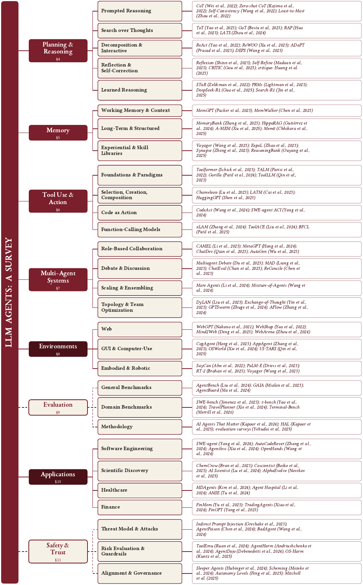

<h1 align="center">🤖 Awesome LLM Agent Papers</h1>

<p align="center"><a href="README.md">English</a> · <a href="README.ko.md">한국어</a> · <a href="README.zh-CN.md">简体中文</a> · <a href="README.ja.md">日本語</a> · <b>Português</b> · <a href="README.es.md">Español</a></p>

<p align="center">
<b>Mais de 200 artigos essenciais, atualizados com frequência</b>: a lista de leitura comentada para construir<br>
agentes LLM que planejam, lembram, usam ferramentas e cooperam. Acompanha o survey <i>“LLM Agents: A Survey”</i>.
</p>

<!-- Identity & credibility -->
<p align="center">
<a href="https://awesome.re"></a>

<a href="https://doi.org/10.20944/preprints202608.0265.v1"></a>
<a href="LICENSE"></a>
<a href="CONTRIBUTING.md"></a>
</p>

<!-- Live star / fork counts. -->
<p align="center">
<a href="https://github.com/js-lee-AI/awesome-llm-agent-papers/stargazers"></a>
<a href="https://github.com/js-lee-AI/awesome-llm-agent-papers/network/members"></a>
</p>

<p align="center">
📄 <b><a href="https://www.preprints.org/manuscript/202608.0265">Leia o survey → “LLM Agents: A Survey”</a></b> &nbsp;·&nbsp; 📖 <b><a href="https://llm-agents-a-survey.gitbook.io/llm-agents-a-survey-docs/pt/">Livro online no GitBook</a></b> &nbsp;·&nbsp; <a href="paper/llm-agents-a-survey.pdf">PDF neste repositório</a> &nbsp;·&nbsp; ⭐ <b><a href="#starter-kit">Comece pelo Kit inicial de 10 artigos</a></b>
</p>

<p align="center"><sub><i> LLM agents · LLM agent papers · autonomous agents · agentic AI · multi-agent systems · tool use · ReAct · planning · memory · agent benchmarks · agent safety &amp; prompt injection</i></sub></p>

<p align="center"></p>

## ✨ Destaques

| | O que você encontra aqui |
|---|---|
| 📚 **Tudo o que está no survey, e mais** | As 228 referências de *“LLM Agents: A Survey”*, mais artigos publicados depois que o survey foi escrito. Novos artigos continuam sendo adicionados. |
| 🧭 **Organizada por função** | 10 seções que seguem a estrutura do survey: Surveys, Arquiteturas, Planejamento, Memória, Uso de ferramentas, Multiagente, Ambientes, Aplicações, Avaliação e Segurança. |
| ✍️ **Com comentários** | Cada entrada traz uma nota de uma linha sobre a contribuição do artigo, o local e o ano de publicação e, quando existe uma implementação oficial, um link `[code]`. |
| ⭐ **Kit inicial** | Uma [lista de 10 artigos](#starter-kit) para você se situar na área, com uma nota explicando por que vale a pena ler cada um primeiro. |
| 🔎 **Fácil de navegar** | Um [sumário](#contents) com o número de artigos por seção, e seções que podem ser recolhidas. |

**Tópicos abordados:** cognitive architectures · ReAct e a combinação de raciocínio e ação · planejamento long-horizon · memória de agentes · LLMs com acesso a ferramentas · colaboração multiagente · agentes web / de código / embodied · benchmarks e avaliação de agentes · segurança, alinhamento e prompt injection indireta.

> 📖 **O survey como livro online**: [**LLM Agents: A Survey**](https://llm-agents-a-survey.gitbook.io/llm-agents-a-survey-docs/pt/) no GitBook reescreve o artigo para quem está começando na área, em dez capítulos que partem dos conceitos básicos. Assim como no artigo, as abordagens que não deram certo recebem tanto espaço quanto as que funcionaram.

> 🔁 **A lista do segundo survey**: [**Awesome Agent Loop Papers**](https://github.com/js-lee-AI/awesome-agent-loop-papers) reúne trabalhos sobre o loop do agente em si, com 524 artigos e 60 projetos de código aberto (frameworks, harnesses de programação, infraestrutura de memória e de sandbox, bibliotecas de skills, registros). A lista acompanha *The Agent Loop: A Survey of Control Strategies, Skills, and Harnesses for LLM Agents*.

Este repositório reúne artigos essenciais sobre **agentes baseados em LLMs**: modelos de linguagem equipados com planejamento, memória, uso de ferramentas e coordenação multiagente para perseguir objetivos ao longo de muitos passos. Os artigos seguem a taxonomia do survey que acompanha esta lista e cobrem os componentes centrais de um agente, os ambientes e as aplicações em que os agentes são usados e as questões transversais de avaliação e segurança. Cada entrada leva ao artigo e, quando existe uma implementação oficial, ao código.

Esta é uma **seleção com curadoria, atualizada continuamente**, e não uma cópia da bibliografia do survey. As seções ficam recolhidas por padrão; clique em **Mostrar N artigos** para expandir.

> **Legenda:** ⭐ = escolhido para o [Kit inicial](#starter-kit) (leia estes primeiro) · `[code]` = link para uma implementação oficial.

<a id="starter-kit"></a>
## ⭐ Kit inicial

Está começando na área? Estes dez artigos são um bom ponto de partida.

| # | Artigo | Área | Por que começar por aqui |
|---|-------|------|----------------|
| 1 | [ReAct: Synergizing Reasoning and Acting](https://arxiv.org/abs/2210.03629) | Planejamento | O padrão do loop de agente moderno: intercalar raciocínio e ações. |
| 2 | [Reflexion: Verbal Reinforcement Learning](https://arxiv.org/abs/2303.11366) | Planejamento | Self-reflection guardada na memória como um loop de melhoria sem gradientes. |
| 3 | [Toolformer: LMs Can Teach Themselves to Use Tools](https://arxiv.org/abs/2302.04761) | Uso de ferramentas | O artigo pioneiro sobre uso de ferramentas aprendido de forma autossupervisionada. |
| 4 | [Generative Agents: Interactive Simulacra](https://arxiv.org/abs/2304.03442) | Multiagente | Memória + reflection na escala de uma população; o design clássico de memória de agentes. |
| 5 | [Voyager: An Open-Ended Embodied Agent](https://arxiv.org/abs/2305.16291) | Memória / Amb. | Aprendizado ao longo da vida com uma biblioteca crescente de skills executáveis. |
| 6 | [Cognitive Architectures for Language Agents (CoALA)](https://arxiv.org/abs/2309.02427) | Fundamentos | O vocabulário (memória, action space, loop de decisão) que organiza esta lista. |
| 7 | [A Survey on LLM-based Autonomous Agents](https://arxiv.org/abs/2308.11432) | Survey | O survey geral de referência da área. |
| 8 | [LLM-based Multi-Agents: A Survey](https://arxiv.org/abs/2402.01680) | Multiagente | A referência padrão para o ramo multiagente. |
| 9 | [AgentBench: Evaluating LLMs as Agents](https://arxiv.org/abs/2308.03688) | Avaliação | O benchmark padrão de agentes que abrange vários ambientes. |
| 10 | [Not what you've signed up for (Indirect Prompt Injection)](https://arxiv.org/abs/2302.12173) | Segurança | O artigo que fundou o modelo de ameaças da segurança de agentes. |

<a id="to-watch"></a>
## 🔥 10 artigos para acompanhar (2026)

Trabalhos recentes de 2026 que já estão chamando atenção.

| Artigo | Área | Stars |
|-------|------|-------|
| [GenericAgent: A Token-Efficient Self-Evolving LLM Agent via Contextual Information Density Maximization](https://arxiv.org/abs/2604.17091) | Arquiteturas |  |
| [SimpleMem: Efficient Lifelong Memory for LLM Agents](https://arxiv.org/abs/2601.02553) | Memória |  |
| [AutoSci: A Memory-Centric Agentic System for the Full Scientific Research Lifecycle](https://arxiv.org/abs/2605.31468) | Aplicações |  |
| [Mobile-Agent-v3.5: Multi-platform Fundamental GUI Agents](https://arxiv.org/abs/2602.16855) | Ambientes |  |
| [AgentDoG: A Diagnostic Guardrail Framework for AI Agent Safety and Security](https://arxiv.org/abs/2601.18491) | Segurança |  |
| [Agentic Reasoning for Large Language Models](https://arxiv.org/abs/2601.12538) | Surveys |  |
| [UniToolCall: Unifying Tool-Use Representation, Data, and Evaluation for LLM Agents](https://arxiv.org/abs/2604.11557) | Uso de ferramentas |  |
| [Graph-of-Agents: A Graph-based Framework for Multi-Agent LLM Collaboration](https://arxiv.org/abs/2604.17148) | Multiagente |  |
| [Can AI Agents Answer Your Data Questions? A Benchmark for Data Agents (DataAgentBench)](https://arxiv.org/abs/2603.20576) | Avaliação |  |
| [Harness Updating Is Not Harness Benefit: Disentangling Evolution Capabilities in Self-Evolving LLM Agents](https://arxiv.org/abs/2605.30621) | Planejamento |  |

<sub><a href="#contents">↑ Voltar ao sumário</a></sub>

## <a id="contents"></a>Sumário

- [⭐ Kit inicial](#starter-kit)
- [🔥 10 artigos para acompanhar (2026)](#to-watch)
- **🧭 Fundamentos**
  - [📚 Surveys e artigos de posicionamento (57)](#surveys)
  - [🏗️ Arquiteturas e frameworks de agentes (51)](#architectures)
- **🧱 Parte I: Componentes centrais**
  - [🧠 Planejamento e raciocínio (51)](#planning)
  - [💾 Memória (56)](#memory)
  - [🔧 Uso de ferramentas (46)](#tools)
  - [🤝 Sistemas multiagente (51)](#multi-agent)
- **🌍 Parte II: Agentes em ambientes e aplicações**
  - [🌐 Ambientes interativos (57)](#environments)
  - [🚀 Aplicações (54)](#applications)
- **⚖️ Parte III: Questões transversais**
  - [📊 Avaliação e benchmarks (50)](#evaluation)
  - [🛡️ Segurança e alinhamento (59)](#safety)

## 🧭 Fundamentos

<a id="surveys"></a>
### 📚 Surveys e artigos de posicionamento (57)
*No survey: §1-§3 (Introdução, Fundamentos, Taxonomia).*

<details>
<summary><b>Mostrar 57 artigos</b></summary>

- **[A Survey on Large Language Model based Autonomous Agents](https://arxiv.org/abs/2308.11432)** (Wang et al., arXiv 2023) - *O survey geral de referência sobre agentes LLM e o mais citado da área.* ⭐ [[code](https://github.com/Paitesanshi/LLM-Agent-Survey)]
- **[The Rise and Potential of Large Language Model Based Agents: A Survey](https://arxiv.org/abs/2309.07864)** (Xi et al., arXiv 2023) - *Junto com Wang et al. 2023, é um dos dois surveys gerais que fundaram a área.* [[code](https://github.com/WooooDyy/LLM-Agent-Paper-List)]
- **[Cognitive Architectures for Language Agents](https://arxiv.org/abs/2309.02427)** (Sumers et al., TMLR 2023) - *O vocabulário conceitual e de arquitetura mais adotado para descrever agentes LLM.* ⭐ [[code](https://github.com/ysymyth/awesome-language-agents)]
- **[ReAct: Synergizing Reasoning and Acting in Language Models](https://arxiv.org/abs/2210.03629)** (Yao et al., ICLR 2023) - *O precursor técnico mais citado dos agentes LLM modernos.* ⭐ [[code](https://github.com/ysymyth/ReAct)]
- **[Reflexion: Language Agents with Verbal Reinforcement Learning](https://arxiv.org/abs/2303.11366)** (Shinn et al., NeurIPS 2023) - *Estabelece o loop 'self-reflection + memória' como alternativa ao RL baseado em gradientes para o autoaperfeiçoamento de agentes.* ⭐ [[code](https://github.com/noahshinn/reflexion)]
- **[Toolformer: Language Models Can Teach Themselves to Use Tools](https://arxiv.org/abs/2302.04761)** (Schick et al., NeurIPS 2023) - *Artigo pioneiro sobre uso de ferramentas, base do pilar de 'aumento com ferramentas' nas taxonomias de agentes LLM.* ⭐
- **[Generative Agents: Interactive Simulacra of Human Behavior](https://arxiv.org/abs/2304.03442)** (Park et al., arXiv 2023) - *Demonstração fundadora de sociedades e simulações de agentes movidos por LLMs.* ⭐ [[code](https://github.com/joonspk-research/generative_agents)]
- **[Voyager: An Open-Ended Embodied Agent with Large Language Models](https://arxiv.org/abs/2305.16291)** (Wang et al., TMLR 2023) - *Exemplo pioneiro de agentes LLM embodied, com skills em código e aprendizado ao longo da vida.* ⭐ [[code](https://github.com/MineDojo/Voyager)]
- **[HuggingGPT: Solving AI Tasks with ChatGPT and its Friends in Hugging Face](https://arxiv.org/abs/2303.17580)** (Shen et al., NeurIPS 2023) - *Exemplo fundador do padrão de agente em que o LLM atua como orchestrator de ferramentas e modelos.* [[code](https://github.com/microsoft/JARVIS)]
- **[MRKL Systems: A Modular, Neuro-Symbolic Architecture that Combines Large Language Models, External Knowledge Sources and Discrete Reasoning](https://arxiv.org/abs/2205.00445)** (Karpas et al., arXiv 2022) - *O mais antigo precursor neurossimbólico muito citado das arquiteturas de agentes e de uso de ferramentas com LLMs.*
- **[Agent AI: Surveying the Horizons of Multimodal Interaction](https://arxiv.org/abs/2401.03568)** (Durante et al., arXiv 2024) - *Amplia o escopo dos surveys de agentes LLM para incluir a IA de agentes multimodais e embodied.*
- **[Igniting Language Intelligence: The Hitchhiker's Guide From Chain-of-Thought Reasoning to Language Agents](https://arxiv.org/abs/2311.11797)** (Zhang et al., arXiv 2023) - *Liga a literatura de raciocínio (CoT) à literatura de agentes.* [[code](https://github.com/Zoeyyao27/CoT-Igniting-Agent)]
- **[Large Language Model based Multi-Agents: A Survey of Progress and Challenges](https://arxiv.org/abs/2402.01680)** (Guo et al., IJCAI 2024) - *O survey de referência padrão para o ramo multiagente dos agentes LLM.* ⭐ [[code](https://github.com/taichengguo/LLM_MultiAgents_Survey_Papers)]
- **[Understanding the Planning of LLM Agents: A Survey](https://arxiv.org/abs/2402.02716)** (Huang et al., arXiv 2024) - *Cobre a lacuna sobre planejamento que os surveys fundamentais deixavam.*
- **[Tool Learning with Large Language Models: A Survey](https://arxiv.org/abs/2405.17935)** (Qu et al., arXiv 2024) - *O survey definitivo sobre o pilar de uso de ferramentas dos agentes LLM.* [[code](https://github.com/quchangle1/LLM-Tool-Survey)]
- **[A Survey on the Memory Mechanism of Large Language Model based Agents](https://arxiv.org/abs/2404.13501)** (Zhang et al., arXiv 2024) - *O survey padrão sobre o subsistema de memória dos agentes LLM.* [[code](https://github.com/nuster1128/LLM_Agent_Memory_Survey)]
- **[Agentic Large Language Models, a Survey](https://arxiv.org/abs/2503.23037)** (Plaat et al., arXiv 2025) - *Survey geral recente e muito citado, com uma taxonomia compacta em raciocinar, agir e interagir.*
- **[Large Language Model Agent: A Survey on Methodology, Applications and Challenges](https://arxiv.org/abs/2503.21460)** (Luo et al., arXiv 2025) - *Um dos surveys gerais mais abrangentes e recentes (2025).* [[code](https://github.com/luo-junyu/Awesome-Agent-Papers)]
- **[Fully Autonomous AI Agents Should Not Be Developed](https://arxiv.org/abs/2502.02649)** (Mitchell et al., arXiv 2025) - *Artigo de posicionamento de grande destaque e muito discutido que diverge da maioria sobre a autonomia de agentes.*
- **[AI Agents vs. Agentic AI: A Conceptual Taxonomy, Applications and Challenges](https://arxiv.org/abs/2505.10468)** (Sapkota et al., arXiv 2025) - *Desfaz ambiguidades de terminologia e de conceito e é cada vez mais citado, já que a área usa esses termos de forma inconsistente.*
- **[LLM-Based Human-Agent Collaboration and Interaction Systems: A Survey](https://arxiv.org/abs/2505.00753)** (Zou et al., arXiv 2025) - *Cobre o ramo da cooperação entre humanos e agentes, identificado já nos primeiros surveys fundamentais.* [[code](https://github.com/HenryPengZou/Awesome-Human-Agent-Collaboration-Interaction-Systems)]
- **[Levels of Autonomy for AI Agents](https://arxiv.org/abs/2506.12469)** (Feng et al., arXiv 2025) - *Oferece um framework operacional muito citado para comparar o grau de autonomia entre sistemas de agentes LLM.*
- **[Advances and Challenges in Foundation Agents: From Brain-Inspired Intelligence to Evolutionary, Collaborative, and Safe Systems](https://arxiv.org/abs/2504.01990)** (Liu et al., arXiv 2025) - *Survey de referência com 48 autores que organiza a área em torno de módulos cognitivos inspirados no cérebro, autoevolução, inteligência coletiva e segurança.*
- **[The Landscape of Agentic Reinforcement Learning for LLMs: A Survey](https://arxiv.org/abs/2509.02547)** (Zhang et al., arXiv 2025) - *O survey de referência sobre agentic RL: treinar LLMs como agentes que tomam decisões, e não como geradores passivos.*
- **[A Comprehensive Survey of Self-Evolving AI Agents: A New Paradigm Bridging Foundation Models and Lifelong Agentic Systems](https://arxiv.org/abs/2508.07407)** (Fang et al., arXiv 2025) - *Revisa as técnicas com que os agentes otimizam os próprios componentes a partir de dados de interação, ligando os modelos de fundação a sistemas de agentes que aprendem ao longo da vida.*
- **[Deep Research Agents: A Systematic Examination and Roadmap](https://arxiv.org/abs/2506.18096)** (Huang et al., arXiv 2025) - *O primeiro survey sistemático sobre agentes de pesquisa autônomos long-horizon (busca, uso de ferramentas, síntese de relatórios).*
- **[A Survey of AI Agent Protocols](https://arxiv.org/abs/2504.16736)** (Yang et al., arXiv 2025) - *Mapeia a nova camada de protocolos (MCP, A2A e sucessores) e propõe dimensões de avaliação para padrões de interoperabilidade entre agentes.*

- **[Agentic Reasoning for Large Language Models](https://arxiv.org/abs/2601.12538)** (Wei et al., arXiv 2026) - *Survey que organiza o raciocínio de agentes em três camadas (agente único, autoevolutivo e multiagente) e liga o raciocínio em contexto ao pós-treinamento.* [[code](https://github.com/weitianxin/Awesome-Agentic-Reasoning)]
- **[Memory for Autonomous LLM Agents: Mechanisms, Evaluation, and Emerging Frontiers](https://arxiv.org/abs/2603.07670)** (Du et al., arXiv 2026) - *Trata a memória de agentes como um loop de escrever, gerenciar e ler, com uma taxonomia de mecanismos, benchmarks e aplicações.*
- **[Anatomy of Agentic Memory: Taxonomy and Empirical Analysis of Evaluation and System Limitations](https://arxiv.org/abs/2602.19320)** (Jiang et al., arXiv 2026) - *Classifica as estruturas de memória de agentes e mostra empiricamente a saturação dos benchmarks e problemas de validade das métricas em vários sistemas.*
- **[Beyond Individual Intelligence: Surveying Collaboration, Failure Attribution, and Self-Evolution in LLM-based Multi-Agent Systems](https://arxiv.org/abs/2605.14892)** (Qi et al., arXiv 2026) - *Propõe um framework unificado, 'LIFE' (foundation, integrate, find faults, evolve), para colaboração multiagente, failure attribution e autoevolução.*
- **[A Technical Taxonomy of LLM Agent Communication Protocols](https://arxiv.org/abs/2606.19135)** (Sander et al., arXiv 2026) - *Analisa nove protocolos abertos de comunicação entre agentes em cinco dimensões e prevê a convergência para uma pilha de protocolos federada.*
- **[Bridging the Agent-World Gap: Text World Models for LLM-based Agents](https://arxiv.org/abs/2606.09032)** (Li et al., arXiv 2026) - *Sistematiza os modelos de mundo em texto (LLM-as-WM vs. code-as-WM), que dão aos agentes uma previsão explícita do ambiente para planejamento e verificação.* [[code](https://github.com/sustech-nlp/awesome-text-world-models)]
- **[Agents That Know Too Much: A Data-Centric Survey of Privacy in LLM Agents](https://arxiv.org/abs/2606.26627)** (Lahjouji et al., arXiv 2026) - *Survey centrado em dados que organiza a pesquisa sobre privacidade de agentes pela superfície de dados, e não pelo tipo de ataque, e mapeia as lacunas de governança.*
- **[Self-Improvements in Modern Agentic Systems: A Survey](https://arxiv.org/abs/2607.13104)** (Ren et al., arXiv 2026) - *Descreve um agente moderno como um modelo de fundação mais um scaffold operacional e organiza o autoaperfeiçoamento pelo que é atualizado (pesos ou scaffold) e pelo sinal que motiva a mudança.* [[code](https://github.com/selfimproving-agent/awesome-Self-Improving-Agents)]
- **[Dynamic Agent Skills: A Lifecycle Survey and Taxonomy of Evolving Skill Libraries](https://arxiv.org/abs/2607.10113)** (Li et al., arXiv 2026) - *Revisa 124 artigos sobre bibliotecas de skills que evoluem, vistas como repositórios de artefatos com ciclo de vida gerenciado, e argumenta que as etapas decisivas são a admissão e o reparo, não a aquisição.*
- **[From Question Answering to Task Completion: A Survey on Agent System and Harness Design](https://arxiv.org/abs/2606.20683)** (Guo et al., arXiv 2026) - *Analisa os agentes separando o que cabe ao modelo e o que cabe ao harness, decompõe o harness em seis responsabilidades de runtime e pergunta onde de fato está o gargalo de desempenho.* [[code](https://github.com/ggjy/Awesome-Agent-Engineering)]
- **[Isolation as a First-Class Principle for LLM-Agent System Safety: Concepts, Taxonomy, Challenges and Future Directions](https://arxiv.org/abs/2607.12406)** (Jing et al., arXiv 2026) - *Artigo de posicionamento que trata prompt injection, uso indevido de ferramentas e memory poisoning como um único problema estrutural: a falta de fronteiras de isolamento em cinco interfaces do agente.*
- **[Always-On Agents: A Survey of Persistent Memory, State, and Governance in LLM Agents](https://arxiv.org/abs/2606.30306)** (Ding et al., arXiv 2026) - *Revisa 435 trabalhos sobre agentes com estado persistente entre sessões e constata que a literatura privilegia o acúmulo e a busca de informações e negligencia a governança e a recuperação após falhas.*
- **[Externalization in LLM Agents: A Unified Review of Memory, Skills, Protocols and Harness Engineering](https://arxiv.org/abs/2604.08224)** (Zhou et al., arXiv 2026) - *Descreve a evolução dos agentes como externalização: a capacidade sai dos pesos e passa para a memória, as skills, os protocolos e a infraestrutura do harness.*
- **[SoK: Agentic Skills -- Beyond Tool Use in LLM Agents](https://arxiv.org/abs/2602.20867)** (Jiang et al., arXiv 2026) - *Sistematiza as skills de agentes como procedimentos reutilizáveis que podem ser chamados e traça a linha que separa uma skill de uma chamada atômica de ferramenta.*
- **[From Storage to Experience: A Survey on the Evolution of LLM Agent Memory Mechanisms](https://arxiv.org/abs/2605.06716)** (Luo et al., arXiv 2026) - *Revisa a memória de agentes como uma evolução em três etapas (armazenamento, reflection e experiência), movida por consistência, dinâmica e aprendizado contínuo.* [[code](https://github.com/FeishuLuo/Evolving-LLM-Agent-Memory-Survey)]
- **[LLM agents security duality: a comprehensive survey of self-security and empowered cybersecurity](https://arxiv.org/abs/2606.28450)** (Xu et al., arXiv 2026) - *Survey que organiza, em uma taxonomia pela origem da ameaça, as ameaças de segurança a agentes LLM e suas mitigações, junto com um framework que mapeia as capacidades dos agentes em todo o ciclo de ataque e defesa cibernética.*
- **[Agentic Environment Engineering for Large Language Models: A Survey of Environment Modeling, Synthesis, Evaluation, and Application](https://arxiv.org/abs/2606.12191)** (Li et al., arXiv 2026) - *Organiza a pesquisa sobre ambientes para agentes baseados em LLMs em torno de um ciclo de vida de engenharia (modelagem, síntese, avaliação e aplicação) e propõe uma classificação de ambientes com oito atributos.*
- **[Toward Efficient Agents: Memory, Tool learning, and Planning](https://arxiv.org/abs/2601.14192)** (Yang et al., arXiv 2026) - *Survey sobre a eficiência de sistemas de agentes LLM em três componentes (memória, aprendizado do uso de ferramentas e planejamento), que trata a relação entre eficácia e custo como uma fronteira de Pareto.*
- **[Agentic Artificial Intelligence (AI): Architectures, Taxonomies, and Evaluation of Large Language Model Agents](https://arxiv.org/abs/2601.12560)** (Arunkumar V et al., arXiv 2026) - *Survey que propõe uma taxonomia unificada de seis componentes (Percepção, Cérebro, Planejamento, Ação, Uso de ferramentas, Colaboração) para agentes LLM e revisa suas arquiteturas, ambientes de operação e práticas de avaliação, terminando com problemas em aberto como ações produzidas por hallucination, loops infinitos e prompt injection.*
- **[A Survey on Long-Term Memory Security in LLM Agents: Attacks, Defenses, and Governance Across the Memory Lifecycle](https://arxiv.org/abs/2604.16548)** (Lin et al., arXiv 2026) - *Revisa as ameaças de segurança à long-term memory de agentes LLM, organizando ataques, defesas e governança em seis fases do ciclo de vida da memória e quatro objetivos de segurança, e defende um framework de "Verifiable Memory Governance".*
- **[Uncertainty Quantification in LLM Agents: Foundations, Emerging Challenges, and Opportunities](https://arxiv.org/abs/2602.05073)** (Oh et al., arXiv 2026) - *Defende que a quantificação de incerteza precisa sair do QA de turno único e passar para agentes interativos, e apresenta uma formulação geral e os quatro desafios próprios dos agentes: a escolha do estimador, entidades heterogêneas, a dinâmica da incerteza e a falta de benchmarks de granularidade fina.*
- **[Multi-Agent Debate Strategies: Survey, Taxonomy, and Challenges](https://arxiv.org/abs/2607.26212)** (Motger et al., arXiv 2026) - *Revisa 141 estudos de debate multiagente e constata que a área adotou, sem discussão explícita, topologias estáticas e fully connected com votação, escolhidas por convenção e não por comparação controlada.*
- **[Beyond the Leaderboard: A Synthesis of Tool-Use, Planning, and Reasoning Failures in Large Language Model Agents](https://arxiv.org/abs/2607.05775)** (Albayaydh et al., arXiv 2026) - *Reúne 27 artigos de avaliação, com 19 benchmarks, em seis grupos de falhas e constata que as falhas se acumulam de forma não linear com o tamanho da tarefa e que acrescentar scaffolding não melhora a confiabilidade de forma consistente.*
- **[How Agents Ask for Permission: User Permissions for AI Agents, from Interfaces to Enforcement](https://arxiv.org/abs/2607.13718)** (Michael et al., arXiv 2026) - *Compara 21 propostas de permissões para agentes com cinco agentes comerciais, classifica como as políticas no nível do usuário são especificadas, derivadas das entradas do usuário e aplicadas em tempo de execução e aponta as lacunas que restam.*
- **[Blockchain Empowered Trustworthy Agent Networks: Foundations, Taxonomy, and Future Directions](https://arxiv.org/abs/2608.04626)** (Zhu et al., arXiv 2026) - *Revisa o caminho dos sistemas multiagente clássicos até as redes abertas de agentes, de 1980 a 2026, e argumenta que o problema da confiança passa para o nível da rede quando agentes de donos diferentes fazem transações entre si, um nível que os mecanismos de segurança de agente único não alcançam.*
- **[Software Engineering for and with GUI Agent](https://arxiv.org/abs/2608.09278)** (Yu et al., arXiv 2026) - *Revisa 336 artigos sobre agentes de GUI publicados entre janeiro de 2018 e abril de 2026 e constata que as arquiteturas convergem para loops modulares de perceber, raciocinar e agir, enquanto a recuperação de falhas, a escalation para humanos, a aplicação das regras de segurança e a auditabilidade continuam pouco desenvolvidas; a avaliação ainda se concentra no sucesso da tarefa e é difícil de comparar entre protocolos.*
- **[Agent Safety Should Be a Runtime Contract](https://arxiv.org/abs/2608.11274)** (Ng et al., arXiv 2026) - *Artigo de posicionamento que coloca a segurança de agentes no harness, como um contrato de runtime com um lado preventivo (sandboxes, verificações de permissão, monitores) e um lado de evidências (execuções de teste, captura de logs, diffs de arquivos). O argumento se apoia em 52 incidentes documentados, em uma auditoria do schema de trajectories de 12 sistemas de agentes públicos e em uma auditoria dos títulos de todos os 28.560 artigos da NeurIPS, ICML e ICLR de 2023-2025, que mostra um desequilíbrio agregado de 8-12x entre as publicações sobre treinamento e sobre implantação.*
- **[Information Retrieval Misses the Mark for LLM Agents](https://doi.org/10.2139/ssrn.6903579)** (Sun et al., SSRN 2026) - *Artigo de posicionamento que responde à leitura da prática atual resumida em "o RAG morreu, os agentes só precisam de grep": admite que a base mudou, mas argumenta que o descompasso é estrutural em cinco dimensões, já que o corpus, a entrada, o objetivo, o episódio e a unidade recuperável que a recuperação de informação (IR) pressupõe não servem para um agente que planeja, navega, chama ferramentas e decide se continua buscando. Para testar isso, o artigo mantém o agente fixo e troca a recuperação entre BM25, vetorial, grep, híbrida e closed-book no HotpotQA-distractor e no 2WikiMultihopQA, e defende que a recuperação seja repensada como uma política de aquisição de evidências condicionada ao estado.*
- **[Terminal Agents: A Survey of AI Agents in Command-Line Environments](https://arxiv.org/abs/2608.20485)** (Bin et al., arXiv 2026) - *Usa o terminal, e não o domínio da tarefa, como critério de organização: estuda agentes cujo loop avança por meio da execução de comandos e de feedback em texto, mapeados por arquitetura, aquisição de competências e avaliação em um perfil de competências de sete dimensões. Os diagnósticos do próprio survey, em condições fixas, mostram que cada família de benchmarks expõe sinais de processo diferentes e que as comparações pareadas entre sistemas dependem do benchmark, o que limita o quanto um resultado pode ser atribuído a um único componente.*
- **[Autonomous Research Agents: A Survey of AI Scientists and the Verification Gap](https://arxiv.org/abs/2608.05179)** (Ding et al., arXiv 2026) - *Codifica 26 dos 125 sistemas de cientista de IA triados em sete dimensões de auditoria e constata que o gargalo deixou de ser a capacidade e passou a ser a verificabilidade: 83% dos 24 sistemas executáveis publicam o código, mas só 38% publicam seeds ou traces de execução e só 38% relatam alguma verificação de novidade. Dos nove sistemas de loop fechado, sete são reexecuções mecânicas, e nenhum sistema do corpus tem um oracle dentro do loop validado externamente.*
</details>

<sub><a href="#contents">↑ Voltar ao sumário</a></sub>

<a id="architectures"></a>
### 🏗️ Arquiteturas e frameworks de agentes (51)
*No survey: §2 (Fundamentos) e os exemplos usados ao longo do texto.*

<details>
<summary><b>Mostrar 51 artigos</b></summary>

- **[Auto-GPT for Online Decision Making: Benchmarks and Additional Opinions](https://arxiv.org/abs/2306.02224)** (Yang et al., arXiv 2023) - *O único estudo empírico, com rigor próximo ao de uma publicação revisada por pares, sobre o padrão de design de agente autônomo do AutoGPT, que foi muito influente, mas nunca teve artigo próprio.* [[code](https://github.com/younghuman/LLMAgent)]
- **[AgentBench: Evaluating LLMs as Agents](https://arxiv.org/abs/2308.03688)** (Liu et al., ICLR 2024) - *O benchmark de referência padrão para medir a capacidade geral de um agente único em ambientes heterogêneos.* ⭐ [[code](https://github.com/THUDM/AgentBench)]
- **[WebArena: A Realistic Web Environment for Building Autonomous Agents](https://arxiv.org/abs/2307.13854)** (Zhou et al., ICLR 2024) - *O ambiente de teste que, na prática, virou padrão para arquiteturas de agente único que navegam na web.* [[code](https://github.com/web-arena-x/webarena)]
- **[Gorilla: Large Language Model Connected with Massive APIs](https://arxiv.org/abs/2305.15334)** (Patil et al., NeurIPS 2024) - *Artigo central sobre uso de ferramentas por um agente único, que mostra que fine-tuning com recuperação permite a um agente chamar de forma confiável grandes catálogos de APIs reais.* [[code](https://github.com/ShishirPatil/gorilla)]
- **[ReWOO: Decoupling Reasoning from Observations for Efficient Augmented Language Models](https://arxiv.org/abs/2305.18323)** (Xu et al., arXiv 2023) - *Alternativa influente ao loop do ReAct, voltada para eficiência, que ilustra a escolha de arquitetura entre planejar antes de executar e intercalar as duas coisas.* [[code](https://github.com/billxbf/ReWOO)]
- **[Tree of Thoughts: Deliberate Problem Solving with Large Language Models](https://arxiv.org/abs/2305.10601)** (Yao et al., NeurIPS 2023) - *Arquitetura central de raciocínio por busca deliberada, base de frameworks posteriores de planejamento e busca para agente único, como o LATS.* [[code](https://github.com/princeton-nlp/tree-of-thought-llm)]
- **[WebGPT: Browser-assisted question-answering with human feedback](https://arxiv.org/abs/2112.09332)** (Nakano et al., arXiv 2021) - *Precursor dos agentes web modernos baseados em LLMs, anterior ao ChatGPT, que estabelece o padrão de usar a navegação como ferramenta com feedback humano.*
- **[SELF-REFINE: Iterative Refinement with Self-Feedback](https://arxiv.org/abs/2303.17651)** (Madaan et al., NeurIPS 2023) - *Loop mínimo e muito adotado de autoaperfeiçoamento para agente único, reutilizado como sub-rotina em muitas arquiteturas de agentes maiores.* [[code](https://github.com/madaan/self-refine)]
- **[SWE-agent: Agent-Computer Interfaces Enable Automated Software Engineering](https://arxiv.org/abs/2405.15793)** (Yang et al., NeurIPS 2024) - *Mostra que o design da interface muda de forma concreta a capacidade de um agente único, algo que hoje é padrão no design de agentes de programação.* [[code](https://github.com/princeton-nlp/SWE-agent)]
- **[Language Agent Tree Search Unifies Reasoning, Acting, and Planning in Language Models](https://arxiv.org/abs/2310.04406)** (Zhou et al., ICML 2024) - *Representa o estado da arte na convergência entre o planejamento baseado em busca e a linhagem ReAct/Reflexion.* [[code](https://github.com/lapisrocks/LanguageAgentTreeSearch)]
- **[Executable Code Actions Elicit Better LLM Agents](https://arxiv.org/abs/2402.01030)** (Wang et al., ICML 2024) - *Estabelece o 'código como ação' como uma das principais alternativas de design de action space para agentes únicos.* [[code](https://github.com/xingyaoww/code-act)]
- **[Describe, Explain, Plan and Select: Interactive Planning with Large Language Models Enables Open-World Multi-Task Agents](https://arxiv.org/abs/2302.01560)** (Wang et al., NeurIPS 2023) - *Arquitetura central de planejamento para agente único em tarefas de mundo aberto e embodied.* [[code](https://github.com/CraftJarvis/MC-Planner)]
- **[OS-Copilot: Towards Generalist Computer Agents with Self-Improvement](https://arxiv.org/abs/2402.07456)** (Wu et al., arXiv 2024) - *Um dos principais exemplos recentes de agente único de uso geral, no nível do sistema operacional, que se aprimora sozinho e leva a autonomia no estilo AutoGPT a ambientes de computador reais.* [[code](https://github.com/OS-Copilot/OS-Copilot)]
- **[AppAgent: Multimodal Agents as Smartphone Users](https://arxiv.org/abs/2312.13771)** (Zhang et al., CHI 2025) - *Arquitetura recente e representativa de agente único que estende o paradigma ReAct e de uso de ferramentas ao controle de GUIs e de celulares.* [[code](https://github.com/TencentQQGYLab/AppAgent)]
- **[The Landscape of Emerging AI Agent Architectures for Reasoning, Planning, and Tool Calling: A Survey](https://arxiv.org/abs/2404.11584)** (Masterman et al., arXiv 2024) - *Survey dedicado especificamente aos padrões de design de arquitetura de agentes, diretamente útil para classificar frameworks de agente único.*
- **[MetaGPT: Meta Programming for A Multi-Agent Collaborative Framework](https://arxiv.org/abs/2308.00352)** (Hong et al., ICLR 2024) - *Framework muito citado que mostra como templates de papéis e procedimentos para cada agente aumentam a confiabilidade e que marca a transição entre o design de frameworks de agente único e o de frameworks multiagente.* [[code](https://github.com/geekan/MetaGPT)]
- **[Gemini 2.5: Pushing the Frontier with Advanced Reasoning, Multimodality, Long Context, and Next Generation Agentic Capabilities](https://arxiv.org/abs/2507.06261)** (Comanici et al., arXiv 2025) - *Relatório de um modelo de fronteira que apresenta o uso de ferramentas por agentes e a operação de computadores como capacidades principais.*
- **[Kimi K2: Open Agentic Intelligence](https://arxiv.org/abs/2507.20534)** (Kimi Team, arXiv 2025) - *Modelo aberto carro-chefe, construído explicitamente em torno do pós-treinamento para agentes em larga escala.* [[code](https://github.com/MoonshotAI/Kimi-K2)]

- **[GenericAgent: A Token-Efficient Self-Evolving LLM Agent via Contextual Information Density Maximization](https://arxiv.org/abs/2604.17091)** (Liang et al., arXiv 2026) - *Agente autoevolutivo e econômico em tokens que acumula experiência contextual; um dos frameworks de agentes de 2026 com mais estrelas.* [[code](https://github.com/lsdefine/GenericAgent)]
- **[Orchestral AI: A Framework for Agent Orchestration](https://arxiv.org/abs/2601.02577)** (Roman et al., arXiv 2026) - *Framework para compor e orquestrar agentes especializados por trás de uma única interface.* [[code](https://github.com/orchestralAI/orchestral-ai)]
- **[AgentArk: Distilling Multi-Agent Intelligence into a Single LLM Agent](https://arxiv.org/abs/2602.03955)** (Luo et al., arXiv 2026) - *Faz a distillation da inteligência de vários agentes para um único agente LLM e mantém os ganhos da colaboração a um custo menor.* [[code](https://github.com/AIFrontierLab/AgentArk)]
- **[The Interplay of Harness Design and Post-Training in LLM Agents](https://arxiv.org/abs/2606.25447)** (Kim et al., arXiv 2026) - *Mostra que o design do harness e o pós-treinamento interagem, de modo que um pós-treinamento que leva o harness em conta melhora o desempenho tanto dentro quanto fora da distribuição.*
- **[Next-Generation Agentic Reinforcement Learning Systems Enable Self-Evolving Agents](https://arxiv.org/abs/2607.01120)** (Ran Yan et al., arXiv 2026) - *Argumenta que é a pilha de sistemas de agentic RL, e não o algoritmo, que permite criar agentes capazes de revisar os próprios componentes, e não apenas os pesos.*
- **[From Atomic Actions to Standard Operating Procedures: Iterative Tool Optimization for Self-Evolving LLM Agents](https://arxiv.org/abs/2607.07321)** (Ding et al., arXiv 2026) - *Transforma sequências de ações recorrentes, tiradas de traces de execução, em procedimentos de ordem superior que podem ser chamados e depois mescla, avalia e poda o conjunto de ferramentas resultante.*
- **[Self-Evolving World Models for LLM Agent Planning](https://arxiv.org/abs/2606.30639)** (Zhang et al., arXiv 2026) - *Refina o modelo de mundo interno do agente em tempo de teste, com o executor fixo, e torna mais preciso o loop de planejar e simular.*
- **[Scaling Self-Evolving Agents via Parametric Memory](https://arxiv.org/abs/2606.04536)** (Ren et al., arXiv 2026) - *Tira a autoevolução da context window e a leva para os parâmetros, de modo que a experiência acumulada escala sem aumentar o prompt.*
- **[Inside the Scaffold: A Source-Code Taxonomy of Coding Agent Architectures](https://arxiv.org/abs/2604.03515)** (Rombaut et al., arXiv 2026) - *Deriva do código-fonte uma taxonomia de 13 scaffolds abertos de agentes de programação e identifica cinco primitivas de loop combináveis que os sistemas recombinam.*
- **[Agentic Harness Engineering: Observability-Driven Automatic Evolution of Coding-Agent Harnesses](https://arxiv.org/abs/2604.25850)** (Lin et al., arXiv 2026) - *Faz evoluir automaticamente o harness de um agente de programação a partir de sinais de observabilidade e eleva o resultado no Terminal-Bench 2 de 69,7 para 77,0.*
- **[AgentFactory: A Self-Evolving Framework Through Executable Subagent Accumulation and Reuse](https://arxiv.org/abs/2603.18000)** (Zhang et al., arXiv 2026) - *Acumula capacidade salvando as soluções bem-sucedidas como código executável e reutilizável de subagentes, e não como prompts em texto, e refina esse código com o feedback da execução.* [[code](https://github.com/zzatpku/AgentFactory)]
- **[CORAL: Towards Autonomous Multi-Agent Evolution for Open-Ended Discovery](https://arxiv.org/abs/2604.01658)** (Qu et al., COLM 2026) - *Substitui regras de exploração fixas no código por agentes de longa duração que exploram, refletem e colaboram por meio de uma memória persistente compartilhada, com espaços de trabalho isolados e o avaliador separado; alcança o estado da arte em 10 tarefas de otimização com uma taxa de melhoria por avaliação de 3 a 10 vezes maior, e quatro agentes que coevoluem levam a tarefa de kernel da Anthropic de 1363 para 1103 ciclos.* [[code](https://github.com/Human-Agent-Society/CORAL)]
- **[LogicHunter: Testing LLM Agent Frameworks with an Agentic Oracle](https://arxiv.org/abs/2607.06195)** (Long et al., arXiv 2026) - *Propõe o LogicHunter, um framework de fuzzing guiado por especificação combinado com um oracle baseado em ReAct que funciona como agente: busca documentação, navega pelo código-fonte e inspeciona o estado em tempo de execução. Em três frameworks de agentes muito usados, encontra 40 bugs até então desconhecidos, dos quais 30 foram confirmados e 26 corrigidos, e o oracle tem precisão de 91,17%, contra 29,27% da melhor abordagem passiva.*
- **[AgentFlow: Building Agent Dependency Graphs for Static Analysis of Agent Programs](https://arxiv.org/abs/2607.01640)** (Wang et al., arXiv 2026) - *Apresenta o AgentFlow, um framework de análise estática que recupera as dependências de agentes a partir do código-fonte de agentes LLM construindo um Agent Dependency Graph independente de framework, cujos nós tipados cobrem agentes, prompts, modelos, capacidades, estados de memória e políticas de controle; em 5.399 programas de agentes reais, revela 238 riscos do tipo taint entre prompt e ferramenta.*
- **[SEAGym: An Evaluation Environment for Self-Evolving LLM Agents](https://arxiv.org/abs/2606.17546)** (Zheng et al., arXiv 2026) - *Apresenta o SEAGym, um ambiente de avaliação para agentes LLM autoevolutivos que mede as modificações no harness do agente nas dimensões de treinamento, validação, teste held-out, replay e custo, em vez de uma única pontuação de tarefa.*
- **[Harness-MU: A Safe, Governed, and Effective Harness for Multi-User LLM Agents](https://arxiv.org/abs/2606.21856)** (Fan et al., arXiv 2026) - *Propõe o Harness-MU, um harness independente de modelo, que não exige ajuste e aplica controle de acesso multiusuário a agentes LLM por meio de hooks de execução determinísticos, e não de salvaguardas internas do modelo.* [[code](https://github.com/YuanJrShiuan/Harness-MulUser)]
- **[Co-Evolving Skill Generation and Policy Optimization](https://arxiv.org/abs/2606.08755)** (Zhang et al., arXiv 2026) - *Propõe um framework online para agentes de linguagem com skills que estima a utilidade marginal, dependente do contexto, de cada skill candidata por meio de grupos de comparação pareados (skills recuperadas com e sem a candidata), para descartar skills ineficazes ou prejudiciais antes de armazená-las, dentro do orçamento padrão de rollouts; além disso, treina a própria política para gerar skills.*
- **[DemoEvolve: Overcoming Sparse Feedback in Agentic Harness Evolution with Demonstrations](https://arxiv.org/abs/2605.24539)** (Che et al., arXiv 2026) - *O DemoEvolve usa trajectories de demonstração de especialistas humanos para guiar a busca na evolução de harnesses de agentes e trata a instabilidade causada por recompensas esparsas em ambientes estocásticos complexos como o Balatro, onde só a prática do próprio agente não basta.*
- **[Self-Evolving Software Agents](https://arxiv.org/abs/2604.27264)** (Robol et al., arXiv 2026) - *Propõe uma arquitetura que combina raciocínio BDI (Belief-Desire-Intention) com grandes modelos de linguagem, na qual um módulo de evolução automática extrai novos requisitos da experiência e sintetiza o design e o código correspondentes.*
- **[Codified Context: Infrastructure for AI Agents in a Complex Codebase](https://arxiv.org/abs/2602.20478)** (Vasilopoulos et al., arXiv 2026) - *Propõe uma infraestrutura de três componentes (uma constituição de convenções, 19 agentes especializados e uma base de conhecimento com 34 documentos de especificação) para dar contexto persistente a assistentes de programação baseados em LLMs.* [[code](https://github.com/arisvas4/codified-context-infrastructure)]
- **[LLM-as-a-Verifier: A General-Purpose Verification Framework](https://arxiv.org/abs/2607.05391)** (Kwok et al., arXiv 2026) - *Trata a verificação como um eixo de escala próprio: pontuações contínuas obtidas dos logits de tokens de pontuação, escaladas por granularidade, avaliação repetida e decomposição de critérios, chegam a 86,5% no Terminal-Bench V2 sem treinamento adicional.* [[code](https://github.com/llm-as-a-verifier/llm-as-a-verifier)]
- **[Molt: A Scalable PyTorch-Native Training Framework for Agentic Reinforcement Learning](https://arxiv.org/abs/2607.21653)** (Hu et al., arXiv 2026) - *Mostra que um sistema de treinamento de agentic RL compacto e nativo em PyTorch, pequeno o bastante para que um pesquisador ou um assistente de programação o leia do começo ao fim, tem resultados estatisticamente comparáveis aos de uma pilha baseada em Megatron.* [[code](https://github.com/NVIDIA-NeMo/labs-molt)]
- **[Baselines Before Architecture: Evaluating Coding Agents for Autonomous Penetration Testing](https://arxiv.org/abs/2607.13085)** (Dhakal et al., arXiv 2026) - *Agentes de programação de linha de comando, na configuração padrão, já resolvem boa parte das 104 tarefas do benchmark XBOW, e execuções repetidas de um agente simples podem igualar arquiteturas de harness publicadas quando o modelo é o mesmo.*
- **[Argus: A General-Purpose Agentic Runtime for Long-Horizon Reasoning](https://arxiv.org/abs/2608.05144)** (Li et al., arXiv 2026) - *Um runtime persistente em que Manager, Planner, Engineer e Reviewer executam missões delimitadas sobre um estado de projeto durável e só aceitam memórias, skills e verificadores depois de uma revisão feita pelo papel responsável; os pesos ficam fixos, e os 78% no SWE-Bench Pro, contra 59% de uma baseline direta, vêm apenas do estado do runtime.*
- **[Architectural Implications of Agentic AI Workflows](https://arxiv.org/abs/2608.04458)** (Yang et al., arXiv 2026) - *Caracteriza as cargas de trabalho de agentes como um problema de datacenter por meio de um estudo em produção na Azure e constata que a orquestração e as ferramentas colocam a CPU no critical path e que a execução fragmentada deixa ociosa parte da capacidade de CPU e de GPU em servidores convencionais homogêneos.*
- **[Ouroboros: A Self-Developing Frontier Coding Agent with Reviewed Core Evolution](https://arxiv.org/abs/2608.08311)** (Razzhigaev et al., arXiv 2026) - *Um harness de agente de programação cujas ferramentas, prompts, montagem de contexto e implementação central melhoram por meio de commits revisados, que se tornam o runtime do trabalho seguinte; relata 86,74% no Terminal-Bench 2.1 e 90,69% no OSWorld-Verified a partir de snapshots congelados, enquanto uma implantação separada, de 161 dias, continua evoluindo em produção.* [[code](https://github.com/razzant/ouroboros)]
- **[The Scaffolding Matters More Than the Interface: A Controlled Comparison of MCP and CLI Tool Use Across Seven Agent Scaffoldings, Five Language Models, and One Software Task](https://arxiv.org/abs/2608.08654)** (Alier Forment et al., arXiv 2026) - *Uma mesma tarefa de git, executada em sete scaffoldings de agentes e cinco modelos de linguagem, mostra que o custo depende do scaffolding, e não da interface MCP ou CLI: os dois scaffoldings sem suporte a MCP concluem todas as execuções pela CLI e custam de 5,0x a 28x menos que os cinco scaffoldings com suporte a MCP, considerando só as execuções pela CLI; as treze razões MCP/CLI estritamente pareadas vão de 0,43x a 29x, e 12,9% do dinheiro gasto nas execuções com MCP não resulta em nenhum trabalho concluído, contra 2,2% nas execuções pela CLI.*
- **[Persistent Recursive Worlds Enable Autonomous Software Evolution](https://arxiv.org/abs/2608.10450)** (Huang et al., arXiv 2026) - *Torna persistente o projeto de software, e não o agente: agentes de vida limitada propõem mudanças locais e só as consequências aceitas avançam o histórico de versões. Uma execução de mais de 120 horas construiu um compilador de C em Rust com cerca de 250 mil linhas, que passou em todo o c-testsuite, com um gasto de US$ 44 em tokens do modelo.*
- **[What Does Multi-Harness RL Learn? Credit Assignment and Portability in Coding Agents](https://arxiv.org/abs/2609.04518)** (Le et al., arXiv 2026) - *Reexecuta registros congelados do Aider, OpenHands, Qwen Code e SWE-agent para testar isoladamente se reunir harnesses em um mesmo grupo de vantagem gera uma habilidade transferível, e o harness de avaliação pesa mais que todo o resto: em 24.000 avaliações seladas, ele altera a taxa média de resolução de 2,14% para 9,27%, enquanto a receita de treinamento a altera em 1,16 ponto. Agrupar entre harnesses supera agrupar dentro de cada harness em 0,25 ponto em um harness held-out, com um intervalo de confiança que inclui o zero e é mais estreito que a variação entre seeds de cada regra.*
- **[TROVE: Adaptive Agent Skill Orchestration via Trace-Grounded Route Validation and Editing](https://arxiv.org/abs/2609.05019)** (Wang et al., arXiv 2026) - *Trata uma rota planejada como provisória, e não como definitiva: offline, condensa traces avaliados de busca de workflows em skills atômicas e compostas e em um grafo de transições condicionado ao resultado; online, mantém a continuação válida, insere uma resposta local apoiada nos traces ou substitui apenas o sufixo inválido, de modo que as evidências de runtime levam a um reparo local em vez de um novo planejamento amplo. As ablações atribuem a maior parte do benefício offline às skills compostas e a maior parte do ganho de eficiência à substituição do sufixo.*
- **[SwiftSage: A Generative Agent with Fast and Slow Thinking for Complex Interactive Tasks](https://arxiv.org/abs/2305.17390)** (Lin et al., NeurIPS 2023) - *Divide o agente em um modelo pequeno com fine-tuning, que age rápido, e um planner GPT-4 acionado apenas em situações como uma ação travada ou inválida, e supera SayCan, ReAct e Reflexion em 30 tipos de tarefa do ScienceWorld.*
- **[R2V Agent: Teaching SLMs When to Ask for Help](https://arxiv.org/abs/2605.16604)** (Hemadri et al., arXiv 2026) - *Faz o roteamento a cada passo, e não a cada consulta, porque a dificuldade muda no meio da trajectory: um router calibrado pelo escore de Brier faz escalation de um modelo pequeno obtido por distillation para um LLM professor só quando o risco residual de falha é alto, o que eleva o sucesso no TextWorld de 64,6% para 98,2% com uma taxa de escalation de 41,7%.* [[code](https://github.com/RaghuHemadri/r2v-agent)]
- **[REFLEX with Jev for Efficient Selective Control in LLM Agents](https://arxiv.org/abs/2609.26532)** (Wu and Lim, arXiv 2026) - *Deixa que o Jev, um modelo que responde com uma decisão tipada em vez de texto, faça as escolhas delimitadas do agente e só chama um LLM forte quando a confidence é baixa ou quando é preciso gerar texto: 95% de sucesso com 72,7% menos chamadas ao modelo forte em um benchmark congelado de 100 tarefas, mas pouco ganho em relação a uma cascade generativa barata no BFCL e em tarefas no estilo τ.*
</details>

<sub><a href="#contents">↑ Voltar ao sumário</a></sub>

## 🧱 Parte I: Componentes centrais

<a id="planning"></a>
### 🧠 Planejamento e raciocínio (51)
*No survey: §4 (Planejamento e raciocínio).*

<details>
<summary><b>Mostrar 51 artigos</b></summary>

- **[Chain-of-Thought Prompting Elicits Reasoning in Large Language Models](https://arxiv.org/abs/2201.11903)** (Wei et al., NeurIPS 2022) - *A técnica fundamental por trás de praticamente todos os módulos de raciocínio e planejamento de agentes LLM; o ponto de partida de toda a linhagem CoT/ToT/ReAct.*
- **[Self-Consistency Improves Chain of Thought Reasoning in Language Models](https://arxiv.org/abs/2203.11171)** (Wang et al., ICLR 2023) - *Estratégia padrão de ensemble e verificação em tempo de inferência, muito reutilizada em pipelines de raciocínio e planejamento de agentes.*
- **[Large Language Models are Zero-Shot Reasoners](https://arxiv.org/abs/2205.11916)** (Kojima et al., NeurIPS 2022) - *Mostra que o comportamento de raciocínio está latente e pode ser ativado por prompt em zero-shot, o que viabiliza templates de prompt de uso geral para agentes.* [[code](https://github.com/kojima-takeshi188/zero_shot_cot)]
- **[Least-to-Most Prompting Enables Complex Reasoning in Large Language Models](https://arxiv.org/abs/2205.10625)** (Zhou et al., ICLR 2023) - *Uma das primeiras formalizações da decomposição de tarefas, primitiva central de planejamento reutilizada por quase todos os planners de tarefas de agentes LLM que vieram depois.*
- **[STaR: Bootstrapping Reasoning With Reasoning](https://arxiv.org/abs/2203.14465)** (Zelikman et al., NeurIPS 2022) - *Precursor do paradigma de treinamento de reasoning models com RL (por exemplo, DeepSeek-R1 e o1), usado para ensinar aos agentes um raciocínio gerado por eles mesmos.* [[code](https://github.com/ezelikman/STaR)]
- **[Graph of Thoughts: Solving Elaborate Problems with Large Language Models](https://arxiv.org/abs/2308.09687)** (Besta et al., AAAI 2024) - *Leva para além das árvores os frameworks de raciocínio estruturado e de busca usados por agentes, com ganhos de qualidade e de custo em tarefas complexas de vários passos.* [[code](https://github.com/spcl/graph-of-thoughts)]
- **[Reasoning with Language Model is Planning with World Model](https://arxiv.org/abs/2305.14992)** (Hao et al., EMNLP 2023) - *Liga o planejamento clássico como busca (MCTS, modelos de mundo) ao raciocínio de LLMs, com relevância direta para o planejamento de agentes sob incerteza.* [[code](https://github.com/maitrix-org/llm-reasoners)]
- **[CRITIC: Large Language Models Can Self-Correct with Tool-Interactive Critiquing](https://arxiv.org/abs/2305.11738)** (Gou et al., ICLR 2024) - *Combina self-critique com verificação apoiada em ferramentas, um mecanismo central nos frameworks de agentes modernos que baseiam a reflection em feedback externo.* [[code](https://github.com/microsoft/ProphetNet/tree/master/CRITIC)]
- **[Plan-and-Solve Prompting: Improving Zero-Shot Chain-of-Thought Reasoning by Large Language Models](https://arxiv.org/abs/2305.04091)** (Wang et al., ACL 2023) - *Template leve de planejar e depois executar, muito usado e adotado diretamente por vários módulos de planejamento de agentes LLM.* [[code](https://github.com/AGI-Edgerunners/Plan-and-Solve-Prompting)]
- **[ADaPT: As-Needed Decomposition and Planning with Language Models](https://arxiv.org/abs/2311.05772)** (Prasad et al., ACL 2024) - *Mostra um planejamento adaptativo, condicionado à execução, que ajusta a granularidade do plano à capacidade do agente, um avanço importante em relação aos agentes estáticos que planejam e depois executam.* [[code](https://github.com/archiki/ADaPT)]
- **[Self-Discover: Large Language Models Self-Compose Reasoning Structures](https://arxiv.org/abs/2402.03620)** (Zhou et al., NeurIPS 2024) - *Mostra que os LLMs conseguem escolher sozinhos a estratégia de raciocínio para cada tarefa, uma capacidade de metarraciocínio central para o planejamento adaptativo de agentes.*
- **[Buffer of Thoughts: Thought-Augmented Reasoning with Large Language Models](https://arxiv.org/abs/2406.04271)** (Yang et al., NeurIPS 2024) - *Representa a recuperação de estruturas de raciocínio reutilizáveis guardadas em memória, ligando as estratégias de raciocínio ao design da long-term memory de agentes.* [[code](https://github.com/YangLing0818/buffer-of-thought-llm)]
- **[Large Language Models Cannot Self-Correct Reasoning Yet](https://arxiv.org/abs/2310.01798)** (Huang et al., ICLR 2024) - *Resultado crítico e muito citado que alerta contra a confiança excessiva em loops de self-critique no design de agentes e motiva métodos baseados em feedback externo.*
- **[Training Language Models to Self-Correct via Reinforcement Learning](https://arxiv.org/abs/2409.12917)** (Kumar et al., ICLR 2025) - *Mostra que a self-correction pode se tornar realmente eficaz com RL, e não apenas com prompts, o que orienta diretamente o pós-treinamento dos reasoning models usados em agentes modernos.*
- **[Let's Verify Step by Step](https://arxiv.org/abs/2305.20050)** (Lightman et al., ICLR 2024) - *Estabelece os process reward models e a verificação passo a passo, hoje um componente padrão para guiar a busca e a self-critique em agentes de raciocínio.* [[code](https://github.com/openai/prm800k)]
- **[DeepSeek-R1: Incentivizing Reasoning Capability in LLMs via Reinforcement Learning](https://arxiv.org/abs/2501.12948)** (Guo et al., Nature 2025) - *Lançamento marcante de um reasoning model aberto, que mostra comportamentos emergentes de planejamento e reflection induzidos por RL, hoje na base da nova geração de agentes de raciocínio.* [[code](https://github.com/deepseek-ai/DeepSeek-R1)]
- **[Towards Reasoning in Large Language Models: A Survey](https://arxiv.org/abs/2212.10403)** (Huang et al., ACL 2023) - *Um dos primeiros e mais citados surveys dedicados ao raciocínio de LLMs, citação natural na seção de raciocínio de qualquer survey sobre agentes LLM.* [[code](https://github.com/jeffhj/LM-reasoning)]
- **[Large Language Models for Planning: A Comprehensive and Systematic Survey](https://arxiv.org/abs/2505.19683)** (Cao et al., arXiv 2025) - *Survey dedicado e atualizado que cobre exatamente a parte de estratégias de planejamento deste subtema, ideal para fundamentar afirmações sobre a taxonomia.* [[code](https://github.com/Quester-one/Awesome-LLM-Planning)]
- **[When Can LLMs Actually Correct Their Own Mistakes? A Critical Survey of Self-Correction of LLMs](https://arxiv.org/abs/2406.01297)** (Kamoi et al., ACL 2024) - *O principal survey crítico sobre self-critique e self-correction, essencial para um tratamento equilibrado e rigoroso dos métodos de reflection em um survey sobre agentes.* [[code](https://github.com/ryokamoi/llm-self-correction-papers)]
- **[Search-R1: Training LLMs to Reason and Leverage Search Engines with Reinforcement Learning](https://arxiv.org/abs/2503.09516)** (Jin et al., arXiv 2025) - *Resultado de referência em agentic RL: o modelo aprende, só com recompensas de resultado, a intercalar chamadas a um mecanismo de busca com o próprio raciocínio.* [[code](https://github.com/PeterGriffinJin/Search-R1)]
- **[ReTool: Reinforcement Learning for Strategic Tool Use in LLMs](https://arxiv.org/abs/2504.11536)** (Feng et al., arXiv 2025) - *RL que ensina um reasoning model quando e como chamar um interpretador de código no meio de uma derivação.*

- **[Harness Updating Is Not Harness Benefit: Disentangling Evolution Capabilities in Self-Evolving LLM Agents](https://arxiv.org/abs/2605.30621)** (Lin et al., arXiv 2026) - *Separa a 'atualização do harness' do 'benefício do harness' em agentes autoevolutivos e encontra uma curva de benefício não monotônica entre as faixas de modelos.* [[code](https://github.com/A-EVO-Lab/a-evolve)]
- **[Demystifying Reinforcement Learning for Long-Horizon Tool-Using Agents: A Comprehensive Recipe](https://arxiv.org/abs/2603.21972)** (Wu et al., arXiv 2026) - *Receita empírica de agentic RL que cobre reward shaping, escala do modelo, dados e escolha de algoritmo, e alcança o estado da arte no TravelPlanner.* [[code](https://github.com/WxxShirley/Agent-STAR)]
- **[StraTA: Incentivizing Agentic Reinforcement Learning with Strategic Trajectory Abstraction](https://arxiv.org/abs/2605.06642)** (Xue et al., arXiv 2026) - *Treina em conjunto a geração de estratégias e a execução de ações por meio de abstrações amostradas de trajectories, melhorando o agentic RL no ALFWorld, no WebShop e no SciWorld.*
- **[The Self-Correction Illusion: LLMs Correct Others but Not Themselves](https://arxiv.org/abs/2606.05976)** (Chen et al., arXiv 2026) - *Mostra que os LLMs corrigem afirmações feitas por outros, mas não os mesmos erros quando foram eles que os escreveram, um efeito dos rótulos de papel do template de chat e não uma falta de capacidade.*
- **[Recursive Self-Improvement in AI: From Bounded Self-Refinement to Autonomous Research Loops](https://arxiv.org/abs/2607.07663)** (Chen et al., arXiv 2026) - *Mapeia o espectro que vai do autorrefinamento limitado aos loops autônomos de pesquisa e mostra onde cada etapa do autoaperfeiçoamento recursivo falha hoje.*
- **[SIRI: Self-Internalizing Reinforcement Learning with Intrinsic Skills for LLM Agent Training](https://arxiv.org/abs/2606.02355)** (He et al., arXiv 2026) - *Aprendizado por reforço que internaliza na política as skills descobertas, em vez de deixá-las em uma biblioteca externa.* [[code](https://github.com/kirito618/SIRI)]
- **[Agentic Chain-of-Thought Steering for Efficient and Controllable LLM Reasoning](https://arxiv.org/abs/2606.03965)** (Xia et al., arXiv 2026) - *Direciona o chain-of-thought de agentes na inferência para controlar o tamanho do raciocínio, equilibrando computação e acurácia sem retreinar o modelo.* [[code](https://github.com/Andree-9/ACTS)]
- **[ECHO: Prune To Act, Trace To Learn With Selective Turn Memory In Agentic RL](https://arxiv.org/abs/2606.31650)** (Xie et al., arXiv 2026) - *Memória seletiva de turnos para agentic RL: poda a trajectory para agir e guarda o trace para aprender.*
- **[AgentTether: Graph-Guided Diagnosis and Runtime Intervention for Reliable LLM Agent Operation](https://arxiv.org/abs/2607.06273)** (Zhao et al., arXiv 2026) - *Diagnostica as falhas do agente em um grafo da execução e intervém durante a execução, e não apenas a posteriori.*
- **[Reasoning as Gradient: Scaling MLE Agents Beyond Tree Search](https://arxiv.org/abs/2603.01692)** (Zhang et al., arXiv 2026) - *Substitui a tree search de um agente de MLE por um framework de otimização no estilo de gradiente, que associa o raciocínio aos gradientes e a memória de sucessos ao momentum.* [[code](https://github.com/microsoft/RD-Agent)]
- **[MAP: A Map-then-Act Paradigm for Long-Horizon Interactive Agent Reasoning](https://arxiv.org/abs/2605.13037)** (Liu et al., arXiv 2026) - *Constrói um mapa cognitivo do ambiente antes de agir, separando o mapeamento da ação no raciocínio interativo long-horizon.*
- **[Learning from Trials and Errors: Reflective Test-Time Planning for Embodied LLMs](https://arxiv.org/abs/2602.21198)** (Hong et al., arXiv 2026) - *Planejamento reflexivo em tempo de teste para agentes embodied, que aprende com as próprias tentativas e erros dentro de um único episódio.* [[code](https://github.com/Reflective-Test-Time-Planning/Reflective-Test-Time-Planning)]
- **[Agora: Enhancing LLM Agent Reasoning Via Auction-Based Task Allocation](https://arxiv.org/abs/2607.09600)** (Zhou et al., arXiv 2026) - *Propõe o Agora, um framework de orquestração baseado em leilões, em que os passos de raciocínio são tratados como itens negociáveis e modelos especialistas e ferramentas dão lances neles de acordo com a competência retificada, e não com a confidence bruta.*
- **[Training the Orchestrator: A Supervised Approach to End-to-End PDDL Planning with LLM Agents](https://arxiv.org/abs/2606.21740)** (Mangannavar et al., arXiv 2026) - *Apresenta o HALO, que treina com supervisão uma pequena política de orchestrator ajustada com QLoRA em trajectories de refinamento de planos certificadas por um verificador, em 11 domínios PDDL.*
- **[Retrospective Progress-Aware Self-Refinement for LLM Agent Training](https://arxiv.org/abs/2606.14302)** (Ma et al., arXiv 2026) - *Apresenta o RePro, um framework de rollout em que o agente LLM primeiro executa as ações online e depois reavalia, em retrospecto, o progresso de cada passo, condicionado à trajectory completa e ao resultado conhecido.*
- **[LiTS: A Modular Framework for LLM Tree Search](https://arxiv.org/abs/2603.00631)** (Li et al., arXiv 2026) - *O LiTS é um framework em Python que decompõe a tree search com LLMs em componentes reutilizáveis Policy, Transition e RewardModel, com suporte a algoritmos como MCTS e BFS, avaliado no MATH500, no Crosswords e no MapEval.* [[code](https://github.com/xinzhel/lits-llm)]
- **[Localizing and Correcting Errors for LLM-based Planners](https://arxiv.org/abs/2602.00276)** (Kumar et al., arXiv 2026) - *Propõe o Localized In-Context Learning (L-ICL), que localiza violações de restrições em planos gerados por LLMs e injeta exemplos corretivos mínimos para os passos que falham.*
- **[CLEANER: Self-Purified Trajectories Boost Agentic Reinforcement Learning](https://arxiv.org/abs/2601.15141)** (Xu et al., arXiv 2026) - *Propõe o CLEANER, que usa o Similarity-Aware Adaptive Rollback para montar trajectories de agentic RL depuradas, substituindo os passos com falha por self-corrections bem-sucedidas, e melhora a acurácia no AIME24/25 com menos passos de treinamento.*
- **[VERGE: Formal Refinement and Guidance Engine for Verifiable LLM Reasoning](https://arxiv.org/abs/2601.20055)** (Singh et al., arXiv 2026) - *Framework neurossimbólico que decompõe as saídas do LLM em afirmações atômicas, as formaliza em lógica de primeira ordem e verifica a consistência com solvers SMT para refinar as respostas de forma iterativa, usando o consenso entre vários modelos.*
- **[TREK: A Travel Reasoning and Evaluation Kit for LLM Agents in Complex Trip Planning](https://arxiv.org/abs/2607.26977)** (Qi et al., arXiv 2026) - *Benchmark de planejamento de viagens avaliado por um avaliador determinístico baseado em regras, e não por um juiz LLM; o melhor de 15 agentes entrega um itinerário totalmente viável em apenas 46,2% das tarefas que têm solução.* [[code](https://github.com/TonyQJH/TREK-A-Travel-Reasoning-and-Evaluation-Kit-for-LLM-Agents-in-Complex-Trip-Planning)]
- **[PRO-LONG: Programmatic Memory Enables Long-Horizon Reasoning](https://arxiv.org/abs/2607.20064)** (Fox et al., arXiv 2026) - *Guardar o log estruturado completo das interações e fazer buscas nele com um agente de programação soma 18 pontos no ARC-AGI-3 em relação a um agente de programação básico e iguala harnesses especializados com 4,2-5,8x menos tokens.* [[code](https://github.com/alexisfox7/PRO-LONG)]
- **[The Physics of Multi-Turn Long-Horizon Planning: From Pre-training to Post-training via Single- and Multi-Teacher On-Policy Agentic Distillation](https://arxiv.org/abs/2607.24720)** (Men et al., arXiv 2026) - *Estudo controlado sobre a origem da capacidade de planejamento long-horizon: a modelagem de transições de estado com CoT no pré-treinamento é a que melhor generaliza, trajectories subótimas prejudicam de forma desproporcional e a distillation com vários professores só combina padrões de planejamento compatíveis.*
- **[SearchMaster: Grounded and Regulated Self-Play for Search Agents](https://arxiv.org/abs/2608.01822)** (Tan et al., arXiv 2026) - *Self-play para agentes de busca que enfrenta as três formas pelas quais os dados autogerados levam ao erro: cadeias de evidências para barrar perguntas pseudo multi-hop, dificuldade medida pela profundidade da busca e não pela taxa de sucesso, e uma penalidade por abrir documentos que o agente nunca usa.* [[code](https://github.com/WentaoTan/SearchMaster)]
- **[R³-Bench: LLMs Struggle with Resource-Rational Reasoning under Shared Budgets](https://arxiv.org/abs/2608.16033)** (Wang et al., arXiv 2026) - *Com um orçamento de computação compartilhado por um conjunto de seis problemas, um oracle offline construído a partir das curvas de resposta do mesmo modelo em cada problema isolado iguala ou supera a pontuação real do modelo no conjunto em todas as 72 células e fica estritamente acima em 71, o que expõe uma diferença entre a competência demonstrada em problemas isolados e o que os modelos conseguem sob um orçamento compartilhado; os diagnósticos das trajectories mostram pouca atualização de estratégia.* [[code](https://github.com/NineAbyss/R-3-Bench)]
- **[Second Thought: Reasoning in Parallel as LLM Agents Act and Observe](https://arxiv.org/abs/2608.13667)** (Sun et al., arXiv 2026) - *Abre quatro ramos auxiliares de raciocínio no intervalo ocioso em que um agente ReAct espera pelo ambiente e os junta de volta na observação, o que reduz o número de turnos em todos os nove pares de modelo e benchmark e reduz em até 43% a decodificação na thread principal em seis deles, com o Pass@1 estatisticamente inalterado em sete dos nove.*
- **[CHIME: Credit-Aware Hierarchical Memory Evolution for Long-Horizon Agentic Planning](https://arxiv.org/abs/2609.02074)** (Ye et al., arXiv 2026) - *Mantém um banco de planejamento separado de um banco de execução e atribui o resultado de cada tarefa ao plano, à execução, a ambos ou a nenhum antes de registrar qualquer coisa, com o argumento de que o feedback do resultado final mistura a qualidade do plano com erros de execução e ruído do ambiente. A memória resultante é menor, seus valores aprendidos acompanham a utilidade que as memórias têm nas tarefas seguintes, com as memórias de planejamento valendo mais que as de execução, e ela se transfere entre modelos base.*
- **[Do GUI Agents Know When Not to Act? Enabling Conflict-Aware Termination for Multimodal GUI Agents](https://arxiv.org/abs/2609.03438)** (Huang et al., arXiv 2026) - *Avalia a decisão de parar, e não a de agir, com instruções que se contradizem e instruções que contradizem o que está na tela, e encontra um excesso de obediência com viés para a execução: agentes que vão bem em tarefas viáveis continuam executando nas conflitantes. Uma verificação de viabilidade em tempo de inferência, somada à modulação das ações, reduz esse problema em cinco agentes sem prejudicar o desempenho nas tarefas normais.*
- **[Steer, Don't Solve: Training Small Critic Models for Large Code Agents](https://arxiv.org/abs/2606.21811)** (Gandhi et al., arXiv 2026) - *Treina modelos de crítica de 4B e 8B com SFT e DPO para identificar erros na trajectory de um agente de programação e dar orientações de alto nível a cada poucos passos durante a inferência, sem gerar ações; esses modelos melhoram a taxa de resolução no SWE-bench Verified de seis agentes maiores, em 16,0 pontos para o GLM-4.7-Flash-30B-A3B e em 14,4 para o GPT-OSS-120B, e, quando o agente termina em menos passos, a orientação também reduz o custo, levando o GPT-OSS-20B de US$ 0,07 para US$ 0,03 por exemplo.* [[code](https://github.com/shubhamrgandhi/critic-training)]
- **[Robots That Ask For Help: Uncertainty Alignment for Large Language Model Planners (KnowNo)](https://arxiv.org/abs/2307.01928)** (Ren et al., CoRL 2023) - *Aplica conformal prediction aos próximos passos candidatos de um planner LLM, de modo que o robô só pede ajuda a um humano quando mais de um passo passa do limiar, o que dá uma garantia estatística de conclusão da tarefa com o mínimo de ajuda humana.*
- **[Real-Time Detection and Repair of LLM Agent Failures](https://arxiv.org/abs/2608.02464)** (Dubey, arXiv 2026) - *Substitui a avaliação por LLM a cada passo, que custa mais que o próprio agente, por monitores de telemetria que levam cerca de 200 microssegundos por passo e por uma verificação determinística por recálculo, e reverte as execuções sinalizadas, o que eleva o sucesso nas tarefas de 52% para 73%; os monitores precisam ser recalibrados para cada implantação.* [[code](https://github.com/sunnydubey1111/agent-trajectory-sentinel)]
</details>

<sub><a href="#contents">↑ Voltar ao sumário</a></sub>

<a id="memory"></a>
### 💾 Memória (56)
*No survey: §5 (Memória).*

<details>
<summary><b>Mostrar 56 artigos</b></summary>

- **[RET-LLM: Towards a General Read-Write Memory for Large Language Models](https://arxiv.org/abs/2305.14322)** (Modarressi et al., arXiv 2023) - *Um dos primeiros designs influentes de memória de leitura e escrita estruturada em triplas, precursor dos sistemas de memória de agentes baseados em grafos e em grafos de conhecimento.*
- **[MemoryBank: Enhancing Large Language Models with Long-Term Memory](https://arxiv.org/abs/2305.10250)** (Zhong et al., AAAI 2024) - *Um dos primeiros sistemas a levar para a memória de agentes LLM um mecanismo de esquecimento e consolidação com base psicológica (inspirado na memória humana).* [[code](https://github.com/zhongwanjun/MemoryBank-SiliconFriend)]
- **[Augmenting Language Models with Long-Term Memory](https://arxiv.org/abs/2306.07174)** (Wang et al., NeurIPS 2023) - *Abordagem de arquitetura importante para dar ao próprio modelo de linguagem (e não apenas a um scaffold de agente) um mecanismo treinável de recuperação de long-term memory.* [[code](https://github.com/Victorwz/LongMem)]
- **[Synapse: Trajectory-as-Exemplar Prompting with Memory for Computer Control](https://arxiv.org/abs/2306.07863)** (Zheng et al., ICLR 2024) - *Mostra uma memória de trajectories de episódios, aumentada por recuperação, para fazer o grounding das decisões do agente em tarefas complexas de GUI e de controle do computador.* [[code](https://github.com/ltzheng/Synapse)]
- **[ExpeL: LLM Agents Are Experiential Learners](https://arxiv.org/abs/2308.10144)** (Zhao et al., AAAI 2024) - *Paradigma influente para extrair da memória do próprio agente um conhecimento de 'experiência' reutilizável e transferível, em vez de simplesmente reproduzir episódios brutos.* [[code](https://github.com/LeapLabTHU/ExpeL)]
- **[Walking Down the Memory Maze: Beyond Context Limit through Interactive Reading (MemWalker)](https://arxiv.org/abs/2310.05029)** (Chen et al., arXiv 2023) - *Abordagem influente de navegação de memória em árvore (hierárquica) que liga a modelagem de contexto longo à recuperação de memória feita pelo agente.*
- **[MemGPT: Towards LLMs as Operating Systems](https://arxiv.org/abs/2310.08560)** (Packer et al., COLM 2024) - *Uma das arquiteturas de long-term memory em camadas e autogerenciada para agentes LLM mais citadas, e uma das que mais viraram produto (Letta).* [[code](https://github.com/cpacker/MemGPT)]
- **[Think-in-Memory: Recalling and Post-thinking Enable LLMs with Long-Term Memory](https://arxiv.org/abs/2311.08719)** (Liu et al., arXiv 2023) - *Evita o raciocínio inconsistente que a recuperação ingênua de memórias provoca, armazenando traces de raciocínio em vez de texto bruto, o que influenciou designs posteriores de memória com 'recuperação reflexiva'.*
- **[Evaluating Very Long-Term Conversational Memory of LLM Agents](https://arxiv.org/abs/2402.17753)** (Maharana et al., ACL 2024) - *O benchmark padrão para avaliar e comparar sistemas de long-term memory conversacional para agentes LLM (usado pelo Mem0, MIRIX, A-MEM etc.).* [[code](https://github.com/snap-research/locomo)]
- **[Larimar: Large Language Models with Episodic Memory Control](https://arxiv.org/abs/2403.11901)** (Das et al., ICML 2024) - *Representa a abordagem no nível da arquitetura (e não do prompt) para dar aos LLMs uma episodic memory editável e de atualização rápida.* [[code](https://github.com/IBM/larimar)]
- **[HippoRAG: Neurobiologically Inspired Long-Term Memory for Large Language Models](https://arxiv.org/abs/2405.14831)** (Gutiérrez et al., NeurIPS 2024) - *Framework de long-term memory e RAG inspirado na neurociência e muito influente, que liga a recuperação em grafos de conhecimento à memória de agentes e é muito adotado como baseline forte.* [[code](https://github.com/OSU-NLP-Group/HippoRAG)]
- **[On the Structural Memory of LLM Agents](https://arxiv.org/abs/2412.15266)** (Zeng et al., arXiv 2024) - *Faz uma comparação empírica controlada das formas de estruturar a memória, uma base de evidências útil para um survey discutir os trade-offs de design da memória de agentes.*
- **[A-MEM: Agentic Memory for LLM Agents](https://arxiv.org/abs/2502.12110)** (Xu et al., arXiv 2025) - *Representa a geração mais recente de sistemas de long-term memory para agentes LLM que se auto-organizam de forma dinâmica (ligando notas em um grafo).* [[code](https://github.com/WujiangXu/A-mem)]
- **[From Human Memory to AI Memory: A Survey on Memory Mechanisms in the Era of LLMs](https://arxiv.org/abs/2504.15965)** (Wu et al., arXiv 2025) - *Survey recente e abrangente sobre o subtema, com uma taxonomia fundamentada na psicologia que um survey mais amplo sobre agentes LLM pode citar para organizar a literatura sobre memória.*
- **[Mem0: Building Production-Ready AI Agents with Scalable Long-Term Memory](https://arxiv.org/abs/2504.19413)** (Chhikara et al., arXiv 2025) - *Um dos principais sistemas de long-term memory para agentes LLM, voltado para produção e muito implantado, usado com frequência como referência de estado da arte nas comparações.* [[code](https://github.com/mem0ai/mem0)]
- **[MIRIX: Multi-Agent Memory System for LLM-Based Agents](https://arxiv.org/abs/2507.07957)** (Wang et al., arXiv 2025) - *Ilustra a tendência atual, na fronteira da pesquisa, de arquiteturas de memória multiagente e com vários tipos de memória (multimodais) para agentes baseados em LLMs.* [[code](https://github.com/Mirix-AI/MIRIX)]
- **[LongMemEval: Benchmarking Chat Assistants on Long-Term Interactive Memory](https://arxiv.org/abs/2410.10813)** (Wu et al., ICLR 2025) - *Decompõe a long-term memory interativa em cinco habilidades que podem ser testadas separadamente.* [[code](https://github.com/xiaowu0162/LongMemEval)]
- **[ReasoningBank: Scaling Agent Self-Evolving with Reasoning Memory](https://arxiv.org/abs/2509.25140)** (Ouyang et al., arXiv 2025) - *Extrai memória no nível de estratégia tanto das trajectories bem-sucedidas quanto das que falharam, para que o agente evolua por conta própria ao longo de um fluxo de tarefas.*
- **[Memory OS of AI Agent](https://arxiv.org/abs/2506.06326)** (Kang et al., EMNLP 2025) - *Aplica à memória de agentes o gerenciamento de memória de sistemas operacionais (camadas STM/MTM/LPM, com promoção pela frequência de acesso e paginação segmentada), com ganhos fortes no LoCoMo.* [[code](https://github.com/BAI-LAB/MemoryOS)]
- **[Zep: A Temporal Knowledge Graph Architecture for Agent Memory](https://arxiv.org/abs/2501.13956)** (Rasmussen et al., arXiv 2025) - *Motor de memória em grafo de conhecimento bitemporal (Graphiti) que combina dinamicamente dados de conversas e dados de negócio e supera o MemGPT no DMR e no LongMemEval; referência padrão de memória em produção.* [[code](https://github.com/getzep/graphiti)]
- **[What Deserves Memory: Adaptive Memory Distillation for LLM Agents](https://arxiv.org/abs/2508.03341)** (Ma et al., ACL 2026) - *Episodic memory auto-organizada (Nemori) que segmenta o diálogo pelas fronteiras entre eventos e extrai a semântica com um loop de prever e depois calibrar, reduzindo o custo de construção e melhorando o raciocínio temporal.* [[code](https://github.com/nemori-ai/nemori)]
- **[MemOS: A Memory OS for AI System](https://arxiv.org/abs/2507.03724)** (Li et al., arXiv 2025) - *Eleva a memória a recurso de primeira classe (MemCube) e unifica a memória paramétrica, a de ativações e a de texto puro em um único sistema operacional de agendamento e governança.* [[code](https://github.com/MemTensor/MemOS)]
- **[G-Memory: Tracing Hierarchical Memory for Multi-Agent Systems](https://arxiv.org/abs/2506.07398)** (Zhang et al., NeurIPS 2025) - *Grafo de três níveis (insight, consulta, interação), inspirado na teoria das organizações, que armazena trajectories de colaboração; um design de memória feito sob medida para sistemas multiagente.* [[code](https://github.com/bingreeky/GMemory)]
- **[Agentic Context Engineering: Evolving Contexts for Self-Improving Language Models](https://arxiv.org/abs/2510.04618)** (Zhang et al., ICLR 2026) - *Faz o próprio contexto evoluir como um playbook, com operações delta de gerar, refletir e fazer curadoria, e combate o viés de brevidade e o colapso de contexto em agentes que se aprimoram sozinhos.* [[code](https://github.com/ace-agent/ace)]

- **[SimpleMem: Efficient Lifelong Memory for LLM Agents](https://arxiv.org/abs/2601.02553)** (Liu et al., arXiv 2026) - *Memória para agentes que aprendem ao longo da vida, baseada em compressão semântica (compressão estruturada, síntese online, recuperação que considera a intenção), que reduz os tokens de inferência em até 30x.* [[code](https://github.com/aiming-lab/SimpleMem)]
- **[PlugMem: A Task-Agnostic Plugin Memory Module for LLM Agents](https://arxiv.org/abs/2603.03296)** (Yang et al., arXiv 2026) - *Memória em grafo de conhecimento inspirada na ciência cognitiva, que pode ser plugada em tarefas diferentes sem precisar ser redesenhada.* [[code](https://github.com/TIMAN-group/PlugMem)]
- **[Memanto: Typed Semantic Memory with Information-Theoretic Retrieval for Long-Horizon Agents](https://arxiv.org/abs/2604.22085)** (Abtahi et al., arXiv 2026) - *Esquema de memória tipado com 13 categorias e recuperação baseada em teoria da informação, com uma única consulta; estado da arte no LongMemEval e no LoCoMo.*
- **[MINTEval: Evaluating Memory under Multi-Target Interference in Long-Horizon Agent Systems](https://arxiv.org/abs/2605.18565)** (Lee et al., arXiv 2026) - *Benchmark com 15,6 mil pares de pergunta e resposta (contextos de até 1,8 milhão de tokens) que mostra que os agentes de memória têm dificuldade com fatos que interferem entre si e são atualizados com frequência.* [[code](https://github.com/amy-hyunji/MINTEval)]
- **[What to Keep, What to Forget: A Rate-Distortion View of Memory Compaction in LLMs and Agents](https://arxiv.org/abs/2607.08032)** (Colaco et al., arXiv 2026) - *Dá à compactação de contexto uma formulação de taxa-distorção, que transforma a escolha do que guardar e do que esquecer em um orçamento explícito de distorção, e não em uma heurística.*
- **[AutoMem: Automated Learning of Memory as a Cognitive Skill](https://arxiv.org/abs/2607.01224)** (Wu et al., arXiv 2026) - *Trata o próprio gerenciamento da memória como uma skill que o agente aprende, em vez de uma política de recuperação fixa escrita pelo harness.* [[code](https://github.com/autoLearnMem/AutoMem)]
- **[TokenPilot: Cache-Efficient Context Management for LLM Agents](https://arxiv.org/abs/2606.17016)** (Xu et al., arXiv 2026) - *Gerencia o contexto levando em conta o cache de prompt e preserva a continuidade do cache quando itens são removidos, para reduzir o custo.* [[code](https://github.com/zjunlp/LightMem2)]
- **[Self-GC: Self-Governing Context for Long-Horizon LLM Agents](https://arxiv.org/abs/2607.00692)** (Hao et al., arXiv 2026) - *Deixa o agente governar o próprio contexto em tarefas long-horizon, decidindo quando compactar em vez de compactar em intervalos fixos.*
- **[MemSyco-Bench: Benchmarking Sycophancy in Agent Memory](https://arxiv.org/abs/2607.01071)** (Xiang et al., arXiv 2026) - *Mede a bajulação na memória de agentes: se as crenças armazenadas cedem à pressão do usuário ao longo das sessões.* [[code](https://github.com/XMUDeepLIT/MemSyco-Bench)]
- **[Remember the Decision, Not the Description: A Rate-Distortion Framework for Agent Memory](https://arxiv.org/abs/2605.10870)** (Zou et al., arXiv 2026) - *Dá à memória de agentes uma formulação de taxa-distorção, guardando a decisão e não a descrição, sob um orçamento explícito de distorção.*
- **[LongMemEval-V2: Evaluating Long-Term Agent Memory Toward Experienced Colleagues](https://arxiv.org/abs/2605.12493)** (Wu et al., arXiv 2026) - *Benchmark de long-term memory de agentes voltado para o cenário de um colega experiente, que vai além da resposta a perguntas em contexto curto.*
- **[Experience Compression Spectrum: Unifying Memory, Skills, and Rules in LLM Agents](https://arxiv.org/abs/2604.15877)** (Zhang et al., arXiv 2026) - *Unifica memória, skills e regras como pontos de um mesmo espectro de compressão da experiência, e não como mecanismos separados.*
- **[PLACEMEM: Toward a Compute-Aware Memory Plane for Lifelong Agents](https://arxiv.org/abs/2607.04089)** (Ganguly et al., arXiv 2026) - *Propõe o PLACEMEM, um plano de memória para agentes que aprendem ao longo da vida, construído sobre cápsulas versionadas que ligam semântica, provenance e validade sob uma identidade que leva em conta as correções.*
- **[COMFYCLAW: Self-Evolving Skill Harnesses for Image Generation Workflows](https://arxiv.org/abs/2607.01709)** (Li et al., arXiv 2026) - *Propõe um framework de agentes que formula a construção de workflows de geração de imagens como edição de grafos tipados, usa um vision-language model para detectar e corrigir erros visuais e condensa execuções anteriores em uma biblioteca crescente de skills reutilizáveis; obtém a melhor pontuação média nas seis configurações de agente e supera uma baseline que usa só o verificador, sem evolução de skills.*
- **[The Past Is Prologue: A Plug-in Controller for Selective Updates in Sequentially Evolving LLM Memory](https://arxiv.org/abs/2606.31121)** (Chen et al., arXiv 2026) - *Propõe o Janus, um controlador independente de método que envolve os atualizadores de memória já existentes de agentes LLM e decide se aceita ou rejeita cada atualização candidata.*
- **[E-mem: Multi-agent based Episodic Context Reconstruction for LLM Agent Memory](https://arxiv.org/abs/2601.21714)** (Wang et al., arXiv 2026) - *O E-mem é um framework hierárquico de memória multiagente em que agentes assistentes guardam segmentos de memória sem compressão e um agente mestre coordena o planejamento para reconstruir o contexto dos episódios, avaliado no benchmark LoCoMo.* [[code](https://github.com/dog-last/E-mem)]
- **[AMV-L: Lifecycle-Managed Agent Memory for Tail-Latency Control in Long-Running LLM Systems](https://arxiv.org/abs/2603.04443)** (Bamidele et al., arXiv 2026) - *Propõe o AMV-L, um sistema de memória de agentes que atribui a cada item uma pontuação de utilidade atualizada continuamente e usa promoção, rebaixamento e remoção guiados por valor para limitar a recuperação a um conjunto restrito de candidatos; em comparação com a retenção por TTL, aumenta a vazão em 3,1x e reduz a latência mediana em 4,2x, e o ganho vem de limitar o trabalho de recuperação, não de prompts mais curtos.*
- **[From Raw Experience to Skill Consumption: A Systematic Study of Model-Generated Agent Skills](https://arxiv.org/abs/2605.23899)** (Huang et al., arXiv 2026) - *Propõe um framework de avaliação baseado em utilidade, que cobre a geração de experiência, a extração de skills e o consumo de skills, para as skills de agentes LLM geradas pelo próprio modelo.*
- **[MemFail: Stress-Testing Failure Modes of LLM Memory Systems](https://arxiv.org/abs/2605.26667)** (Garg et al., arXiv 2026) - *Apresenta o MemFail, um benchmark de diagnóstico com cinco conjuntos de dados e quatro tarefas que isola e testa sob estresse os modos de falha de sumarização, armazenamento e recuperação dos sistemas de memória externa usados por agentes LLM.*
- **[Filesystem-Based Memory for LLM Agents: Organization, Evolution, and Sustainability](https://arxiv.org/abs/2607.26637)** (Zhou et al., arXiv 2026) - *Constata que a memória em diretórios de markdown, que os agentes de fato usam em produção, traz economia na busca (cerca de metade do custo de recuperação em material grande), mas não respostas melhores, e que sua organização se degrada à medida que o volume armazenado aumenta.*
- **[Keep It InMind: Benchmarking the Implicit-Association Blind Spot in Agent Memory](https://arxiv.org/abs/2607.24368)** (Li et al., arXiv 2026) - *Mostra que a memória falha quando o fato necessário não se parece com a consulta: os modelos base respondem 84,0% das perguntas indiretas com a memória no contexto, enquanto seis sistemas de recuperação chegam no máximo a 14,4%.*
- **[Metis: Memory Foundation Model](https://arxiv.org/abs/2607.26760)** (Zhang et al., arXiv 2026) - *Leva a memória para dentro do modelo base, em vez de deixá-la em um módulo externo: um estado de memória nativo mantido sem gradientes por um único forward pass, com os pesos congelados na inferência e checkpoints publicados.*
- **[When Memory Lies: An Empirical Study of Spatial Memory Staleness in VLM Agents](https://arxiv.org/abs/2608.04574)** (Sun et al., arXiv 2026) - *Mede o que acontece quando uma memória armazenada, tida como certa, contradiz o que o agente vê: o F1 de visão vai de 0,887 a 0,067 em grades idênticas, e um agente que confia na memória bruta morre mais que o dobro das vezes que o mesmo agente sem nenhuma memória.*
- **[Caching for the Future: Scrub Jay Episodic Memory Principles for Agent Memory Systems](https://arxiv.org/abs/2608.04746)** (Bhandari et al., arXiv 2026) - *Toma emprestado da episodic memory dos gaios (scrub jays) o esquecimento condicionado ao tipo: marca cada item armazenado com um coeficiente de perecibilidade e um horizonte de utilidade para que os fatos desatualizados deixem aos poucos de ser recuperados; remover o termo de decaimento reduz a generalização em 5,7 vezes.*
- **[What Does Context Compression Cost an Agent? Interaction Costs Unrevealed by Task-Completion Metrics](https://arxiv.org/abs/2608.16370)** (Liu, arXiv 2026) - *Uma compressão que deixa a conclusão de tarefas estatisticamente estável ainda pode quase triplicar as chamadas de recuperação de um agente, que precisa readquirir o estado descartado (o GPT-5.5 passa de 80% para 85% de conclusão com p = 1,0, enquanto a recuperação sobe de 21,0 para 63,9 chamadas com p = 0,002); a mesma compressão deslizante não provoca aumento de recuperação no ALFWorld, então esse padrão depende do ambiente.*
- **[When Your Agent Opens the Chat App: Agent-Controlled Search over Raw Chat Logs Rivals Structured Memory](https://arxiv.org/abs/2608.12888)** (Li et al., arXiv 2026) - *Um agente com um loop iterativo de busca por palavras-chave sobre o histórico de conversas sem modificações, indexado lexicalmente por turno, sem resumos, embeddings, árvores ou grafos construídos com antecedência, alcança a maior acurácia média entre os sistemas comparados (58,2 contra 53,2 do HippoRAG 2) em cerca de 2.800 perguntas no cenário incremental de vários turnos do MemoryAgentBench, com o mesmo modelo base GPT-4o-mini para todos.*
- **[ForeDreamer: A Self-Evolving Dual-Agent Memory Architecture for Future Event Prediction](https://arxiv.org/abs/2608.20920)** (Zhong et al., EMNLP Findings 2026) - *Converte as evidências brutas da web em memória estruturada antes da previsão, em vez de passar os resultados da recuperação diretamente ao agente, e separa uma memória factual específica de cada pergunta de uma memória de experiências que persiste entre episódios de previsão; um subagente de memória constrói a primeira, e duas linhas de evolução melhoram tanto a previsão quanto a construção da memória. Avaliado no Prophet Arena e no FutureX.* [[code](https://github.com/zhongzero/ForeDreamer)]
- **[Corpus2Skill: Distilling Enterprise Knowledge into Navigable Agent Skills for QA and RAG](https://arxiv.org/abs/2604.14572)** (Sun et al., EMNLP Findings 2026) - *Um compilador offline condensa o corpus em um diretório hierárquico de skills que o agente percorre no momento de servir, descendo de uma visão geral por resumos cada vez mais detalhados até os documentos e voltando dos ramos que não levam a nada, em vez de fazer uma nova consulta para cada pergunta. Em onze conjuntos de dados, a navegação não se mostra um substituto universal: vence em cinco, empata em três e perde em três, com os ganhos concentrados em corpora de domínio único cuja taxonomia de temas pode ser recuperada, enquanto a recuperação plana continua preferível em conjuntos de perguntas factuais de domínio aberto.* [[code](https://github.com/dukesun99/Corpus2Skill)]
- **[Does Your Agent's Memory Survive a Model Upgrade? A Controlled Study of Memory Portability](https://arxiv.org/abs/2609.05339)** (Goyal et al., arXiv 2026) - *Mantém fixo o histórico armazenado e troca o modelo, mostrando que o formato da memória decide se ela sobrevive a uma atualização: um grafo de conhecimento de schema fixo altera a acurácia em 0,0004 ponto, notas comprimidas pelo modelo oscilam de forma assimétrica, +9,91 ou -13,28 pontos conforme a direção da migração, um índice de embeddings migrado pela metade recupera só 4,96 dos 11,90 pontos que a regeração completa dos embeddings recupera, e reparar apenas as notas armazenadas não atinge a meta de 90% de recuperação em nenhum dos 48 históricos, a menos que a fonte bruta tenha sido guardada.*
- **[The Memory Trust Gap: Capability-Dependent Failures in Persistent-Memory Agents](https://arxiv.org/abs/2609.01852)** (Hu et al., arXiv 2026) - *Separa o caso em que a memória é a única fonte do caso em que uma ferramenta de referência tem o valor correto e interpreta a falha como excesso de confiança, e não como confusão: quando só têm a memória, os modelos respondem com um valor armazenado desatualizado com uma frequência de 0,92 a 1,00, e o dano na condição de armadilha depende da capacidade, já que os modelos maiores de uma série de tamanhos do Qwen3 são os que mais desabam quando uma nota desatualizada aparece disfarçada de atual.*
- **[Dual-Layer Agentic Memory with Fast Write Routing and Slow Consolidation](https://arxiv.org/abs/2608.22215)** (Li et al., arXiv 2026) - *Transforma cada escrita na memória em uma escolha entre três opções (pular, escrever uma nova, atualizar) feita por uma cascade de modelos de 1,7B a 8B, que poda até 68% da memória redundante, faz escalation em menos da metade das entradas e mantém mais de 98% do exact match obtido com retenção total.*
- **[Jev-Mem: System-One-Controlled Agentic Memory for Efficient AI Agents](https://arxiv.org/abs/2609.23986)** (Jiang et al., arXiv 2026) - *Entrega ao Jev a tipagem da memória, o roteamento, a travessia do grafo e a decisão de parar, e só chama o LLM para raciocinar sobre o que volta; constrói a memória do LoCoMo 6,6x mais rápido que a baseline mais rápida e marca 0,777 contra 0,700, e a maior parte dessa margem vem das perguntas adversariais.* [[code](https://github.com/libingzheren/Jev-Mem)]
</details>

<sub><a href="#contents">↑ Voltar ao sumário</a></sub>

<a id="tools"></a>
### 🔧 Uso de ferramentas (46)
*No survey: §6 (Uso de ferramentas e execução de ações).*

<details>
<summary><b>Mostrar 46 artigos</b></summary>

- **[TALM: Tool Augmented Language Models](https://arxiv.org/abs/2205.12255)** (Parisi et al., arXiv 2022) - *Formulação pioneira e influente de bootstrapping autossupervisionado para o uso de ferramentas em modelos de linguagem, que antecipa diretamente a abordagem autossupervisionada do Toolformer.*
- **[API-Bank: A Comprehensive Benchmark for Tool-Augmented LLMs](https://arxiv.org/abs/2304.08244)** (Li et al., EMNLP 2023) - *Um dos primeiros e mais citados benchmarks dedicados a avaliar e treinar LLMs de diálogo com acesso a ferramentas.* [[code](https://github.com/AlibabaResearch/DAMO-ConvAI)]
- **[Chameleon: Plug-and-Play Compositional Reasoning with Large Language Models](https://arxiv.org/abs/2304.09842)** (Lu et al., NeurIPS 2023) - *Exemplo de destaque de composição e orquestração de ferramentas de tipos variados, planejada em linguagem natural, muito citado na literatura de uso de ferramentas e de raciocínio composicional.* [[code](https://github.com/lupantech/chameleon-llm)]
- **[Large Language Models as Tool Makers](https://arxiv.org/abs/2305.17126)** (Cai et al., arXiv 2023) - *Trabalho fundador da linha de criação de ferramentas (em oposição ao uso de ferramentas), que mostra que os LLMs podem escrever as próprias ferramentas reutilizáveis em vez de apenas chamar ferramentas que já existem.* [[code](https://github.com/ctlllll/LLM-ToolMaker)]
- **[GPT4Tools: Teaching Large Language Model to Use Tools via Self-instruction](https://arxiv.org/abs/2305.18752)** (Yang et al., NeurIPS 2023) - *Referência muito usada entre as abordagens de código aberto com instruction tuning para o uso de ferramentas multimodais, que complementa os artigos sobre uso de ferramentas com modelos proprietários.* [[code](https://github.com/StevenGrove/GPT4Tools)]
- **[ToolkenGPT: Augmenting Frozen Language Models with Massive Tools via Tool Embeddings](https://arxiv.org/abs/2305.11554)** (Hao et al., NeurIPS 2023) - *Arquitetura alternativa influente para a seleção escalável de ferramentas, que evita o gargalo de tamanho de contexto de listar as ferramentas no prompt.* [[code](https://github.com/Ber666/ToolkenGPT)]
- **[ToolAlpaca: Generalized Tool Learning for Language Models with 3000 Simulated Cases](https://arxiv.org/abs/2306.05301)** (Tang et al., arXiv 2023) - *Evidência importante de que modelos abertos pequenos podem adquirir uma capacidade geral de uso de ferramentas com corpora sintetizados automaticamente, e influente para os pipelines posteriores que treinam o uso de ferramentas com dados sintéticos.* [[code](https://github.com/tangqiaoyu/ToolAlpaca)]
- **[RestGPT: Connecting Large Language Models with Real-World RESTful APIs](https://arxiv.org/abs/2306.06624)** (Song et al., arXiv 2023) - *Leva o uso de ferramentas a APIs REST reais, complexas e com estado, indo além dos conjuntos de ferramentas de brinquedo, com um benchmark ainda usado para avaliar agentes em APIs reais.* [[code](https://github.com/Yifan-Song793/RestGPT)]
- **[ToolLLM: Facilitating Large Language Models to Master 16000+ Real-world APIs](https://arxiv.org/abs/2307.16789)** (Qin et al., ICLR 2024) - *Um dos maiores e mais citados conjuntos de dados e frameworks de uso de ferramentas, que estabelece o ToolBench como recurso padrão de treinamento e avaliação para LLMs de código aberto que usam ferramentas.* [[code](https://github.com/OpenBMB/ToolBench)]
- **[Tool Documentation Enables Zero-Shot Tool-Usage with Large Language Models](https://arxiv.org/abs/2308.00675)** (Hsieh et al., arXiv 2023) - *Usa a documentação, e não demonstrações, para levar o modelo a usar ferramentas, uma ideia metodológica importante e muito citada para escalar para muitas ferramentas.*
- **[Small LLMs Are Weak Tool Learners: A Multi-LLM Agent](https://arxiv.org/abs/2401.07324)** (Shen et al., EMNLP 2024) - *Influente para a abordagem multiagente, de decomposição em papéis, do aprendizado do uso de ferramentas, e especialmente relevante para levar o uso de ferramentas de forma eficiente a modelos abertos menores.* [[code](https://github.com/X-PLUG/Multi-LLM-Agent)]
- **[StableToolBench: Towards Stable Large-Scale Benchmarking on Tool Learning of Large Language Models](https://arxiv.org/abs/2403.07714)** (Guo et al., ACL 2024) - *Artigo de infraestrutura de avaliação muito usado, que corrige os problemas de reprodutibilidade que afetavam os benchmarks de aprendizado do uso de ferramentas em larga escala com APIs reais.* [[code](https://github.com/THUNLP-MT/StableToolBench)]
- **[What Are Tools Anyway? A Survey from the Language Model Perspective](https://arxiv.org/abs/2403.15452)** (Wang et al., COLM 2024) - *Survey dedicado ao uso de ferramentas do ponto de vista dos modelos de linguagem, que pode ser citado diretamente como referência de subtema em um survey mais amplo sobre agentes LLM.*
- **[ToolACE: Winning the Points of LLM Function Calling](https://arxiv.org/abs/2409.00920)** (Liu et al., arXiv 2024) - *Representa o estado da arte das abordagens com pipeline de dados sintéticos para treinar modelos abertos pequenos em function calling preciso, em um nível comparável ao do GPT-4.*
- **[xLAM: A Family of Large Action Models to Empower AI Agent Systems](https://arxiv.org/abs/2409.03215)** (Zhang et al., arXiv 2024) - *Iniciativa industrial de destaque (Salesforce) que estabelece os 'large action models' como uma classe de modelos própria, otimizada para o uso de ferramentas por agentes; seus cinco modelos (de 1B a 8x22B) lideraram o Berkeley Function-Calling Leaderboard no lançamento e se tornaram uma baseline comum.* [[code](https://github.com/SalesforceAIResearch/xLAM)]
- **[The Berkeley Function Calling Leaderboard (BFCL): From Tool Use to Agentic Evaluation of Large Language Models](https://openreview.net/forum?id=2GmDdhBdDk)** (Patil et al., ICML 2025) - *O leaderboard e benchmark que virou padrão, na prática, para comparar o desempenho de LLMs em function calling e uso de ferramentas, citado por quase todos os artigos posteriores sobre function calling.* [[code](https://github.com/ShishirPatil/gorilla)]
- **[Model Context Protocol (MCP): Landscape, Security Threats, and Future Research Directions](https://arxiv.org/abs/2503.23278)** (Hou et al., arXiv 2025) - *Análise de segurança do ecossistema MCP ao longo do ciclo de vida dos servidores; a referência sobre riscos de cadeia de suprimentos na camada de protocolo.*

- **[UniToolCall: Unifying Tool-Use Representation, Data, and Evaluation for LLM Agents](https://arxiv.org/abs/2604.11557)** (Liang et al., arXiv 2026) - *Reúne em um único framework a representação de chamadas de ferramentas, um corpus com mais de 22 mil ferramentas e mais de 390 mil instâncias e sete benchmarks padronizados.* [[code](https://github.com/EIT-NLP/UniToolCall)]
- **[Skill Retrieval Augmentation for Agentic AI](https://arxiv.org/abs/2604.24594)** (Su et al., arXiv 2026) - *Permite que os agentes recuperem e apliquem skills sob demanda a partir de grandes bibliotecas; apresenta o SRA-Bench, com cerca de 26 mil skills.*
- **[ToolFailBench: Diagnosing Tool-Use Failures in LLM Agents](https://arxiv.org/abs/2607.04686)** (Soni et al., arXiv 2026) - *Benchmark de diagnóstico que separa as formas como o uso de ferramentas falha, em vez de medir apenas o sucesso na tarefa final.* [[code](https://github.com/SoHarshh/ToolFailBench)]
- **[Why Multi-Step Tool-Use Reinforcement Learning Collapses and How Supervisory Signals Fix It](https://arxiv.org/abs/2606.26027)** (Hao et al., arXiv 2026) - *Identifica por que o RL com uso de ferramentas em vários turnos colapsa e quais sinais de supervisão evitam isso.* [[code](https://github.com/hypasd-art/Tool-RL-Box)]
- **[When Does Restricting a Coding Agent to execute_code Help? A Regime × Agent-Design Ablation](https://arxiv.org/abs/2607.10569)** (Yang et al., arXiv 2026) - *Ablação que investiga quando restringir um agente de programação a uma única ação execute_code ajuda e em quais regimes atrapalha.* [[code](https://github.com/hyang0129/onlycodes)]
- **[PACT: Privileged Trace Co-Training for Multi-Turn Tool-Use Agents](https://arxiv.org/abs/2606.16215)** (Du et al., arXiv 2026) - *Treina em conjunto agentes que usam ferramentas em vários turnos com traces privilegiados, transferindo informações que estão disponíveis no treinamento, mas não na inferência.* [[code](https://github.com/ZhenbangDu/PACT)]
- **[PlanBench-XL: Evaluating Long-Horizon Planning of LLM Tool-Use Agents in Large-Scale Tool Ecosystems](https://arxiv.org/abs/2606.22388)** (Liu et al., arXiv 2026) - *Benchmark de planejamento long-horizon para agentes que usam ferramentas em grandes ecossistemas de ferramentas, onde a recuperação e a seleção são o fator dominante.* [[code](https://github.com/JiayuJeff/PlanBench-XL)]
- **[MCP-Atlas: A Large-Scale Benchmark for Tool-Use Competency with Real MCP Servers](https://arxiv.org/abs/2602.00933)** (Bandi et al., arXiv 2026) - *Benchmark de uso de ferramentas em larga escala construído sobre servidores reais do Model Context Protocol, e não sobre stubs sintéticos de ferramentas.* [[code](https://github.com/scaleapi/mcp-atlas)]
- **[Model Context Protocol (MCP) Tool Descriptions Are Smelly! Towards Improving AI Agent Efficiency with Augmented MCP Tool Descriptions](https://arxiv.org/abs/2602.14878)** (Hasan et al., arXiv 2026) - *Mostra que as descrições de ferramentas MCP têm problemas de qualidade recorrentes e que corrigi-los melhora de forma mensurável o uso de ferramentas pelos agentes.*
- **[LLM Agents Already Know When to Call Tools -- Even Without Reasoning](https://arxiv.org/abs/2605.09252)** (Sun et al., arXiv 2026) - *Constata que os agentes já codificam quando chamar uma ferramenta sem um trace de raciocínio explícito, o que questiona a necessidade de raciocinar antes de cada chamada.* [[code](https://github.com/Trustworthy-ML-Lab/when2tool)]
- **[Tool-Making and Self-Evolving LLM Agents in Low-Latency Systems](https://arxiv.org/abs/2607.08010)** (Kujanpää et al., arXiv 2026) - *Substitui o loop de geração de código em tempo de inferência de um agente LLM por um pipeline offline em que agentes criam ferramentas, compilando passos recorrentes de procedimentos operacionais padrão em ferramentas validadas e versionadas. Em um sistema de triagem de alarmes em produção, as chamadas de ferramenta reduzem a latência p50 em 42%, e em 1.500 alarmes históricos reduzem a taxa de erro end-to-end em até 53%.*
- **[Looking Is Not Picking: An Attention-Segment Account of Tool-Selection Failures in LLM Agents](https://arxiv.org/abs/2606.16364)** (Chen et al., arXiv 2026) - *Com métricas de atenção por segmento em casos de falha do BFCL, em modelos de 0,5B a 32B parâmetros, o artigo localiza os erros de seleção de ferramentas na etapa de decisão, e não na recuperação.*
- **[HyperTool: Beyond Step-Wise Tool Calls for Tool-Augmented Agents](https://arxiv.org/abs/2606.13663)** (Du et al., arXiv 2026) - *Reúne sub-rotinas determinísticas de ferramentas em uma única chamada externa que o modelo emite como código, de modo que os valores intermediários circulam localmente e não pelo trace de raciocínio; no MCP-Universe, isso eleva o Qwen3-32B de 15,7% para 35,3%.*
- **[Tool-Aware Optimization with Entropy Guidance for Efficient Agentic Reinforcement Learning](https://arxiv.org/abs/2606.03762)** (Cao et al., arXiv 2026) - *Estabiliza o agentic RL descartando os rollouts em que todas as chamadas de ferramenta falham ou cujos resultados são uniformemente certos ou errados, e acrescenta um bônus de entropia nos tokens que vêm depois das chamadas de ferramenta para manter a exploração nos pontos de decisão que importam.*
- **[SENTINEL: Failure-Driven Reinforcement Learning for Training Tool-Using Language Model Agents](https://arxiv.org/abs/2606.12908)** (Wang et al., arXiv 2026) - *Propõe o SENTINEL, um pipeline de aprendizado por reforço guiado por falhas em que um Controller extrai modos de falha dos rollouts malsucedidos da própria política, um Proposer os transforma em tarefas de treinamento direcionadas e o Solver treina nessas tarefas; no Tau2-Bench Retail com o Qwen3-4B, eleva o pass^1 de 66,4 para 74,9.*
- **[SCRIBE: Structured Mid-Level Supervision for Tool-Using Language Models](https://arxiv.org/abs/2601.03555)** (Jiang et al., arXiv 2026) - *O SCRIBE é um framework de aprendizado por reforço que baseia a modelagem de recompensas no nível do processo, para agentes com ferramentas, em uma biblioteca curada de protótipos de skills.*
- **[CodeDelegator: Mitigating Context Pollution via Role Separation in Code-as-Action Agents](https://arxiv.org/abs/2601.14914)** (Fei et al., arXiv 2026) - *Propõe o CodeDelegator, que separa um agente Delegator persistente, responsável pelo planejamento estratégico, de agentes Coder novos que executam as subtarefas com contextos limpos.*
- **[PruneTIR: Inference-Time Tool Call Pruning for Effective yet Efficient Tool-Integrated Reasoning](https://arxiv.org/abs/2605.09931)** (Zhang et al., arXiv 2026) - *Propõe um framework de tempo de inferência que poda chamadas de ferramenta erradas no raciocínio integrado a ferramentas por meio de Success-Triggered Pruning, Stuck-Triggered Pruning e Resampling.*
- **[The Evolution of Tool Use in LLM Agents: From Single-Tool Call to Multi-Tool Orchestration](https://arxiv.org/abs/2603.22862)** (Xu et al., arXiv 2026) - *Survey sobre agentes LLM que usam várias ferramentas, que organiza o progresso recente em seis dimensões (planejamento e execução, treinamento, segurança, eficiência, desenvolvimento de capacidades e avaliação) e as aplicações desses agentes em engenharia de software, workflows corporativos, interfaces gráficas e sistemas móveis.*
- **[AppWorld-UL: Benchmarking Diverse Agent-User Interactions for Tool-Use](https://arxiv.org/abs/2607.20536)** (Chen et al., arXiv 2026) - *O Claude Opus 4.7 resolve apenas 48,6% de 516 tarefas com ferramentas e com o usuário no loop que exigem esclarecimento, confirmação ou recusa, e cai para 21,3% nos cenários composicionais.*
- **[HANDBOOK.md: A Benchmark for Long-Context Agentic Instruction Following](https://arxiv.org/abs/2607.25398)** (Panavas et al., arXiv 2026) - *Quando o agente recebe um documento de políticas de 20 a 124 páginas junto com ferramentas MCP, ele deixa de obedecer: a melhor de trinta configurações passa em 36,2% das tentativas sob avaliação rigorosa.* [[code](https://github.com/surge-ai/handbook)]
- **[ToolAtlas: Learning Once, Reusing Everywhere with Tool-Side Memory](https://arxiv.org/abs/2607.11126)** (Fang et al., arXiv 2026) - *Coloca a memória do lado do provedor da ferramenta, e não do agente: registros das capacidades, dos limites de falha e das composições das ferramentas, obtidos com testes de execução, elevam o pass@1 em até 21,61% e se transferem entre frameworks de agentes sem retreinamento.*
- **[The Bitter Lesson of Tool Calling](https://arxiv.org/abs/2608.06370)** (Patel et al., arXiv 2026) - *Compara a chamada programática de ferramentas com o JSON nativo em 14 modelos no BFCL v4: expor as ferramentas como stubs Python tipados, que o modelo chama por código, iguala ou supera o JSON em 11 dos 14, ganha 10,6% na família GPT-5.6 e se mantém estável sob context rot, onde a baseline piora.*
- **[Diagnosing Tool-Selection Reasoning in LLM Agents with Canary Tools](https://arxiv.org/abs/2608.04719)** (Anand et al., arXiv 2026) - *Insere ferramentas-isca de diagnóstico em um conjunto de ferramentas MCP para que um simples resultado de ferramenta errada se transforme em um perfil do motivo, com seis tipos de sonda e 8.640 execuções; a suscetibilidade varia cerca de 36x entre os modelos e não acompanha o nível de capacidade.*
- **[The Devil Is in the Interface: Evaluating How Tool Architecture Shapes Coding Agent Behavior](https://arxiv.org/abs/2608.11386)** (Xu et al., arXiv 2026) - *Com as informações e ações subjacentes fixas e variando apenas a forma de expô-las, seis arquiteturas de ferramentas em 11.700 trajectories de correção de issues no nível do repositório mostram que interfaces estruturadas de baixo nível aumentam a consistência entre tentativas repetidas em até 4,7x e que interfaces Python no estilo CodeAct igualam o desempenho nas tarefas com 41,6% menos passos e 56,3% menos tokens, enquanto ferramentas de scaffolding cognitivo baseadas em texto mudam pouco.*
- **[Thinking With Tools, Not With Pixels: Tool Calls as Text Scaffolds for Visual Reasoning](https://arxiv.org/abs/2608.09682)** (Shao et al., arXiv 2026) - *Substituir as imagens que as ferramentas de corte e zoom devolvem por um marcador de texto iguala ou supera o thinking-with-images completo com LoRA, fine-tuning completo e RL, então o sinal que importa é o texto estruturado emitido no momento da chamada, e não os pixels devolvidos; a latência cai de 29% a 46%, e as chamadas de API para executar ferramentas desaparecem.*
- **[Can MCP Clients Decide What to Do After Failure? A Result-Only Actionability Audit](https://arxiv.org/abs/2609.00072)** (Mehan, arXiv 2026) - *Pergunta o que um software determinístico consegue decidir apenas com o resultado de uma falha MCP já concluída: em uma amostra deliberadamente pequena de 21 falhas induzidas em dez servidores acessíveis, os campos tipados tornam a falha visível em 18 casos e uma política geral legível em 8, mas nunca expõem uma causa específica, um alvo, um reparo executável ou uma restrição de repetição, o que deixa a recuperação dependente de um texto que alguém precisa interpretar.*
- **[One Policy Is Enough: Single-Agent Reinforcement Learning Outperforms Tree Search for Chemistry Tool Learning](https://arxiv.org/abs/2608.30952)** (Dariani et al., arXiv 2026) - *Substitui uma tree search evolutiva hierárquica, com modelos separados de política e de execução sob dois críticos aprendidos, por uma única geração da esquerda para a direita treinada com reforço no nível do resultado, contra uma recompensa programática extraída da cadeia de chamadas de referência. Sem nenhum crítico aprendido nem juiz no loop de treinamento, ainda assim melhora o Tool F1 em 5,5% e o Return F1 em 9,6% no Qwen-2.5-7B, com uma única chamada ao modelo por pergunta.*
- **[DRACO: Fine-Grained Credit Assignment with Dynamic Rubrics for Long-Horizon Agent Training](https://arxiv.org/abs/2609.04094)** (Gandhi et al., arXiv 2026) - *Treina com GRPO agentes long-horizon que usam ferramentas quando não existe um sinal de sucesso de referência: gera rubrics específicas da tarefa durante o treinamento, avalia cada trajectory uma única vez com um juiz LLM e redistribui a vantagem, em forma fechada, entre os passos responsáveis por cada critério anotado, sem um módulo de atribuição treinado. No AppWorld, ganha 15,9 pontos sobre o modelo base e supera em 5,3 o GRPO treinado com a recompensa de referência, mesmo sem usar verificador, e leva um ganho de 5,3 pontos ao Tau-Bench sem um juiz de fronteira.* [[code](https://github.com/IBM/draco)]
</details>

<sub><a href="#contents">↑ Voltar ao sumário</a></sub>

<a id="multi-agent"></a>
### 🤝 Sistemas multiagente (51)
*No survey: §7 (Sistemas multiagente).*

<details>
<summary><b>Mostrar 51 artigos</b></summary>

- **[CAMEL: Communicative Agents for "Mind" Exploration of Large Language Model Society](https://arxiv.org/abs/2303.17760)** (Li et al., NeurIPS 2023) - *Um dos primeiros frameworks, e dos mais citados, a estabelecer a cooperação autônoma entre agentes por meio da interpretação de papéis.* [[code](https://github.com/camel-ai/camel)]
- **[Improving Factuality and Reasoning in Language Models through Multiagent Debate](https://arxiv.org/abs/2305.14325)** (Du et al., ICML 2024) - *Artigo seminal sobre debate multiagente, responsável por popularizar o debate no estilo 'society of minds' como técnica aplicada em tempo de inferência.* [[code](https://github.com/composable-models/llm_multiagent_debate)]
- **[Encouraging Divergent Thinking in Large Language Models through Multi-Agent Debate](https://arxiv.org/abs/2305.19118)** (Liang et al., EMNLP 2024) - *Diagnostica um modo de falha central que explica por que o debate multiagente ajuda mais do que a self-consistency.* [[code](https://github.com/Skytliang/Multi-Agents-Debate)]
- **[ChatEval: Towards Better LLM-based Evaluators through Multi-Agent Debate](https://arxiv.org/abs/2308.07201)** (Chan et al., ICLR 2024) - *Mostra que o debate multiagente torna mais confiável a avaliação com LLM-as-judge.* [[code](https://github.com/chanchimin/ChatEval)]
- **[AutoGen: Enabling Next-Gen LLM Applications via Multi-Agent Conversation](https://arxiv.org/abs/2308.08155)** (Wu et al., arXiv 2023) - *Framework de orquestração multiagente amplamente adotado na indústria (Microsoft).* [[code](https://github.com/microsoft/autogen)]
- **[ChatDev: Communicative Agents for Software Development](https://arxiv.org/abs/2307.07924)** (Qian et al., ACL 2024) - *Demonstração muito citada de colaboração multiagente end-to-end em um workflow real e complexo.* [[code](https://github.com/OpenBMB/ChatDev)]
- **[AgentVerse: Facilitating Multi-Agent Collaboration and Exploring Emergent Behaviors in Agents](https://arxiv.org/abs/2308.10848)** (Chen et al., ICLR 2024) - *Framework de uso geral para colaboração multiagente, com equipes montadas dinamicamente, e um estudo das dinâmicas sociais que emergem entre os agentes.* [[code](https://github.com/OpenBMB/AgentVerse)]
- **[Building Cooperative Embodied Agents Modularly with Large Language Models](https://arxiv.org/abs/2307.02485)** (Zhang et al., ICLR 2024) - *Estende a colaboração e a comunicação multiagente a cenários embodied, com grounding no mundo físico.* [[code](https://github.com/UMass-Embodied-AGI/CoELA)]
- **[ReConcile: Round-Table Conference Improves Reasoning via Consensus among Diverse LLMs](https://arxiv.org/abs/2309.13007)** (Chen et al., ACL 2024) - *Usa LLMs heterogêneos como backbones dos agentes e combina persuasão e votação ponderadas pela confidence no debate e no consenso entre eles.* [[code](https://github.com/dinobby/ReConcile)]
- **[Dynamic LLM-Agent Network: An LLM-Agent Collaboration Framework with Agent Team Optimization (v2 retitled: A Dynamic LLM-Powered Agent Network for Task-Oriented Agent Collaboration)](https://arxiv.org/abs/2310.02170)** (Liu et al., arXiv 2023) - *Introduz a otimização dinâmica da composição e da topologia das equipes de agentes para a colaboração multiagente.* [[code](https://github.com/SALT-NLP/DyLAN)]
- **[Exchange-of-Thought: Enhancing Large Language Model Capabilities through Cross-Model Communication](https://arxiv.org/abs/2312.01823)** (Yin et al., EMNLP 2023) - *Oferece uma taxonomia dos paradigmas de comunicação entre agentes, útil para mapear os mecanismos de comunicação.* [[code](https://github.com/yinzhangyue/EoT)]
- **[LLM-Deliberation: Evaluating LLMs with Interactive Multi-Agent Negotiation Games (v2 retitled: Cooperation, Competition, and Maliciousness: LLM-Stakeholders Interactive Negotiation)](https://arxiv.org/abs/2309.17234)** (Abdelnabi et al., arXiv 2023) - *Estende a pesquisa multiagente com LLMs à comunicação estratégica e competitiva (negociação).* [[code](https://github.com/S-Abdelnabi/LLM-Deliberation)]
- **[Unleashing the Emergent Cognitive Synergy in Large Language Models: A Task-Solving Agent through Multi-Persona Self-Collaboration](https://arxiv.org/abs/2307.05300)** (Wang et al., ACL 2024) - *Caso-limite que mostra ser possível simular a colaboração no estilo multiagente dentro de um único modelo, por meio de personas.* [[code](https://github.com/MikeWangWZHL/Solo-Performance-Prompting)]
- **[Should we be going MAD? A Look at Multi-Agent Debate Strategies for LLMs](https://arxiv.org/abs/2311.17371)** (Smit et al., ICML 2024) - *Contraponto crítico e empírico importante sobre quando o debate multiagente realmente ajuda.* [[code](https://github.com/instadeepai/DebateLLM)]
- **[Debating with More Persuasive LLMs Leads to More Truthful Answers](https://arxiv.org/abs/2402.06782)** (Khan et al., ICML 2024) - *Relaciona o debate multiagente ao problema de scalable oversight em segurança de IA.* [[code](https://github.com/ucl-dark/llm_debate)]
- **[Mixture-of-Agents Enhances Large Language Model Capabilities](https://arxiv.org/abs/2406.04692)** (Wang et al., ICLR 2025) - *Arquitetura influente que mostra que a agregação estruturada de vários agentes pode superar qualquer modelo proprietário forte usado sozinho.* [[code](https://github.com/togethercomputer/MoA)]
- **[More Agents Is All You Need](https://arxiv.org/abs/2402.05120)** (Li et al., TMLR 2024) - *Baseline crucial que mostra que boa parte do ganho dos sistemas multiagente pode vir de escalar o ensemble, e não da comunicação.* [[code](https://github.com/MoreAgentsIsAllYouNeed/AgentForest)]
- **[Beyond Self-Talk: A Communication-Centric Survey of LLM-Based Multi-Agent Systems](https://arxiv.org/abs/2502.14321)** (Yan et al., arXiv 2025) - *O survey recente mais diretamente ligado à comunicação dentro de sistemas multiagente com LLMs.*
- **[Multi-Agent Collaboration Mechanisms: A Survey of LLMs](https://arxiv.org/abs/2501.06322)** (Tran et al., arXiv 2025) - *Survey recente dedicado ao tema, com uma taxonomia estruturada dos mecanismos de colaboração.*
- **[Language Agents as Optimizable Graphs](https://arxiv.org/abs/2402.16823)** (Zhuge et al., ICML 2024) - *GPTSwarm: formaliza sistemas multiagente como computation graphs cujos prompts e arestas são aprendidos em conjunto.* [[code](https://github.com/metauto-ai/GPTSwarm)]
- **[Scaling Large Language Model-based Multi-Agent Collaboration](https://arxiv.org/abs/2406.07155)** (Qian et al., arXiv 2024) - *Escala a colaboração para mais de 1000 agentes em topologias explícitas; grafos irregulares superam os regulares (um resultado sobre a escala da colaboração).*
- **[AFlow: Automating Agentic Workflow Generation](https://arxiv.org/abs/2410.10762)** (Zhang et al., ICLR 2025) - *Busca entre workflows representados como código para descobrir automaticamente pipelines de agentes.*

- **[Graph-of-Agents: A Graph-based Framework for Multi-Agent LLM Collaboration](https://arxiv.org/abs/2604.17148)** (Yun et al., arXiv 2026) - *Seleção de agentes baseada em grafos, com troca de mensagens nos sentidos direto e reverso, que supera o Mixture-of-Agents usando menos agentes.* [[code](https://github.com/UNITES-Lab/GoA)]
- **[Latent Agents: A Post-Training Procedure for Internalized Multi-Agent Debate](https://arxiv.org/abs/2604.24881)** (Yi et al., arXiv 2026) - *Destila o debate multiagente em um único modelo com fine-tuning em duas etapas, reduzindo os tokens em até 93% e preservando perspectivas que ainda podem ser direcionadas.* [[code](https://github.com/johnsk95/latent_agents)]
- **[Uno-Orchestra: Parsimonious Agent Routing via Selective Delegation](https://arxiv.org/abs/2605.05007)** (Cui et al., arXiv 2026) - *Uma única política de RL decide ao mesmo tempo a profundidade da decomposição e a delegação aos workers, superando as baselines de workflow com custo 10x menor.*
- **[Competition and Cooperation of LLM Agents in Games](https://arxiv.org/abs/2604.00487)** (Yao et al., arXiv 2026) - *Constata que agentes LLM cooperam, em vez de chegar a equilíbrios de Nash, em jogos de alocação de recursos e de Cournot, guiados por um raciocínio de equidade.*
- **[Multi-Agent LLMs Fail to Explore Each Other](https://arxiv.org/abs/2607.11250)** (Choi et al., arXiv 2026) - *Formula a exploração entre pares como um jogo estocástico parcialmente observável e constata que os agentes atuais são míopes e polarizados quando sondam uns aos outros; a correção proposta, MACE, usa uma seleção estruturada de pares, e o artigo prova que o valor da exploração aumenta com a diversidade dos agentes.* [[code](https://github.com/deeplearning-wisc/mace)]
- **[Who Broke the System? Failure Localization in LLM-Based Multi-Agent Systems](https://arxiv.org/abs/2607.07989)** (Xia et al., arXiv 2026) - *Identifica qual agente causou a falha em uma execução multiagente, informação necessária para a depuração e que as taxas de sucesso agregadas escondem.*
- **[When is Routing Meaningful? Diversity and Robustness in Language Model Societies](https://arxiv.org/abs/2607.09197)** (Huot et al., arXiv 2026) - *Pergunta quando faz sentido rotear entre uma sociedade de modelos e quando a diversidade traz robustez em vez de ruído.*
- **[What LLM Agents Say When No One Is Watching: Social Structure and Latent Objective Emergence in Multi-Agent Debates](https://arxiv.org/abs/2607.02507)** (Ghaffarizadeh et al., arXiv 2026) - *Observa o que os agentes dizem quando não há plateia e revela objetivos latentes e uma estrutura social que as métricas de tarefa não captam.*
- **[Decision Protocols in Multi-Agent Large Language Model Conversations](https://arxiv.org/abs/2607.05477)** (Kaesberg et al., arXiv 2026) - *Compara protocolos de decisão em conversas multiagente e trata a regra de votação ou de consenso como uma variável de projeto.*
- **[The Long-Horizon Task Mirage? Diagnosing Where and Why Agentic Systems Break](https://arxiv.org/abs/2604.11978)** (Wang et al., arXiv 2026) - *Diagnostica onde e por que sistemas de agentes falham em tarefas long-horizon e argumenta que boa parte da competência aparente nessas tarefas é ilusória.*
- **[GoAgent: Group-of-Agents Communication Topology Generation for LLM-based Multi-Agent Systems](https://arxiv.org/abs/2603.19677)** (Chen et al., arXiv 2026) - *Gera a communication topology de um sistema multiagente como um grafo de grupos de agentes, em vez de defini-la à mão.*
- **[Reinforcement Learning for LLM-based Multi-Agent Systems through Orchestration Traces](https://arxiv.org/abs/2605.02801)** (Zhang et al., arXiv 2026) - *Treina um sistema multiagente end-to-end com aprendizado por reforço a partir de traces de orquestração.*
- **[Learning Latency-Aware Orchestration for Multi-Agent Systems](https://arxiv.org/abs/2607.13359)** (Shi et al., arXiv 2026) - *Otimiza o critical path da execução em vez do custo total: aprende grafos de execução sensíveis à latência durante o treinamento e poda interações redundantes entre agentes em tempo de execução, o que reduz a latência end-to-end em mais de 50% com acurácia competitiva.*
- **[ProACT: Towards Breakdown-Aware Proactive Agent in Multi-User Collaboration](https://arxiv.org/abs/2607.03730)** (Yang et al., arXiv 2026) - *Propõe o ProACT, um framework que permite a agentes conversacionais acompanhar um diálogo entre vários usuários, com cada fala atribuída a quem a disse, detectar se o turno atual contém uma ruptura na colaboração que justifique intervir e decidir entre ficar em silêncio ou intervir com uma skill de colaboração específica; em 3.244 exemplos por turno e cinco backbones, supera o chat direto em adequação, em evitar interrupções e em concisão.*
- **[MAS-Orchestra: Understanding and Improving Multi-Agent Reasoning Through Holistic Orchestration and Controlled Benchmarks](https://arxiv.org/abs/2601.14652)** (Ke et al., arXiv 2026) - *Formula a coordenação multiagente com LLMs como um problema de aprendizado por reforço que gera um sistema multiagente inteiro de uma vez (orquestração holística) e apresenta o MASBENCH, um benchmark controlado com cinco dimensões de tarefa.*
- **[Security Threat Modeling for Emerging AI-Agent Protocols: A Comparative Analysis of MCP, A2A, Agora, and ANP](https://arxiv.org/abs/2602.11327)** (Anbiaee et al., arXiv 2026) - *Aplica modelagem de ameaças a quatro protocolos de comunicação entre agentes de IA (MCP, A2A, Agora, ANP) e propõe um framework qualitativo de risco que identifica doze riscos no nível do protocolo nas fases de criação, operação e atualização, além de um estudo de caso com MCP que mede com que frequência uma ferramenta é executada a partir do provedor errado quando vários servidores são combinados.*
- **[WebWeaver: Breaking Topology Confidentiality in LLM Multi-Agent Systems with Stealthy Context-Based Inference](https://arxiv.org/abs/2603.11132)** (Xiong et al., arXiv 2026) - *Propõe o WebWeaver, um framework de ataque que infere a communication topology de sistemas multiagente com LLMs comprometendo um único agente e raciocinando apenas a partir dos contextos dos agentes, sem usar os IDs deles.*
- **[Towards Self-Improving Error Diagnosis in Multi-Agent Systems](https://arxiv.org/abs/2604.17658)** (Li et al., arXiv 2026) - *Apresenta o ErrorProbe, um framework que se aprimora sozinho para failure attribution em sistemas multiagente com LLMs; usa rastreamento retroativo e uma equipe Strategist/Investigator/Arbiter com episodic memory verificada para localizar o agente responsável e o passo em que o erro começou, e supera as baselines no TracerTraj e no Who&When, com vantagem mais clara no nível do passo.*
- **[OrchBench: Evaluating Multi-Agent Orchestration Plans in Isolation via Deterministic Simulation](https://arxiv.org/abs/2607.25656)** (Ren et al., arXiv 2026) - *Pontua planos de orquestração por simulação, sem executar os workers, e sua pontuação tem correlação r=0,816 com a qualidade da execução real usando 1,3% dos tokens; preservar as informações críticas para a tarefa vale mais do que adicionar agentes.*
- **[Two Calls Beat Five Agents: Evaluating Multi-Agent Pipelines Against Self-Refinement for Local Language Models](https://arxiv.org/abs/2607.26922)** (Prajapati et al., arXiv 2026) - *O self-refinement com duas chamadas supera um pipeline de cinco papéis em um modelo local de 7B (86,2% contra 82,0% no GSM8K, com uso de tokens 7,4x menor), e trocar JSON por texto simples importa mais do que a arquitetura.*
- **[Do Latent Channels Actually Communicate? A Causal Audit of Latent Multi-Agent LLM](https://arxiv.org/abs/2607.26773)** (Zhang et al., arXiv 2026) - *Troca as mensagens latentes entre exemplos para mostrar que a acurácia agregada esconde o mecanismo: um efeito de -1,00 ponto no GSM8K se divide em -6,17 vindos de uma mensagem não relacionada e +5,17 vindos do conteúdo específico do exemplo.*
- **[When Does Latent Communication Pay? A Causal Audit of Relayed KV Caches in Multi-Agent LLMs](https://arxiv.org/abs/2608.04893)** (Cheng et al., arXiv 2026) - *Audita a alegação de que repassar KV caches entre agentes transfere pensamentos latentes, substituindo-os por caches permutados, zerados e com momentos equiparados: quando o receptor precisa da informação privada do remetente, o efeito é real; quando não precisa, o ganho relatado é estatisticamente equivalente a zero.*
- **[Everyone Conforms, No One Believes: Pluralistic Ignorance in LLM Agent Populations](https://arxiv.org/abs/2608.02758)** (YS, arXiv 2026) - *Constata que populações de agentes reproduzem a pluralistic ignorance, conformando-se publicamente de 64 a 94% das vezes enquanto rejeitam a norma em privado, e que um único dissidente público desfaz o falso consenso em menos de 26% das vezes em sete de oito modelos.*
- **[CityReal: Human-Aligned Urban Behavior and City Dynamics Simulation with Large-Scale LLM Agents](https://arxiv.org/abs/2608.16897)** (Bougie et al., arXiv 2026) - *Simula em larga escala o comportamento urbano e a dinâmica das cidades de forma alinhada ao comportamento humano; agentes guiados por intenções aprendem hábitos e preferências por meio de adaptadores textuais para reproduzir as estatísticas de populações reais.*
- **[When Agents Coordinate: Measuring Coordination in Multi-Agent AI Coding](https://arxiv.org/abs/2608.16801)** (Destefanis et al., arXiv 2026) - *Converte 1902 execuções de programação feitas por equipes de agentes em redes temporais de mensagens, escritas e leituras de arquivos: arquivos compartilhados substituem a troca repetida de mensagens um a um e reduzem os tokens de saída em cerca de 42% com oito agentes em trabalhos com muitas mensagens; nomear um agente como coordenador não cria um centro de comunicação nem melhora o sucesso de forma confiável; e, em 244 reexecuções isoladas, os agentes ainda tentam acessar o material de correção oculto em quatro quintos das execuções.*
- **[Debate Training Reduces Reward Hacking in RLAIF](https://arxiv.org/abs/2608.17776)** (Kenton et al., arXiv 2026) - *O fine-tuning por RL de uma política da classe Gemini 2.5 Flash, feito com um debate entre gerador e crítico arbitrado por um juiz congelado e mais fraco (Gemini 2.5 Flash Lite), mantém o desempenho do juiz ao longo do treinamento, enquanto a baseline RLAIF com um único jogador aprende logo a burlá-lo, e recupera 45% da diferença de desempenho; sem restrições aos jogadores, o treinamento adversarial corre o risco de cair no judge-hacking por parte do crítico, e limites de palavras nas críticas (eficazes até 150 palavras) equilibram o jogo ao custo da clareza de expressão do crítico.*
- **[OrchMAS: Orchestrated Reasoning with Multi Collaborative Heterogeneous Scientific Expert Structured Agents](https://arxiv.org/abs/2603.03005)** (Feng et al., arXiv 2026) - *Separa a orquestração da execução em dois níveis para o raciocínio científico: um modelo que atua como orchestrator lê a tarefa, monta um pipeline adequado ao domínio e escreve o papel e o prompt de cada agente especialista que instancia, depois revisa esse pipeline durante a execução com base no feedback intermediário, enquanto um modelo de execução separado realiza os passos; isso permite combinar, em uma mesma execução, backbones de capacidade e custo diferentes.*
- **[At Equal Inference Cost, Multi-Agent Structure Does Not Beat a Single Frozen Agent](https://arxiv.org/abs/2609.04217)** (Dylan et al., arXiv 2026) - *Fixa o número total de chamadas ao modelo, e não o número de rollouts no ambiente, e a vantagem relatada de uma equipe Planner-Executor-Critic sobre um único executor evoluído desaparece: 0,769 contra 0,754 no ALFWorld com p = 0,80, gastando 1,8 vez o número de chamadas de avaliação; a análise leave-one-in atribui todo o valor obtido ao executor, já que o planner e o crítico evoluem para prompts vazios ou inertes, e a equipe tende a se sair pior no WebShop.*
- **[A Case Study on Emergent Cheating and Whistleblowing in Autonomous Research Swarms](https://arxiv.org/abs/2609.04170)** (Paglieri et al., arXiv 2026) - *Em um coletivo de 100 agentes que provavam conjecturas formais, um deles encontrou um exploit no sistema de avaliação, que se espalhou pela biblioteca de conhecimento compartilhada e depois por mensagens diretas entre agentes sob pressão competitiva, enquanto outro grupo auditou as provas fraudulentas, alertou os demais, organizou boicotes e propôs correções na validação; os canais transparentes que propagaram o exploit são os mesmos que tornaram a resistência possível, e os autores tratam isso como um problema de governança de bens comuns, não como uma falha de um agente isolado.*
</details>

<sub><a href="#contents">↑ Voltar ao sumário</a></sub>

## 🌍 Parte II: Agentes em ambientes e aplicações

<a id="environments"></a>
### 🌐 Ambientes interativos (57)
*No survey: §8 (Agentes em ambientes interativos).*

<details>
<summary><b>Mostrar 57 artigos</b></summary>

- **[Do As I Can, Not As I Say: Grounding Language in Robotic Affordances](https://arxiv.org/abs/2204.01691)** (Ahn et al., CoRL 2022) - *Demonstração fundamental de um LLM usado como planner, com grounding nas affordances do mundo real, para agentes robóticos embodied.* [[code](https://github.com/google-research/google-research/tree/master/saycan)]
- **[Inner Monologue: Embodied Reasoning through Planning with Language Models](https://arxiv.org/abs/2207.05608)** (Huang et al., CoRL 2022) - *Estabeleceu o padrão de planejamento em malha fechada, com grounding no feedback, que está por trás das arquiteturas posteriores de agentes embodied e de GUI.*
- **[ALFWorld: Aligning Text and Embodied Environments for Interactive Learning](https://arxiv.org/abs/2010.03768)** (Shridhar et al., ICLR 2021) - *Benchmark muito usado para avaliar agentes embodied e domésticos baseados em LLMs (ReAct, Reflexion), que une o raciocínio em texto e a execução embodied.* [[code](https://github.com/alfworld/alfworld)]
- **[RT-1: Robotics Transformer for Real-World Control at Scale](https://arxiv.org/abs/2212.06817)** (Brohan et al., RSS 2023) - *Modelo fundamental de transformer para robôs em larga escala, que estabeleceu a receita depois estendida pelo RT-2 e pelo OpenVLA.* [[code](https://github.com/google-research/robotics_transformer)]
- **[PaLM-E: An Embodied Multimodal Language Model](https://arxiv.org/abs/2303.03378)** (Driess et al., ICML 2023) - *LLM multimodal embodied e seminal, que mostra que o pré-treinamento vision-language em escala de internet se transfere para o raciocínio robótico embodied; inspirou o RT-2 e os modelos VLA.*
- **[RT-2: Vision-Language-Action Models Transfer Web Knowledge to Robotic Control](https://arxiv.org/abs/2307.15818)** (Brohan et al., CoRL 2023) - *Estabeleceu o paradigma de modelagem vision-language-action (VLA), central na pesquisa sobre agentes embodied e robóticos.*
- **[OpenVLA: An Open-Source Vision-Language-Action Model](https://arxiv.org/abs/2406.09246)** (Kim et al., CoRL 2024) - *Alternativa de código aberto aos modelos VLA fechados, que democratiza a pesquisa sobre controle robótico guiado por LLMs.* [[code](https://github.com/openvla/openvla)]
- **[WebShop: Towards Scalable Real-World Web Interaction with Grounded Language Agents](https://arxiv.org/abs/2207.01206)** (Yao et al., NeurIPS 2022) - *Benchmark fundamental e muito usado para agentes web de linguagem com grounding, anterior à pesquisa sobre navegação web com LLMs e uma das motivações dela.* [[code](https://github.com/princeton-nlp/WebShop)]
- **[Mind2Web: Towards a Generalist Agent for the Web](https://arxiv.org/abs/2306.06070)** (Deng et al., NeurIPS 2023) - *Primeiro benchmark e primeiro agente baseado em LLM projetados explicitamente para a navegação web generalista em sites reais; referência padrão citada pelos artigos seguintes sobre agentes web e de GUI.* [[code](https://github.com/OSU-NLP-Group/Mind2Web)]
- **[A Real-World WebAgent with Planning, Long Context Understanding, and Program Synthesis](https://arxiv.org/abs/2307.12856)** (Gur et al., ICLR 2024) - *Divide uma instrução em subinstruções canônicas, resume HTML longo em trechos relevantes para a tarefa e age por meio de código Python gerado, o que aumenta o sucesso em sites reais em mais de 50% e o coloca em primeiro lugar no planejamento offline do Mind2Web.*
- **[GPT-4V(ision) is a Generalist Web Agent, if Grounded](https://arxiv.org/abs/2401.01614)** (Zheng et al., ICML 2024) - *Primeira demonstração sistemática de que LLMs multimodais podem atuar como agentes web visuais generalistas, o que acelerou a passagem para agentes web e de GUI com grounding visual.* [[code](https://github.com/OSU-NLP-Group/SeeAct)]
- **[WebVoyager: Building an End-to-End Web Agent with Large Multimodal Models](https://arxiv.org/abs/2401.13919)** (He et al., ACL 2024) - *Demonstração e benchmark importantes para agentes de navegador multimodais no mundo real, muito usados para avaliar os sistemas de agentes web que vieram depois.* [[code](https://github.com/MinorJerry/WebVoyager)]
- **[Web Agents with World Models: Learning and Leveraging Environment Dynamics in Web Navigation](https://arxiv.org/abs/2410.13232)** (Chae et al., ICLR 2025) - *Confirma que os LLMs atuais não têm um modelo de mundo e treina um que descreve em texto livre o que cada ação mudaria, para que o agente possa simular o resultado antes de se comprometer com algo irreversível, como uma reserva não reembolsável; melhora a seleção de política no WebArena e no Mind2Web e sai mais barato do que usar tree search.* [[code](https://github.com/kyle8581/WMA-Agents)]
- **[CogAgent: A Visual Language Model for GUI Agents](https://arxiv.org/abs/2312.08914)** (Hong et al., arXiv 2023) - *Um dos primeiros VLMs grandes feitos especificamente para GUI grounding apenas com capturas de tela; deu origem à linha de arquiteturas de agentes visuais de GUI em alta resolução.* [[code](https://github.com/zai-org/CogAgent)]
- **[SeeClick: Harnessing GUI Grounding for Advanced Visual GUI Agents](https://arxiv.org/abs/2401.10935)** (Cheng et al., ACL 2024) - *Estabeleceu o GUI grounding como subproblema central dos agentes visuais de GUI e apresentou o ScreenSpot, um benchmark padrão de grounding.* [[code](https://github.com/njucckevin/SeeClick)]
- **[Mobile-Agent: Autonomous Multi-Modal Mobile Device Agent with Visual Perception](https://arxiv.org/abs/2401.16158)** (Wang et al., arXiv 2024) - *Exemplo representativo de agente de GUI móvel centrado em visão, que opera entre aplicativos sem depender de metadados.* [[code](https://github.com/X-PLUG/MobileAgent)]
- **[OSWorld: Benchmarking Multimodal Agents for Open-Ended Tasks in Real Computer Environments](https://arxiv.org/abs/2404.07972)** (Xie et al., NeurIPS 2024) - *Benchmark padrão para avaliar agentes de 'computer use', usado na avaliação de praticamente todos os principais agentes de computer use desde 2024.* [[code](https://github.com/xlang-ai/OSWorld)]
- **[AndroidWorld: A Dynamic Benchmarking Environment for Autonomous Agents](https://arxiv.org/abs/2405.14573)** (Rawles et al., ICLR 2025) - *O benchmark reproduzível mais usado para agentes de GUI móveis, com variação dinâmica das tarefas.* [[code](https://github.com/google-research/android_world)]
- **[UI-TARS: Pioneering Automated GUI Interaction with Native Agents](https://arxiv.org/abs/2501.12326)** (Qin et al., arXiv 2025) - *Modelo aberto de agente 'nativo' de GUI e computer use, no estado da arte, que mostra a mudança da área em direção a modelos de ação de GUI treinados end-to-end.* [[code](https://github.com/bytedance/UI-TARS)]
- **[GUI Agents: A Survey](https://arxiv.org/abs/2412.13501)** (Nguyen et al., ACL 2025) - *Survey atualizado, dedicado especificamente aos agentes de GUI, útil para estruturar a subárea e a taxonomia de agentes de GUI e de computer use.*
- **[Large Language Model-Brained GUI Agents: A Survey](https://arxiv.org/abs/2411.18279)** (Zhang et al., arXiv 2024) - *Survey complementar, específico sobre agentes de GUI, útil para uma cobertura ampla da literatura de agentes de GUI guiados por LLMs.* [[code](https://github.com/vyokky/LLM-Brained-GUI-Agents-Survey)]
- **[A Survey of WebAgents: Towards Next-Generation AI Agents for Web Automation with Large Foundation Models](https://arxiv.org/abs/2503.23350)** (Ning et al., KDD 2025) - *Survey dedicado à subárea de agentes web, com uma taxonomia pronta e uma discussão sobre confiabilidade específicas para agentes de automação do navegador e da web.*
- **[UI-TARS-2 Technical Report: Advancing GUI Agent with Multi-Turn Reinforcement Learning](https://arxiv.org/abs/2509.02544)** (Wang et al., arXiv 2025) - *Sucessor do UI-TARS; RL com vários turnos para controle de GUI end-to-end.*
- **[π0: A Vision-Language-Action Flow Model for General Robot Control](https://arxiv.org/abs/2410.24164)** (Black et al., arXiv 2024) - *Especialista de ações com flow matching sobre um VLM pré-treinado, que controla muitas plataformas robóticas diferentes.* [[code](https://github.com/Physical-Intelligence/openpi)]
- **[Tongyi DeepResearch Technical Report](https://arxiv.org/abs/2510.24701)** (Tongyi DeepResearch Team, arXiv 2025) - *Modelo aberto de agente de deep research, treinado end-to-end, para pesquisa e síntese long-horizon na web.* [[code](https://github.com/Alibaba-NLP/DeepResearch)]

- **[Mobile-Agent-v3.5: Multi-platform Fundamental GUI Agents](https://arxiv.org/abs/2602.16855)** (Xu et al., arXiv 2026) - *GUI-Owl-1.5: família de agentes de GUI nativos e multiplataforma (celular, desktop e navegador) com um data flywheel e RL com MRPO, estado da arte em mais de 20 benchmarks de GUI.* [[code](https://github.com/X-PLUG/MobileAgent)]
- **[EvoCUA: Evolving Computer Use Agents via Learning from Scalable Synthetic Experience](https://arxiv.org/abs/2601.15876)** (Xue et al., arXiv 2026) - *Agente autoevolutivo de computer use que combina geração de tarefas sintéticas com otimização de política online em sandbox e chega a 56,7% no OSWorld.*
- **[CUA-Suite: Massive Human-annotated Video Demonstrations for Computer-Use Agents](https://arxiv.org/abs/2603.24440)** (Jian et al., arXiv 2026) - *Disponibiliza o VideoCUA, o benchmark UI-Vision e o GroundCUA (56 mil capturas de tela, 3,6 milhões de anotações de UI) para agentes de computer use.* [[code](https://github.com/ServiceNow/GroundCUA)]
- **[Long-Horizon-Terminal-Bench: Testing the Limits of Agents on Long-Horizon Terminal Tasks with Dense Reward-Based Grading](https://arxiv.org/abs/2607.08964)** (Li et al., arXiv 2026) - *Benchmark de terminal feito para tarefas long-horizon, em que os agentes falham por não acompanhar o estado, e não por incompetência em passos isolados.* [[code](https://github.com/zli12321/LHTB)]
- **[WebRetriever: A Large-Scale Comprehensive Benchmark for Efficient Web Agent Evaluation](https://arxiv.org/abs/2607.06118)** (Dong et al., arXiv 2026) - *Benchmark de agentes web em larga escala, projetado para uma avaliação eficiente, em vez de um punhado de sites construídos à mão.* [[code](https://github.com/Mininglamp-AI/WebRetriever)]
- **[CLI-Anything: Towards Agent-Native Computer Use](https://arxiv.org/abs/2606.03854)** (Yang et al., arXiv 2026) - *Defende que o computer use seja nativo para agentes, pela CLI, em vez de imitar a tela no nível dos pixels.* [[code](https://github.com/HKUDS/CLI-Anything)]
- **[PhoneBuddy: Training Open Models for Agentic Phone Use](https://arxiv.org/abs/2606.23049)** (Tang et al., arXiv 2026) - *Treina modelos abertos para o uso do celular por agentes, um cenário dominado por sistemas fechados.* [[code](https://github.com/PhoneBuddyAI/phonebuddy)]
- **[Designing Agent-Ready Websites for AI Web Agents: A Framework for Machine Readability, Actionability, and Decision Reliability](https://arxiv.org/abs/2607.12056)** (Elnaffar et al., arXiv 2026) - *Inverte o problema e pergunta como os sites devem ser construídos para que agentes consigam lê-los e executar ações neles.*
- **[TerminalWorld: Benchmarking Agents on Real-World Terminal Tasks](https://arxiv.org/abs/2605.22535)** (Chu et al., arXiv 2026) - *Avalia agentes em tarefas reais de terminal, em que acompanhar o estado ao longo de uma tarefa long-horizon pesa mais do que a habilidade em um único passo.* [[code](https://github.com/EuniAI/TerminalWorld)]
- **[WebNavigator: Global Web Navigation via Interaction Graph Retrieval](https://arxiv.org/abs/2603.20366)** (Zhang et al., arXiv 2026) - *Navegação web por recuperação sobre um grafo de interações, que dá ao agente a estrutura global do site em vez de visões locais de cada página.* [[code](https://github.com/fate-ubw/webNavigator)]
- **[MobileGym: A Verifiable and Highly Parallel Simulation Platform for Mobile GUI Agent Research](https://arxiv.org/abs/2605.26114)** (Wu et al., arXiv 2026) - *Plataforma de simulação verificável e altamente paralela para treinar e avaliar agentes de GUI móveis.*
- **[ABot-AgentOS: A General Robotic Agent OS with Lifelong Multi-modal Memory](https://arxiv.org/abs/2607.10350)** (Tian et al., arXiv 2026) - *Propõe um sistema operacional de agentes para robôs embodied que unifica planejamento, execução de skills e uma Universal Multi-modal Graph Memory que integra informações visuais, espaciais e temporais.* [[code](https://github.com/amap-cvlab/ABot-AgentOS)]
- **[EvoPolicyGym: Evaluating Autonomous Policy Evolution in Interactive Environments](https://arxiv.org/abs/2607.02440)** (Zhilin Wang et al., arXiv 2026) - *Apresenta a Autonomous Policy Evolution como cenário de avaliação e o benchmark EvoPolicyGym, em que modelos que atuam como agentes modificam iterativamente código executável de políticas em 16 ambientes interativos e compactos de aprendizado por reforço.* [[code](https://github.com/Linzwcs/EvoPolicyGym)]
- **[ChainSWE: Benchmarking Coding Agents on Multi-Bug Software Maintenance](https://arxiv.org/abs/2607.02606)** (Jin et al., arXiv 2026) - *Apresenta o ChainSWE, um benchmark de 304 issues encadeadas cronologicamente em 54 projetos Python, que avalia agentes de programação em correções de bugs sequenciais e dependentes entre si, e não em defeitos isolados.*
- **[VisCritic: Visual State Comparison as Process Reward for GUI Agents](https://arxiv.org/abs/2606.24525)** (Qian et al., arXiv 2026) - *Propõe o VisCritic, um framework visual de process reward que verifica as ações de agentes de GUI comparando capturas de tela de antes e depois da ação no espaço de features visuais, com um vision transformer siamês e uma cabeça de crítico que considera a ação.*
- **[ASPIRE: Agentic /Skills Discovery for Robotics](https://arxiv.org/abs/2607.00272)** (Lu et al., arXiv 2026) - *Propõe o ASPIRE, um sistema de aprendizado contínuo em que um agente escreve e refina de forma autônoma programas de controle de robôs, no paradigma code-as-policy.*
- **[GUI vs. CLI: Execution Bottlenecks in Screen-Only and Skill-Mediated Computer-Use Agents](https://arxiv.org/abs/2606.24551)** (Zhou et al., arXiv 2026) - *Com um benchmark pareado para comparar agentes de computer use nas modalidades GUI e CLI, o artigo relata que o melhor agente de GUI atinge 59,1% de aprovação completa, contra 48,2% do melhor agente de CLI com as skills originais.*
- **[A History-Aware Visually Grounded Critic for Computer Use Agents](https://arxiv.org/abs/2606.11078)** (Lee et al., arXiv 2026) - *Propõe o HiViG, um crítico multimodal treinado em trajectories de GUI que comprime o histórico de interação de um agente de computer use em objetivos de vários passos e verifica as ações propostas em relação à captura de tela atual.* [[code](https://github.com/G-JWLee/HiViG)]
- **[ISE: An Execution-Grounded Recipe for Multi-Turn OS-Agent Trajectories](https://arxiv.org/abs/2606.11520)** (Luo et al., arXiv 2026) - *Propõe o ISE, um pipeline de três etapas (Intent-Simulate-Execute) que sintetiza trajectories de treinamento com vários turnos para agentes de sistema operacional, combinando um simulador de usuário preso ao seu papel com a execução real de ferramentas em ambientes de sistema operacional isolados.* [[code](https://github.com/Valiere01/ISE-Trace)]
- **[Demonstration-Free Robotic Control via LLM Agents](https://arxiv.org/abs/2601.20334)** (Tsui et al., arXiv 2026) - *Apresenta o FAEA (Frontier Agent as Embodied Agent), que aplica um framework de agentes LLM de uso geral, sem modificações, à manipulação robótica, sem demonstrações nem fine-tuning.* [[code](https://github.com/robiemusketeer/faea-sim)]
- **[On Data Engineering for Scaling LLM Terminal Capabilities](https://arxiv.org/abs/2602.21193)** (Pi et al., arXiv 2026) - *Apresenta o Terminal-Task-Gen, um pipeline de geração de tarefas sintéticas, e estuda estratégias de dados (filtragem, currículo) para treinar os modelos Nemotron-Terminal.*
- **[Generalization in Online Reinforcement Learning for Mobile Agents](https://arxiv.org/abs/2603.07432)** (Gu et al., arXiv 2026) - *Apresenta o AndroidWorld-Generalization, um benchmark e um sistema de treinamento por RL online baseado em GRPO para agentes móveis de GUI, com ganhos de generalização zero-shot de 26,1% em instâncias não vistas, que caem para 15,7% em templates não vistos.* [[code](https://github.com/zihuanjiang/AndroidWorld-Generalization)]
- **[WebXSkill: Skill Learning for Autonomous Web Agents](https://arxiv.org/abs/2604.13318)** (Wang et al., arXiv 2026) - *O WebXSkill é um framework de aprendizado de skills para agentes web que combina programas de ação parametrizados com orientações em linguagem natural, extrai padrões de ação reutilizáveis de trajectories sintéticas e os organiza em um grafo indexado por URL para recuperação sensível ao contexto; melhora os resultados no WebArena, no WebVoyager e no Online-Mind2Web.* [[code](https://github.com/aiming-lab/WebXSkill)]
- **[Beyond Sequential Interaction: Benchmarking Parallel Execution and Coordination for GUI Agents](https://arxiv.org/abs/2607.22689)** (Yu et al., arXiv 2026) - *Primeiro benchmark para agentes de GUI paralelos: dividir tarefas long-horizon de desktop entre workers simultâneos em máquinas separadas supera a melhor baseline serial em 12,9 pontos, com cerca de metade dos passos e dos tokens.* [[code](https://github.com/pkgunboat/ParaGUIBench)]
- **[OpenForgeRL: Train Harness-native Agents in Any Environment](https://arxiv.org/abs/2607.21557)** (Yu et al., arXiv 2026) - *Treina agentes end-to-end dentro dos harnesses de inferência reais com que eles são implantados (Claude Code, Codex, OpenClaw) e constata que alguns harnesses são bem mais difíceis de aprender do que outros.*
- **[StateAct: Program State, before Pixels, for Long-Horizon Computer-Use Agents](https://arxiv.org/abs/2607.22798)** (Yang et al., arXiv 2026) - *Fazer o grounding de agentes de computer use no estado do programa, e não em capturas de tela, leva o Claude Opus 4.8 de 20,6% para 26,9% no OSWorld 2.0, com custo por tarefa cerca de nove vezes menor.*
- **[StepReflect: Structured UI Transition Reflection for Mobile GUI Agents](https://arxiv.org/abs/2608.05587)** (Guo et al., arXiv 2026) - *Trata a reflection feita a cada passo por agentes de GUI como predição estruturada sobre especificações explícitas de transição, e não como raciocínio multimodal aberto; um modelo de 8B chega a 82,16% de acurácia de transição no AndroidWorld, 11,83 pontos acima do GPT-5.2 zero-shot com a mesma entrada.*
- **[ComponentBench: Diagnosing Component-Level Failures in Computer-Use Agents](https://arxiv.org/abs/2608.18307)** (Guan et al., arXiv 2026) - *Avalia agentes de computer use no nível dos componentes, com 2.910 tarefas verificadas por programa sobre uma ontologia de 97 componentes canônicos de UI, e constata que, dentro de um mesmo harness, mudar apenas a observação e o action space altera o sucesso nas tarefas em mais de 30% para o mesmo modelo: o GPT-5 mini cai de 83,1% com observações da accessibility tree para 48,9% com controle por pixels apenas por coordenadas.* [[code](https://github.com/TianchenGuan/ComponentBench)]
- **[Neurosymbolic Embodied Agents](https://arxiv.org/abs/2608.16794)** (Albinhassan et al., arXiv 2026) - *Decompõe tarefas domésticas em exploração visual orientada à tarefa e decodificação restrita por PDDL com Monte Carlo tree search, o que permite a modelos abertos de 4B a 27B passar de 90% de sucesso tanto no VirtualHome quanto no ALFWorld; no ALFWorld, as restrições ou a busca sozinhas resolvem menos de um terço das tarefas, mas a combinação das duas resolve mais de 95%, e as falhas restantes se concentram na aquisição de estado, não na geração do plano.*
- **[CUA-Universe: A Scalable and Dynamic Environment for Hybrid GUI+CLI Agents](https://arxiv.org/abs/2609.05374)** (Shi et al., arXiv 2026) - *Constrói ambientes em que o mesmo estado de uma aplicação pode ser alcançado tanto pela tela quanto pela linha de comando, adaptando 16 aplicações reais de desktop em máquinas virtuais reproduzíveis com interfaces de comando descobertas, encapsuladas ou geradas; o treinamento com as trajectories coletadas leva um modelo de 9B a trocar cliques ineficientes e scripts frágeis pela interface que custar menos, com 16,8 pontos a mais de sucesso no OSWorld, 57% menos passos e 44% menos tokens.*
- **[Discriminative World Models for Web Agents](https://arxiv.org/abs/2609.02885)** (Li et al., arXiv 2026) - *Argumenta que um modelo de mundo treinado por predição supervisionada do próximo estado otimiza a coisa errada quando é usado por um ranqueador, já que o ranqueamento precisa de estados previstos que distingam as ações candidatas, e não de estados que apenas pareçam plausíveis; em vez disso, treina com correspondência de estados previstos sobre trajectories ramificadas do WebArena, em que cada ponto de decisão traz as ações alternativas junto com os estados que cada uma produz.*
- **[Routing Is Least Learnable Where It Is Most Valuable: Bounds on Representation Routing for Web Agents](https://arxiv.org/abs/2608.06171)** (Wei et al., arXiv 2026) - *Nenhuma das cinco políticas de roteamento entre seis modos de observação de agentes web, incluindo uma cascade por confidence, supera de forma robusta um único modo fixo bem escolhido, porque um router só recebe rótulos na mesma proporção em que o agente tem sucesso; reexecutar o mesmo modo já muda 12-14% dos resultados.*
</details>

<sub><a href="#contents">↑ Voltar ao sumário</a></sub>

<a id="applications"></a>
### 🚀 Aplicações (54)
*No survey: §10 (Aplicações).*

<details>
<summary><b>Mostrar 54 artigos</b></summary>

- **[AutoCodeRover: Autonomous Program Improvement](https://arxiv.org/abs/2404.05427)** (Zhang et al., arXiv 2024) - *Um dos primeiros agentes autônomos de reparo de programas com bom custo-benefício, com grounding em busca estruturada no código.* [[code](https://github.com/nus-apr/auto-code-rover)]
- **[Agentless: Demystifying LLM-based Software Engineering Agents](https://arxiv.org/abs/2407.01489)** (Xia et al., arXiv 2024) - *Contraponto influente que mostra que pipelines mais simples, sem agentes, podem competir com agentes complexos.* [[code](https://github.com/OpenAutoCoder/Agentless)]
- **[OpenHands: An Open Platform for AI Software Developers as Generalist Agents](https://arxiv.org/abs/2407.16741)** (Wang et al., ICLR 2025) - *A principal plataforma aberta e comunitária, base de boa parte da pesquisa aplicada posterior sobre agentes de programação.* [[code](https://github.com/OpenHands/OpenHands)]
- **[Large Language Model-Based Agents for Software Engineering: A Survey](https://arxiv.org/abs/2409.02977)** (Liu et al., arXiv 2024) - *Survey dedicado ao subtema, com a taxonomia necessária para situar os trabalhos sobre agentes de programação e de engenharia de software.* [[code](https://github.com/FudanSELab/Agent4SE-Paper-List)]
- **[Autonomous chemical research with large language models](https://www.nature.com/articles/s41586-023-06792-0)** (Boiko et al., Nature 2023) - *Uma das primeiras e mais citadas demonstrações de um agente LLM que realiza experimentos científicos autônomos no mundo físico.* [[code](https://github.com/gomesgroup/coscientist)]
- **[ChemCrow: Augmenting large-language models with chemistry tools](https://arxiv.org/abs/2304.05376)** (Bran et al., Nature 2023) - *Artigo fundamental sobre agentes LLM equipados com ferramentas para a química.* [[code](https://github.com/ur-whitelab/chemcrow-public)]
- **[The AI Scientist: Towards Fully Automated Open-Ended Scientific Discovery](https://arxiv.org/abs/2408.06292)** (Lu et al., arXiv 2024) - *Tentativa marcante e muito divulgada de automatizar por completo o ciclo de vida de um artigo científico.* [[code](https://github.com/SakanaAI/AI-Scientist)]
- **[The AI Scientist-v2: Workshop-Level Automated Scientific Discovery via Agentic Tree Search](https://arxiv.org/abs/2504.08066)** (Yamada et al., arXiv 2025) - *Representa um marco concreto e verificável para agentes autônomos de descoberta científica.* [[code](https://github.com/SakanaAI/AI-Scientist-v2)]
- **[Towards an AI co-scientist](https://arxiv.org/abs/2502.18864)** (Gottweis et al., arXiv 2025) - *Importante sistema de agentes aplicados da indústria (Google), voltado à geração de hipóteses científicas.*
- **[AlphaEvolve: A coding agent for scientific and algorithmic discovery](https://arxiv.org/abs/2506.13131)** (Novikov et al., arXiv 2025) - *Demonstração marcante de um agente LLM que faz uma descoberta matemática e algorítmica nova, genuína e verificável.*
- **[Kosmos: An AI Scientist for Autonomous Discovery](https://arxiv.org/abs/2511.02824)** (Mitchener et al., arXiv 2025) - *Um dos agentes 'cientistas de IA' mais capazes e avaliados com mais rigor até hoje.*
- **[ScienceAgentBench: Toward Rigorous Assessment of Language Agents for Data-Driven Scientific Discovery](https://arxiv.org/abs/2410.05080)** (Chen et al., ICLR 2025) - *Benchmark rigoroso, validado por especialistas, que mede a distância entre os agentes LLM atuais e a automação end-to-end da descoberta científica.* [[code](https://github.com/OSU-NLP-Group/ScienceAgentBench)]
- **[Towards Scientific Intelligence: A Survey of LLM-based Scientific Agents](https://arxiv.org/abs/2503.24047)** (Ren et al., arXiv 2025) - *O survey dedicado ao subtema, útil para situar a literatura sobre agentes de descoberta científica.*
- **[A Survey of LLM-based Agents in Medicine: How far are we from Baymax?](https://arxiv.org/abs/2502.11211)** (Wang et al., ACL 2025) - *O principal survey dedicado a agentes LLM na área da saúde.*
- **[MDAgents: An Adaptive Collaboration of LLMs for Medical Decision-Making](https://arxiv.org/abs/2404.15155)** (Kim et al., NeurIPS 2024) - *Exemplo muito citado de orquestração multiagente adaptativa, ajustada à complexidade do raciocínio médico.* [[code](https://github.com/mitmedialab/MDAgents)]
- **[Agent Hospital: A Simulacrum of Hospital with Evolvable Medical Agents](https://arxiv.org/abs/2405.02957)** (Li et al., arXiv 2024) - *Um paradigma original de agentes aplicados, em que os agentes adquirem conhecimento médico especializado por meio de simulação entre agentes.*
- **[Towards Conversational Diagnostic AI](https://arxiv.org/abs/2401.05654)** (Tu et al., arXiv 2024) - *Sistema marcante do Google, avaliado com rigor, que mostra um agente LLM igualando ou superando médicos em diálogos diagnósticos simulados.*
- **[Large Language Model Agent in Financial Trading: A Survey](https://arxiv.org/abs/2408.06361)** (Ding et al., arXiv 2024) - *O survey dedicado ao subtema, necessário como referência para o ramo de finanças dos agentes LLM aplicados.*
- **[FinMem: A Performance-Enhanced LLM Trading Agent with Layered Memory and Character Design](https://arxiv.org/abs/2311.13743)** (Yu et al., AAAI 2023) - *Um dos primeiros agentes de trading com LLM, muito citado, que introduz um projeto de memória em camadas inspirado na cognição humana.* [[code](https://github.com/pipiku915/FinMem-LLM-StockTrading)]
- **[TradingAgents: Multi-Agents LLM Financial Trading Framework](https://arxiv.org/abs/2412.20138)** (Xiao et al., arXiv 2024) - *Sistema multiagente recente e popular para finanças, com vários papéis, muito usado como arquitetura de referência.* [[code](https://github.com/TauricResearch/TradingAgents)]
- **[FinGPT: Open-Source Financial Large Language Models](https://arxiv.org/abs/2306.06031)** (Yang et al., IJCAI 2023) - *Uma das iniciativas de código aberto mais citadas em LLMs e agentes financeiros, que fornece a infraestrutura de modelo base usada por muitos sistemas de agentes financeiros construídos sobre ela.* [[code](https://github.com/AI4Finance-Foundation/FinGPT)]
- **[SWE-Lancer: Can Frontier LLMs Earn $1 Million from Real-World Freelance Software Engineering?](https://arxiv.org/abs/2502.12115)** (Miserendino et al., arXiv 2025) - *Mede a competência de agentes de programação em dólares reais de trabalhos freelance; os modelos de fronteira deixam de ganhar a maior parte do valor oferecido.* [[code](https://github.com/openai/SWELancer-Benchmark)]
- **[AgentClinic: A Multimodal Agent Benchmark to Evaluate AI in Simulated Clinical Environments](https://arxiv.org/abs/2405.07960)** (Schmidgall et al., arXiv 2024) - *Benchmark multimodal de ambientes clínicos simulados para a interação médico-paciente entre agentes.*
- **[OptimAI: Optimization from Natural Language Using LLM-Powered AI Agents](https://arxiv.org/abs/2504.16918)** (Thind et al., arXiv 2025) - *Transforma problemas de otimização descritos em linguagem natural em código executável para solvers, por meio de um pipeline formulator-planner-coder-critic, com seleção de planos por UCB.*

- **[AutoSci: A Memory-Centric Agentic System for the Full Scientific Research Lifecycle](https://arxiv.org/abs/2605.31468)** (Qian et al., arXiv 2026) - *Sistema de agentes centrado em memória que automatiza o ciclo completo da pesquisa científica.* [[code](https://github.com/skyllwt/AutoSci)]
- **[SWE-Pruner: Self-Adaptive Context Pruning for Coding Agents](https://arxiv.org/abs/2601.16746)** (Wang et al., arXiv 2026) - *Poda de contexto autoadaptativa que mantém os agentes de programação eficazes com contextos longos de repositório.* [[code](https://github.com/Ayanami1314/swe-pruner)]
- **[LiteResearcher: A Scalable Agentic RL Training Framework for Deep Research Agent](https://arxiv.org/abs/2604.17931)** (Li et al., arXiv 2026) - *Framework escalável de treinamento com agentic RL para agentes de deep research.* [[code](https://github.com/simplex-ai-inc/LiteResearcher)]
- **[LawThinker: A Deep Research Legal Agent in Dynamic Environments](https://arxiv.org/abs/2602.12056)** (Yang et al., arXiv 2026) - *Agente jurídico de deep research que atua em ambientes jurídicos dinâmicos.* [[code](https://github.com/RUC-NLPIR/LawThinker-agent)]
- **[Agentic Trading: When LLM Agents Meet Financial Markets](https://arxiv.org/abs/2605.19337)** (Xia et al., arXiv 2026) - *Estuda agentes LLM que atuam em mercados financeiros e a dinâmica de negociação que eles produzem.*
- **[Rethinking Scientific Discovery in the Agentic Era](https://arxiv.org/abs/2607.03863)** (Zheng et al., arXiv 2026) - *Artigo de posicionamento sobre o que muda, e o que não muda, quando a descoberta científica é conduzida por agentes.*
- **[Deep Research in Physical Sciences: A Multi-Agent Framework and Comprehensive Benchmark](https://arxiv.org/abs/2606.18648)** (Jiang et al., arXiv 2026) - *Framework multiagente de deep research e benchmark para as ciências físicas.* [[code](https://github.com/yigengjiang/physci-deepresearch)]
- **[HealthAgentBench: A Unified Benchmark Suite of Realistic Agentic Healthcare Environments for Challenging Frontier AI Agents](https://arxiv.org/abs/2606.31179)** (Liu et al., arXiv 2026) - *Conjunto de benchmarks com ambientes realistas de saúde para agentes, em vez de perguntas e respostas clínicas estáticas.* [[code](https://github.com/microsoft/HealthAgentBench)]
- **[EvoDS: Self-Evolving Autonomous Data Science Agent with Skill Learning and Context Management](https://arxiv.org/abs/2606.03841)** (Yang et al., arXiv 2026) - *Agente autoevolutivo de ciência de dados que combina aprendizado de skills com gerenciamento de contexto.* [[code](https://github.com/usail-hkust/EvoDS)]
- **[MetaResearcher: Scaling Deep Research via Self-Reflective Reinforcement Learning in Adversarial Virtual Environments](https://arxiv.org/abs/2606.19893)** (Yu et al., arXiv 2026) - *Treina o ciclo de deep research com aprendizado por reforço que usa self-reflection, em condições adversariais.*
- **[Can Deep Research Agents Retrieve and Organize? Evaluating the Synthesis Gap with Expert Taxonomies](https://arxiv.org/abs/2601.12369)** (Zhang et al., arXiv 2026) - *Avalia a lacuna de síntese em agentes de deep research, ou seja, se eles conseguem organizar as evidências recuperadas, e não só recuperá-las, em comparação com referências de especialistas.* [[code](https://github.com/KongLongGeFDU/TaxoBench)]
- **[ClinicalAgents: Multi-Agent Orchestration for Clinical Decision Making with Dual-Memory](https://arxiv.org/abs/2603.26182)** (Ge et al., arXiv 2026) - *Orquestração multiagente para a tomada de decisão clínica, com um projeto de memória dupla.* [[code](https://github.com/ZhuohanGe/ClinicalAgents-Code)]
- **[SciResearcher: Scaling Deep Research Agents for Frontier Scientific Reasoning](https://arxiv.org/abs/2605.01489)** (Zheng et al., arXiv 2026) - *Escala agentes de deep research para tarefas de raciocínio científico de fronteira.*
- **[Physics-Audited Agentic Discovery in Scientific Machine Learning](https://arxiv.org/abs/2607.07379)** (Abueidda et al., arXiv 2026) - *Seleciona os modelos substitutos descobertos por agentes com base em requisitos físicos verificáveis por máquina, e não só pelo erro, e detecta um caso em que uma baseline com o mesmo erro reage a partes futuras do histórico de carregamento e falha em uma verificação de causalidade.*
- **[LLMoxie: Exploring Agentic AI for Scientific Software Development](https://arxiv.org/abs/2607.02703)** (Setiawan et al., arXiv 2026) - *Relata vinte meses de experiência com a implantação do LLMoxie, uma plataforma institucional de agentic AI em três camadas, com um plano de controle de governança em LiteLLM/MLflow e um ecossistema de código aberto Plugin-Agent-Skill.*
- **[Agon: An Autonomous Large-Scale Omnidisciplinary Research System Built on Prompt Economy](https://arxiv.org/abs/2606.24177)** (Sun et al., arXiv 2026) - *Um orchestrator de pesquisa que valida o que pode ser checado dentro do workflow e deixa o resto para cientistas humanos; foram 444 iterações do loop em várias disciplinas sem código experimental escrito por humanos, e uma taxonomia de falhas separa o que o loop consegue corrigir do que não consegue.* [[code](https://github.com/AutoResearch-Factory/Agon)]
- **[Hybrid-Gym: Training Coding Agents to Generalize Across Tasks](https://arxiv.org/abs/2602.16819)** (Xie et al., arXiv 2026) - *Treina agentes de programação em tarefas auxiliares sintéticas, como localização de funções e busca de dependências, que se transferem para o trabalho real: +25,4% no SWE-Bench Verified, +7,9% no SWT-Bench Verified e +5,1% no Commit-0 Lite.* [[code](https://github.com/yiqingxyq/Hybrid-Gym)]
- **[Toward Expert Investment Teams: A Multi-Agent LLM System with Fine-Grained Trading Tasks](https://arxiv.org/abs/2602.23330)** (Miyazaki et al., arXiv 2026) - *Propõe um framework multiagente com LLMs que decompõe a análise de investimentos em subtarefas de trading detalhadas; avaliado com dados de ações japonesas, melhora o retorno ajustado ao risco em relação a baselines com instruções abstratas.*
- **[MiroEval: Benchmarking Multimodal Deep Research Agents in Process and Outcome](https://arxiv.org/abs/2603.28407)** (Ye et al., arXiv 2026) - *O MiroEval é um benchmark de 100 tarefas (70 só de texto, 30 multimodais) que avalia agentes de deep research nas dimensões de qualidade da síntese, factualidade e processo de pesquisa.* [[code](https://github.com/MiroMindAI/MiroEval)]
- **[HeartAgent: An Autonomous Agent System for Explainable Differential Diagnosis in Cardiology](https://arxiv.org/abs/2603.10764)** (Zhou et al., arXiv 2026) - *O HeartAgent é um sistema multiagente autônomo que integra ferramentas personalizadas e recursos de dados curados, e orquestra subagentes especializados para fazer diagnóstico diferencial explicável em cardiologia.*
- **[AutoNumerics: An Autonomous, PDE-Agnostic Multi-Agent Pipeline for Scientific Computing](https://arxiv.org/abs/2602.17607)** (Du et al., arXiv 2026) - *Constrói solvers numéricos clássicos de EDPs diretamente a partir de enunciados em linguagem natural e os verifica pelo resíduo, mantendo o solver transparente em vez de neural.* [[code](https://github.com/Daviddjddu/Autonumerics)]
- **[Stress-testing large language model agents in a robotic chemistry laboratory](https://arxiv.org/abs/2607.23045)** (Guo et al., arXiv 2026) - *Faz 4.608 testes em um laboratório de química robótico com 45 estações de trabalho: só 3,3% dos workflows dos agentes foram considerados executáveis por especialistas, o melhor sistema chegou a 28,1%, e o feedback nunca levou a um replanejamento.*
- **[PatientAgentBench: A Benchmark Framework for Evaluating Patient-Facing Health AI Agents](https://arxiv.org/abs/2607.25485)** (Vatanparvar et al., arXiv 2026) - *Avalia agentes de saúde voltados a pacientes em 1.200 conversas com uso de ferramentas; a triagem é o que mais separa os modelos (taxas de aprovação de 32% a 88%), e mesmo o melhor tira só 4,25 de 5 no geral.* [[code](https://github.com/amazon-science/PatientAgentBench)]
- **[Agentic Evaluation of Copyright Law Compliance](https://arxiv.org/abs/2607.21799)** (Hui et al., arXiv 2026) - *O Copyright-Bench coloca agentes em trabalhos comerciais (sites, produtos de merchandising, pitch decks) e constata que eles escolhem obras protegidas por direitos autorais mesmo quando há alternativas em domínio público, e que as taxas de violação dos modelos open-weight sobem sob pressão de tempo simulada.*
- **[From Social Coding to Agentic Coding: Productivity and Relational Reconfiguration in Open-Source Communities](https://arxiv.org/abs/2608.03585)** (Zhou et al., arXiv 2026) - *Simula uma comunidade de 1.084 desenvolvedores reais do GitHub com e sem agentes de programação: as tarefas concluídas aumentam 39,0% e o tempo mediano de conclusão cai de 45 para 20 minutos, enquanto a interação direta entre humanos cai de 32,4% para 11,6% e os ganhos se concentram entre quem já era bem conectado.*
- **[Vero: Can AI Agents Build Formally Verified Software Repositories?](https://arxiv.org/abs/2608.13522)** (Ye et al., arXiv 2026) - *Avalia, no nível do repositório, a implementação junto com a síntese de provas verificadas por máquina em 43 instâncias com vários módulos, tiradas de repositórios reais em Python, Dafny, Verus e Coq; a melhor configuração de agente de programação de fronteira resolve por completo só 27 das 43 e não fecha nenhuma especificação nos repositórios mais difíceis.* [[code](https://github.com/sunblaze-ucb/vero)]
- **[Auditing Self-Evolution in Financial Agents: Capability Gains, Security Drift, and Execution-Interface Mismatch](https://arxiv.org/abs/2608.17684)** (Li et al., arXiv 2026) - *Audita três projetos de agentes autoevolutivos (SkillOpt, Agent Workflow Memory, ReasoningBank) em um internet banking simulado e constata que a capacidade e a exposição crescem juntas: o SkillOpt eleva a utilidade em tarefas benignas de 0,741 para 0,837, enquanto a exposição a conteúdo injetado sobe de 0,820 para 0,943, o sucesso geral dos ataques sobe de 0,496 para 0,530 e as alterações não autorizadas no estado financeiro chegam a 0,685.*
- **[SWE-Gate: Passing Functional Tests Is Not Enough for Software Engineering Agents](https://arxiv.org/abs/2609.04167)** (He et al., arXiv 2026) - *Extrai restrições de revisão de comentários reais em revisões de pull requests e as pontua separadamente da correção funcional em 303 instâncias no nível do repositório, em 75 projetos Python; 221 dos 644 patches que passam nos testes funcionais ainda violam uma restrição que um revisor havia apontado, então a pontuação apenas funcional superestima o que o agente de fato entregou.* [[code](https://github.com/DeepSoftwareAnalytics/SWE-Gate)]
- **[Why Better Models Can Create Riskier Systems: Evidence from LLM Agents in Financial Markets](https://arxiv.org/abs/2609.04373)** (Ross et al., arXiv 2026) - *Argumenta que treinamento e arquitetura compartilhados fazem modelos mais capazes se comportarem de forma mais parecida, de modo que suas ações correlacionadas deixam um piso de risco que nenhuma diversificação elimina, e testa isso com traders de LLM em um mercado baseado em agentes: a correlação cresce com a capacidade, mais agentes reduzem o risco no nível do mercado enquanto o raciocínio compartilhado está correto, e a mesma correlação passa a ser um problema quando os agentes compartilham um ambiente de desinformação.*
- **[Training Agents to Evolve with Their Harness: TaoLive Digital Avatar Agent Technical Report](https://arxiv.org/abs/2608.15763)** (TaoLive AIGC LLM Team, arXiv 2026) - *Defende que um modelo compacto precisa ser treinado para um harness que muda o tempo todo, já que modelos grandes se adaptam a Skills, hooks, prompts e schemas de ferramentas editados sem novo treinamento, mas estouram o orçamento de latência de uma transmissão ao vivo; por isso, varia o estado do harness durante o treinamento, de modo que o modelo nunca vê uma configuração fixa: 94,6 em perguntas com variações do harness, contra 75,4 do modelo base, e, enquanto o fine-tuning supervisionado com harness fixo custa 7,7 pontos de IFEval em relação ao modelo base, a receita com essas variações não perde nenhum ponto, com latências P50 e P95 de 3,4 e 8,1 segundos em uma H20 e um teste A/B positivo no Taobao Live.*
</details>

<sub><a href="#contents">↑ Voltar ao sumário</a></sub>

## ⚖️ Parte III: Questões transversais

<a id="evaluation"></a>
### 📊 Avaliação e benchmarks (50)
*No survey: §9 (Avaliação e benchmarks).*

<details>
<summary><b>Mostrar 50 artigos</b></summary>

- **[GAIA: a benchmark for General AI Assistants](https://arxiv.org/abs/2311.12983)** (Mialon et al., ICLR 2024) - *Benchmark de referência para assistentes generalistas baseados em agentes que usam ferramentas; está por trás de rankings públicos populares que acompanham o progresso dos agentes de fronteira.*
- **[SWE-bench: Can Language Models Resolve Real-World GitHub Issues?](https://arxiv.org/abs/2310.06770)** (Jimenez et al., ICLR 2024) - *Benchmark padrão de fato para agentes de programação e de engenharia de software; deu origem à família SWE-bench Verified/Lite/Live/Multimodal.* [[code](https://github.com/SWE-bench/SWE-bench)]
- **[MLAgentBench: Evaluating Language Agents on Machine Learning Experimentation](https://arxiv.org/abs/2310.03302)** (Huang et al., arXiv 2023) - *Benchmark seminal da subárea de avaliação de 'agentes de pesquisa em IA' e 'agentes de engenharia de ML', precursor do MLE-bench, do RE-Bench e de outros.* [[code](https://github.com/snap-stanford/MLAgentBench)]
- **[τ-bench: A Benchmark for Tool-Agent-User Interaction in Real-World Domains](https://arxiv.org/abs/2406.12045)** (Yao et al., arXiv 2024) - *Foi pioneiro na avaliação da interação entre agente e usuário e do cumprimento de políticas; referência padrão para avaliar agentes corporativos e de atendimento ao cliente.* [[code](https://github.com/sierra-research/tau-bench)]
- **[AgentBoard: An Analytical Evaluation Board of Multi-turn LLM Agents](https://arxiv.org/abs/2401.13178)** (Ma et al., NeurIPS 2024) - *Kit de avaliação unificado e muito usado que trata da limitação da pontuação grosseira de aprovado ou reprovado, diretamente relevante para a discussão sobre metodologia de avaliação.* [[code](https://github.com/hkust-nlp/AgentBoard)]
- **[SmartPlay: A Benchmark for LLMs as Intelligent Agents](https://arxiv.org/abs/2310.01557)** (Wu et al., ICLR 2024) - *Metodologia de avaliação que decompõe as capacidades dos agentes e influenciou benchmarks posteriores que medem as capacidades dos agentes com mais detalhe.* [[code](https://github.com/microsoft/SmartPlay)]
- **[TravelPlanner: A Benchmark for Real-World Planning with Language Agents](https://arxiv.org/abs/2402.01622)** (Xie et al., ICML 2024) - *Teste de estresse muito citado para planejamento complexo, com restrições e várias ferramentas, que mostra o quanto os agentes ainda estão longe de um planejamento long-horizon confiável.* [[code](https://github.com/OSU-NLP-Group/TravelPlanner)]
- **[InterCode: Standardizing and Benchmarking Interactive Coding with Execution Feedback](https://arxiv.org/abs/2306.14898)** (Yang et al., NeurIPS 2023) - *Estabeleceu o paradigma de avaliação interativa com feedback de execução que está por trás dos benchmarks posteriores de agentes de programação e de terminal.* [[code](https://intercode-benchmark.github.io)]
- **[GTA: A Benchmark for General Tool Agents](https://arxiv.org/abs/2407.08713)** (Wang et al., NeurIPS 2024) - *Corrige lacunas de realismo (intenção implícita, contexto multimodal autêntico) deixadas pelos benchmarks sintéticos anteriores de uso de ferramentas.* [[code](https://github.com/open-compass/GTA)]
- **[Survey on Evaluation of LLM-based Agents](https://arxiv.org/abs/2503.16416)** (Yehudai et al., arXiv 2025) - *Survey diretamente sobre o tema, que oferece uma taxonomia pronta para a seção de avaliação de um novo survey sobre agentes.*
- **[Evaluation and Benchmarking of LLM Agents: A Survey](https://arxiv.org/abs/2507.21504)** (Mohammadi et al., KDD 2025) - *Survey do subtema desenvolvido de forma independente, que complementa Yehudai et al. e é útil para comparar a cobertura das taxonomias.*
- **[τ²-Bench: Evaluating Conversational Agents in a Dual-Control Environment](https://arxiv.org/abs/2506.07982)** (Barres et al., arXiv 2025) - *Estende o τ-bench a cenários em que tanto o usuário quanto o agente agem sobre o ambiente.* [[code](https://github.com/sierra-research/tau2-bench)]
- **[Agent-as-a-Judge: Evaluate Agents with Agents](https://arxiv.org/abs/2410.10934)** (Zhuge et al., arXiv 2024) - *Sistematiza a avaliação de agentes feita por agentes; é a referência para as preocupações com a circularidade do juiz.* [[code](https://github.com/metauto-ai/agent-as-a-judge)]
- **[Holistic Agent Leaderboard: The Missing Infrastructure for AI Agent Evaluation](https://arxiv.org/abs/2510.11977)** (Kapoor et al., arXiv 2025) - *Harness padronizado que reavalia agentes em larga escala e relata o custo junto com a acurácia.*
- **[Dr. Bench: A Multidimensional Evaluation for Deep Research Agents, from Answers to Reports](https://arxiv.org/abs/2510.02190)** (Yao et al., arXiv 2025) - *Avalia agentes de deep research, das respostas aos relatórios, quanto à qualidade semântica, ao foco temático e à confiabilidade da recuperação.* [[code](https://github.com/EVIGBYEN/DrBench)]
- **[Terminal-Bench: Benchmarking Agents on Hard, Realistic Tasks in Command Line Interfaces](https://arxiv.org/abs/2601.11868)** (Merrill et al., arXiv 2026) - *Tarefas difíceis e realistas de linha de comando; um padrão de fato para agentes de terminal.* [[code](https://github.com/laude-institute/terminal-bench)]

- **[Can AI Agents Answer Your Data Questions? A Benchmark for Data Agents (DataAgentBench)](https://arxiv.org/abs/2603.20576)** (Ma et al., arXiv 2026) - *Benchmark com sistemas de banco de dados heterogêneos; os modelos de fronteira chegam a apenas 38% de acurácia em perguntas complexas sobre dados.* [[code](https://github.com/ucbepic/DataAgentBench)]
- **[AgencyBench: Benchmarking the Frontiers of Autonomous Agents in 1M-Token Real-World Contexts](https://arxiv.org/abs/2601.11044)** (Li et al., arXiv 2026) - *32 cenários reais long-horizon que testam agentes autônomos com contextos de até 1M de tokens.* [[code](https://github.com/GAIR-NLP/AgencyBench)]
- **[Agent-Diff: Benchmarking LLM Agents on Enterprise API Tasks via Code Execution with State-Diff-Based Evaluation](https://arxiv.org/abs/2602.11224)** (Pysklo et al., arXiv 2026) - *Avalia agentes em tarefas com APIs corporativas por meio de execução de código em sandbox, com critérios de sucesso baseados na diferença de estado (e não na correspondência de traces).* [[code](https://github.com/agent-diff-bench/agent-diff)]
- **[When Tools Fail: Benchmarking Dynamic Replanning and Anomaly Recovery in LLM Agents (ToolMaze)](https://arxiv.org/abs/2606.05806)** (Zhu et al., arXiv 2026) - *Benchmark baseado em DAGs, com uma taxonomia de perturbações, que testa o replanejamento e a recuperação dos agentes quando as chamadas de ferramentas falham.* [[code](https://github.com/Zhudongsheng75/ToolMaze)]
- **[Agent-ValueBench: A Comprehensive Benchmark for Evaluating Agent Values](https://arxiv.org/abs/2605.10365)** (Dong et al., arXiv 2026) - *Primeiro benchmark dedicado aos valores de agentes: 394 ambientes executáveis e 4.335 tarefas com conflito de valores em 28 sistemas de valores.*
- **[How Many Tasks Are Enough for Agent Benchmark Decisions? A Replay Analysis of Public LLM Agent Benchmarks](https://arxiv.org/abs/2607.12338)** (Huang et al., arXiv 2026) - *Análise de replay que pergunta de quantas tarefas um benchmark realmente precisa para que seu ranking seja confiável.* [[code](https://github.com/WilliamWJHuang/How-Many-Tasks-Are-Enough-for-Agent-Benchmark-Decisions)]
- **[Beyond Static Leaderboards: Predictive Validity for the Evaluation of LLM Agents](https://arxiv.org/abs/2606.19704)** (Patel et al., arXiv 2026) - *Defende que os rankings de agentes precisam de validade preditiva, e não só de uma pontuação, para dizer algo sobre o uso em produção.*
- **[AgentGym2: Benchmarking Large Language Model Agents in De-Idealized Real-World Environments](https://arxiv.org/abs/2607.05174)** (Xi et al., arXiv 2026) - *Avalia agentes em ambientes menos idealizados e reduz a distância entre os mundos limpos dos benchmarks e o mundo real.* [[code](https://github.com/hotdog-zz/Agentgym2)]
- **[Measuring Harness-Induced Belief Divergence in Multi-Step LLM Agents](https://arxiv.org/abs/2607.04528)** (Yi et al., arXiv 2026) - *Mede o quanto o harness, sozinho, altera as crenças de um agente ao longo dos passos, isolando um fator de confusão na avaliação de agentes.* [[code](https://github.com/Hik289/Harness-induce-bias)]
- **[Rethinking the Evaluation of Harness Evolution for Agents](https://arxiv.org/abs/2607.12227)** (Wang et al., arXiv 2026) - *Repensa como avaliar a evolução de harnesses, já que o harness muda o resultado tanto quanto o modelo.* [[code](https://github.com/rethinking-harness-evolution/code)]
- **[ReliabilityBench: Evaluating LLM Agent Reliability Under Production-Like Stress Conditions](https://arxiv.org/abs/2601.06112)** (Gupta et al., arXiv 2026) - *Avalia a confiabilidade de agentes sob estresse semelhante ao de produção, e não em execuções únicas e limpas.*
- **[AgentAtlas: Beyond Outcome Leaderboards for LLM Agents](https://arxiv.org/abs/2605.20530)** (Mazaheri et al., arXiv 2026) - *Leva a avaliação de agentes além dos rankings de resultado, em direção a um diagnóstico, decisão por decisão, de onde o controle falha.*
- **[CUBE: A Standard for Unifying Agent Benchmarks](https://arxiv.org/abs/2603.15798)** (Lacoste et al., arXiv 2026) - *Propõe um padrão para unificar benchmarks heterogêneos de agentes sob uma única interface.* [[code](https://github.com/The-AI-Alliance/cube-standard)]
- **[UniClawBench: A Universal Benchmark for Proactive Agents on Real-World Tasks](https://arxiv.org/abs/2607.08768)** (Chen et al., arXiv 2026) - *Apresenta o UniClawBench, um benchmark bilíngue orientado por capacidades, com 400 tarefas executadas em ambientes Docker ativos, com checkpoints a cada passo, que avalia agentes LLM proativos em uso de skills, exploração, raciocínio com contexto longo, compreensão multimodal e coordenação entre plataformas, com um agente supervisor oculto para que o feedback ao longo dos turnos nunca revele os critérios de avaliação.* [[code](https://github.com/HKU-MMLab/UniClawBench)]
- **[PolyWorkBench: Benchmarking LLM Agents for Cross-Lingual Long-Horizon Workflows](https://arxiv.org/abs/2607.06008)** (Li et al., arXiv 2026) - *Apresenta o PolyWorkBench, um benchmark de 67 tarefas em comércio, trabalho do conhecimento, análise jurídica, localização e manufatura, que avalia agentes LLM em workflows profissionais multilíngues e long-horizon combinando pontuação estrutural com rubrics, verificações executáveis de estado e um LLM como juiz; o desempenho varia muito entre idiomas e cai bastante nas tarefas translinguísticas mais difíceis.*
- **[EvoAgentBench: Benchmarking Agent Self-Evolution via Ability Transfer](https://arxiv.org/abs/2607.05202)** (Gao et al., arXiv 2026) - *Apresenta um benchmark que avalia a autoevolução de agentes LLM como transferência de conhecimento procedimental, extraindo das execuções dos agentes "Abilities" com grounding nos traces e organizando-as em Ability Graphs específicos de cada domínio, em pesquisa na web, raciocínio algorítmico, engenharia de software e trabalho do conhecimento; as Abilities curadas se transferem de forma confiável entre famílias de modelos, mas nenhum método automático tem ganho em todos os cenários.*
- **[Act As a Real Researcher: A Suite of Benchmarks Evaluating Frontier LLMs and Agentic Harnesses in Research Lifecycle](https://arxiv.org/abs/2606.07462)** (Wang et al., arXiv 2026) - *Apresenta o AARRI-Bench, um conjunto de benchmarks em contêineres que avalia se LLMs de fronteira e harnesses de agentes conseguem executar tarefas de um estagiário de pesquisa iniciante ao longo de todo o ciclo da pesquisa.* [[code](https://github.com/AARR-bench/AARRI-bench)]
- **[ReplicatorBench: Benchmarking LLM Agents for Replicability in Social and Behavioral Sciences](https://arxiv.org/abs/2602.11354)** (Nguyen et al., arXiv 2026) - *Apresenta o ReplicatorBench, um benchmark de afirmações replicáveis e não replicáveis verificadas por humanos, para avaliar agentes LLM na replicação de pesquisas em ciências sociais e comportamentais nas etapas de obtenção de dados, projeto e execução de experimentos e interpretação dos resultados; os agentes projetam e executam bem os experimentos, mas têm dificuldade para obter os novos dados de que uma replicação precisa.* [[code](https://github.com/CenterForOpenScience/llm-benchmarking)]
- **[Benchmark Test-Time Scaling of General LLM Agents](https://arxiv.org/abs/2602.18998)** (Li et al., arXiv 2026) - *Apresenta o General AgentBench, um benchmark unificado para avaliar agentes LLM de uso geral em busca, programação, raciocínio e uso de ferramentas, e constata que o test-time scaling sequencial e o paralelo não melhoram o desempenho, por causa de um teto de contexto no caso sequencial e de uma lacuna de verificação no paralelo, enquanto dez agentes líderes pioram bastante quando passam de avaliações específicas de domínio para o cenário geral.* [[code](https://github.com/cxcscmu/General-AgentBench)]
- **[BenchGuard: Who Guards the Benchmarks? Automated Auditing of LLM Agent Benchmarks](https://arxiv.org/abs/2604.24955)** (Tu et al., arXiv 2026) - *Usa modelos de fronteira para auditar os próprios benchmarks: encontra 12 problemas confirmados pelos autores no ScienceAgentBench, incluindo erros que tornavam tarefas impossíveis de resolver, e reproduz 83,3% dos problemas identificados por especialistas no BIXBench por menos de US$ 15 a cada auditoria de 50 tarefas.*
- **[Automated Benchmark Auditing for AI Agents and Large Language Models](https://arxiv.org/abs/2605.26079)** (Wang et al., arXiv 2026) - *Apresenta o Auto Benchmark Audit (ABA), um framework de agentes que auditou 168 benchmarks em nove domínios e encontrou problemas críticos (design ambíguo, conflitos de execução, gabaritos incorretos) em mais de 25,7% das tarefas; remover essas tarefas reordena os rankings dos modelos e eleva as pontuações médias no SWE-bench Verified e no Terminal-Bench 2 em 9,9% e 9,6%.*
- **[PerspectiveGap: A Benchmark for Multi-Agent Orchestration Prompting](https://arxiv.org/abs/2606.08878)** (Sun et al., arXiv 2026) - *Isola a escrita de prompts de orquestração como uma capacidade própria: 110 cenários em 10 topologias, nos quais 33 modelos têm taxa média de aprovação de 17,2%.* [[code](https://github.com/WhymustIhaveaname/PerspectiveGap)]
- **[ClawBench: Can AI Agents Complete Everyday Online Tasks?](https://arxiv.org/abs/2604.08523)** (Zhang et al., arXiv 2026) - *Coloca agentes de navegador em 153 tarefas do dia a dia em 144 sites reais em produção, interceptando a requisição final para que nada seja de fato comprado ou reservado; o melhor modelo testado conclui um terço delas.* [[code](https://github.com/TIGER-AI-Lab/ClawBench)]
- **[Do Agent Benchmarks Measure Capability? Protocol Validity in the Age of Agentic AI](https://arxiv.org/abs/2607.22368)** (Shao et al., arXiv 2026) - *Audita 2.385 traces de 15 benchmarks de agentes e encontra exposições e reward hacking em cerca de dois terços das tarefas do Frontier Science e do AutoLab, o que infla as pontuações em 0,45 a 1,00.*
- **[The Hidden Footprint: Making Storage a First-Class Metric for LLM Agent Evaluation](https://arxiv.org/abs/2607.11149)** (Yu et al., arXiv 2026) - *Configurações de agentes com a mesma acurácia diferem 15,7x no volume de bytes deixados em disco, então o armazenamento persistente deve ser relatado junto com a acurácia e a reconstrutibilidade.*
- **[OmegaUse-OfficeVal: Benchmarking LLM Agents on Long-Horizon Office-Suite Tasks with Economic Grounding](https://arxiv.org/abs/2607.27155)** (Zhou et al., arXiv 2026) - *Atribui um preço a 100 tarefas de escritório long-horizon pelo trabalho humano que elas substituem, em média 2,32 horas, e constata que os modelos de fronteira são muito mais baratos que os profissionais, mas ficam bem abaixo da qualidade das entregas deles.* [[code](https://omegause-officeval.github.io)]
- **[AV-AIVAT: 74x Cheaper Agent Evaluation with Certified Anytime-Valid Stopping in Imperfect-Information Games](https://arxiv.org/abs/2608.06362)** (Li et al., arXiv 2026) - *Permite que uma comparação entre agentes pare assim que a evidência se firma, sem invalidar o nível de confiança declarado, combinando redução de variância com confidence sequences monitoradas continuamente; em 71.439 mãos de pôquer pareadas, os resultados brutos precisam, na mediana, de 74x o número de partidas.*
- **[PATH-Bench: Path-Dependent Evaluation of Lifelong Agents](https://arxiv.org/abs/2608.01149)** (Yang et al., arXiv 2026) - *Avalia agentes de aprendizado contínuo pela ordem de suas experiências, e não tarefa por tarefa, medindo a transferência para tarefas futuras, a transferência para tarefas anteriores e o esquecimento, e constata que uma transferência forte não implica retenção e que experiências posteriores podem desfazer ganhos anteriores.*
- **[Benchmarking LLM Judges for Mobile Agent Evaluation](https://arxiv.org/abs/2608.11434)** (Wang et al., arXiv 2026) - *Testa seis métodos de LLM-as-judge em 931 trajectories de agentes móveis anotadas por humanos e constata que uma baseline simples, com capturas de tela amostradas, é tão boa quanto juízes feitos sob medida ou melhor que eles; a qualidade do juiz depende do modelo backbone, não do pipeline, e dois backends mostram perfis de falha opostos, um conservador e outro permissivo.*
- **[OmnilingualGAIA2: Evaluating the Multilingual Gap in Frontier AI Agents](https://arxiv.org/abs/2608.08775)** (Caciolai et al., arXiv 2026) - *Ao expandir o GAIA2 para dez idiomas em cinco sistemas de escrita, revela uma diferença translinguística de 8,8 a 18,4 pontos de pass@3 que se concentra na orquestração de ferramentas, e não no raciocínio quantitativo, e não diminui com a escala do modelo; a análise de erros atribui 55% dessa diferença ao modelo e limita a contamination por tradução a 6,4% dos pares cenário-idioma.*
- **[LoopArena: Benchmarking Models as Runtime Controllers for Loop Engineering](https://arxiv.org/abs/2608.28281)** (Wang et al., arXiv 2026) - *Avalia o modelo que conduz, e não o que escreve o código: após cada rodada de programação, o Controller avaliado lê um resumo estruturado da execução e diz a um Worker fixo e separado o que fazer em seguida, o que verificar ou se deve parar, em três configurações que trocam escopo de execução por custo; a melhor taxa de sucesso estrita em tarefas completas é de 24,69%, e a configuração barata, que nunca executa o Worker, ordena os Controllers quase da mesma forma que a cara, com correlação de Spearman de 0,97.* [[code](https://github.com/AMAP-ML/LoopArena)]
- **[τ^τ-Bench: An Environment for End-To-End, Realistic Agent Construction](https://arxiv.org/abs/2609.04611)** (Shi et al., arXiv 2026) - *Faz da construção do agente a própria tarefa: um agente desenvolvedor recebe uma base de código, uma API de produção, um cliente que detém os requisitos e um teto de gastos com inferência, e entrega um agente de atendimento ao cliente que é pontuado ao ser implantado diante de usuários simulados held-out; nas 53 tarefas, a melhor configuração passa em 23,9% das simulações de avaliação, contra um teto de 82,2% escrito por especialistas, e falha de formas reconhecidamente humanas, ao consultar os registros superficialmente, quase não informar o cliente e entregar a primeira arquitetura que funciona.*
- **[Autonomous Evaluation and Refinement of Digital Agents](https://arxiv.org/abs/2404.06474)** (Pan et al., COLM 2024) - *Constrói avaliadores de agentes em vários níveis de custo que concordam com as métricas oracle em 74,4 a 92,9% das vezes e depois os usa como recompensa para melhorar o estado da arte no WebArena em 29% sem supervisão extra.* [[code](https://github.com/Berkeley-NLP/Agent-Eval-Refine)]
- **[JEV-as-a-Judge: Accept When Confident, Escalate When Unsure](https://arxiv.org/abs/2609.26550)** (Li et al., arXiv 2026) - *Um juiz que devolve uma decisão, e não texto, fica a três pontos do juiz LLM mais forte em preferência e factualidade comuns, custando 0,36% do preço dele, e fica mais para trás quando é preciso checar uma derivação ou quando uma resposta errada está bem escrita; uma cascade que aceita ou repassa o caso ao juiz mais forte mantém 99% da acurácia dele.*
</details>

<sub><a href="#contents">↑ Voltar ao sumário</a></sub>

<a id="safety"></a>
### 🛡️ Segurança e alinhamento (59)
*No survey: §11 (Segurança, proteção e confiabilidade).*

<details>
<summary><b>Mostrar 59 artigos</b></summary>

- **[Not what you've signed up for: Compromising Real-World LLM-Integrated Applications with Indirect Prompt Injection](https://arxiv.org/abs/2302.12173)** (Greshake et al., arXiv 2023) - *O artigo que fundou o modelo de ameaça da indirect prompt injection, base de quase toda a pesquisa posterior sobre segurança de agentes LLM.* ⭐ [[code](https://github.com/greshake/llm-security)]
- **[AgentDojo: A Dynamic Environment to Evaluate Prompt Injection Attacks and Defenses for LLM Agents](https://arxiv.org/abs/2406.13352)** (Debenedetti et al., NeurIPS 2024) - *O ambiente de testes padronizado mais usado para medir a robustez de agentes a ataques de prompt injection e avaliar as defesas contra eles.* [[code](https://github.com/ethz-spylab/agentdojo)]
- **[InjecAgent: Benchmarking Indirect Prompt Injections in Tool-Integrated Large Language Model Agents](https://arxiv.org/abs/2403.02691)** (Zhan et al., ACL 2024) - *Benchmark de referência padrão para quantificar a suscetibilidade de agentes integrados a ferramentas à indirect prompt injection.* [[code](https://github.com/uiuc-kang-lab/InjecAgent)]
- **[WASP: Benchmarking Web Agent Security Against Prompt Injection Attacks](https://arxiv.org/abs/2504.18575)** (Evtimov et al., arXiv 2025) - *Estende a avaliação de prompt injection de chamadas de ferramenta em um único passo para agentes autônomos e realistas que navegam na web em vários passos.* [[code](https://github.com/facebookresearch/wasp)]
- **[R-Judge: Benchmarking Safety Risk Awareness for LLM Agents](https://arxiv.org/abs/2401.10019)** (Yuan et al., EMNLP 2024) - *Benchmark muito citado que avalia a capacidade dos próprios LLMs de perceber e julgar riscos, como componente de monitoramento de segurança para agentes.* [[code](https://github.com/Lordog/R-Judge)]
- **[Identifying the Risks of LM Agents with an LM-Emulated Sandbox](https://arxiv.org/abs/2309.15817)** (Ruan et al., ICLR 2024) - *Metodologia escalável e fundamental para red-teaming e descoberta de riscos em agentes que usam ferramentas, sem precisar de acesso a ferramentas reais.* [[code](https://github.com/ryoungj/ToolEmu)]
- **[AgentHarm: A Benchmark for Measuring Harmfulness of LLM Agents](https://arxiv.org/abs/2410.09024)** (Andriushchenko et al., ICLR 2025) - *Benchmark importante que distingue o risco de uso indevido de agentes do risco de jailbreak em chatbots e mostra que a capacidade de agir como agente aumenta o potencial de dano.* [[code](https://github.com/UKGovernmentBEIS/inspect_evals)]
- **[Evil Geniuses: Delving into the Safety of LLM-based Agents](https://arxiv.org/abs/2311.11855)** (Tian et al., arXiv 2023) - *Um dos primeiros estudos sistemáticos a mostrar que a colaboração multiagente com LLMs amplifica o risco de segurança em vez de reduzi-lo.* [[code](https://github.com/T1aNS1R/Evil-Geniuses)]
- **[BadAgent: Inserting and Activating Backdoor Attacks in LLM Agents](https://arxiv.org/abs/2406.03007)** (Wang et al., ACL 2024) - *Demonstração seminal de que backdoors em agentes sobrevivem a um fine-tuning de segurança posterior, o que motivou preocupações com a segurança da cadeia de suprimentos de agentes.* [[code](https://github.com/DPamK/BadAgent)]
- **[AgentPoison: Red-teaming LLM Agents via Poisoning Memory or Knowledge Bases](https://arxiv.org/abs/2407.12784)** (Chen et al., NeurIPS 2024) - *Estabelece o memory poisoning e o envenenamento de bases de conhecimento como uma attack surface distinta, que não exige treinamento e é exclusiva de agentes LLM com memória.* [[code](https://github.com/AI-secure/AgentPoison)]
- **[Agent Security Bench (ASB): Formalizing and Benchmarking Attacks and Defenses in LLM-based Agents](https://arxiv.org/abs/2410.02644)** (Zhang et al., arXiv 2024) - *A maior taxonomia e o maior benchmark unificados, que reúnem diversas classes de ataque e de defesa para agentes LLM em um único framework de avaliação.* [[code](https://github.com/agiresearch/ASB)]
- **[TrustAgent: Towards Safe and Trustworthy LLM-based Agents](https://arxiv.org/abs/2402.01586)** (Hua et al., EMNLP 2024) - *Framework de defesa e mitigação pioneiro e influente, que propõe o planejamento guiado por uma constituição como mecanismo de segurança para agentes.* [[code](https://github.com/agiresearch/TrustAgent)]
- **[SafeAgentBench: A Benchmark for Safe Task Planning of Embodied LLM Agents](https://arxiv.org/abs/2412.13178)** (Yin et al., arXiv 2024) - *Estende a avaliação de segurança de agentes para além dos domínios digitais e de texto, até perigos embodied do mundo físico, e mostra que as falhas de segurança se generalizam para a robótica.* [[code](https://github.com/shengyin1224/SafeAgentBench)]
- **[AI Agents That Matter](https://arxiv.org/abs/2407.01502)** (Kapoor et al., arXiv 2024) - *Crítica muito citada que mudou a forma como a área avalia as alegações sobre capacidades de agentes, diretamente relevante para avaliar com confiabilidade o equilíbrio entre riscos e benefícios dos agentes.*
- **[Sleeper Agents: Training Deceptive LLMs that Persist Through Safety Training](https://arxiv.org/abs/2401.05566)** (Hubinger et al., arXiv 2024) - *Demonstração marcante de que os pipelines atuais de safety training podem não remover comportamentos enganosos ou desalinhados ocultos, com impacto direto nas preocupações com a confiabilidade de agentes.* [[code](https://github.com/anthropics/sleeper-agents-paper)]
- **[Frontier Models are Capable of In-context Scheming](https://arxiv.org/abs/2412.04984)** (Meinke et al., arXiv 2024) - *Primeira evidência empírica sistemática da capacidade de in-context scheming em agentes autônomos de fronteira, uma preocupação central para o risco de alinhamento ligado à autonomia.*
- **[Emergent Misalignment: Narrow Finetuning can Produce Broadly Misaligned LLMs](https://arxiv.org/abs/2502.17424)** (Betley et al., arXiv 2025) - *Resultado recente e muito influente que mostra que um fine-tuning estreito e aparentemente inofensivo de capacidades de agente pode produzir falhas de segurança amplas e imprevisíveis.* [[code](https://github.com/emergent-misalignment/emergent-misalignment)]
- **[AI Deception: A Survey of Examples, Risks, and Potential Solutions](https://arxiv.org/abs/2308.14752)** (Park et al., arXiv 2023) - *Survey fundamental que estabelece o engano por IA como uma categoria de risco distinta e com base empírica, central para a confiabilidade e o alinhamento de agentes.*
- **[AI Alignment: A Comprehensive Survey](https://arxiv.org/abs/2310.19852)** (Ji et al., arXiv 2023) - *Um dos surveys gerais sobre alinhamento mais abrangentes, que fornece a base conceitual (RICE, forward/backward alignment) sobre a qual se apoia o trabalho de segurança específico para agentes.* [[code](https://github.com/PKU-Alignment/AlignmentSurvey)]
- **[A Survey on Trustworthy LLM Agents: Threats and Countermeasures](https://arxiv.org/abs/2503.09648)** (Yu et al., arXiv 2025) - *O survey recente mais diretamente ligado a esta subárea, com uma taxonomia que cobre quase todas as classes de ameaças de segurança específicas de agentes.* [[code](https://github.com/Ymm-cll/TrustAgent)]
- **[A Comprehensive Survey in LLM(-Agent) Full Stack Safety: Data, Training and Deployment](https://arxiv.org/abs/2504.15585)** (Wang et al., arXiv 2025) - *Survey amplo sobre segurança ao longo de todo o ciclo de vida, que situa os riscos específicos de agentes dentro do pipeline mais amplo de segurança de LLMs; útil para tratar o risco de agentes como uma etapa de uma pilha de segurança maior.*
- **[A Survey on Autonomy-Induced Security Risks in Large Model-Based Agents](https://arxiv.org/abs/2506.23844)** (Su et al., arXiv 2025) - *Formula diretamente a tese central deste subtema: a própria autonomia, e não só o LLM de base, é a fonte de novos riscos de segurança específicos de agentes.*
- **[Discovering Language Model Behaviors with Model-Written Evaluations](https://arxiv.org/abs/2212.09251)** (Perez et al., arXiv 2022) - *Evidência empírica inicial e seminal que relaciona a escala do treinamento com RLHF ao surgimento de preferências declaradas de autopreservação e próximas da busca por poder, uma preocupação precursora para o alinhamento de agentes autônomos.* [[code](https://github.com/anthropics/evals)]
- **[Towards Understanding Sycophancy in Language Models](https://arxiv.org/abs/2310.13548)** (Sharma et al., arXiv 2023) - *Estudo empírico importante sobre a bajulação como modo de falha de robustez e alinhamento, com implicações diretas para agentes que precisam fazer avaliações honestas ao tomar decisões de forma autônoma.* [[code](https://github.com/meg-tong/sycophancy-eval)]
- **[Design Patterns for Securing LLM Agents against Prompt Injections](https://arxiv.org/abs/2506.08837)** (Beurer-Kellner et al., arXiv 2025) - *Catálogo de padrões de arquitetura que restringem o que um agente pode fazer depois de ler uma entrada não confiável.*
- **[OS-Harm: A Benchmark for Measuring Safety of Computer Use Agents](https://arxiv.org/abs/2506.14866)** (Kuntz et al., arXiv 2025) - *Estende a medição de segurança de agentes a agentes de computer use que operam interfaces reais.*
- **[The 2025 AI Agent Index: Documenting Technical and Safety Features of Deployed Agentic AI Systems](https://arxiv.org/abs/2602.17753)** (Staufer et al., FAccT 2026) - *Índice empírico de 30 sistemas de agentes em uso; documenta uma diferença de transparência entre capacidades e segurança.*

- **[AgentDoG: A Diagnostic Guardrail Framework for AI Agent Safety and Security](https://arxiv.org/abs/2601.18491)** (Liu et al., arXiv 2026) - *Taxonomia unificada dos riscos de agentes que serve de base a um guardrail de diagnóstico, que aponta as causas raiz de trajectories inseguras em vez de dar rótulos binários.* [[code](https://github.com/AI45Lab/AgentDoG)]
- **[The Landscape of Prompt Injection Threats in LLM Agents: From Taxonomy to Analysis](https://arxiv.org/abs/2602.10453)** (Wang et al., arXiv 2026) - *Organiza em uma taxonomia as ameaças de indirect prompt injection contra agentes LLM e analisa as lacunas de cobertura das defesas.*
- **[ARGUS: Defending LLM Agents Against Context-Aware Prompt Injection](https://arxiv.org/abs/2605.03378)** (Weng et al., arXiv 2026) - *Constrói um grafo de provenance da influência que verifica se as decisões do agente se apoiam em evidências confiáveis, reduzindo o sucesso dos ataques para 3,8%.*
- **[Provably Secure Agent Guardrail](https://arxiv.org/abs/2605.29251)** (Wu et al., arXiv 2026) - *Obriga os agentes a formalizar suas intenções como restrições em lógica de primeira ordem antes de agir, chegando a zero ataques bem-sucedidos e zero falsos positivos.*
- **[AutoRISE: Agent-Driven Strategy Evolution for Red-Teaming Large Language Models](https://arxiv.org/abs/2604.22871)** (Gautam et al., arXiv 2026) - *Um agente de programação evolui estratégias de ataque executáveis (e não só prompts) e aumenta o sucesso dos ataques de jailbreak em 17 pontos em 11 modelos.*
- **[When Agents Remember Too Much: Memory Poisoning Attacks on Large Language Model Agents](https://arxiv.org/abs/2607.06595)** (Torres et al., arXiv 2026) - *Ataques de memory poisoning contra agentes, que corrompem o estado persistente para que o comprometimento sobreviva à sessão.*
- **[Agent Data Injection Attacks are Realistic Threats to AI Agents](https://arxiv.org/abs/2607.05120)** (Choi et al., arXiv 2026) - *Mostra que a injeção de dados nas entradas de um agente é uma ameaça realista, e não um cenário artificial de laboratório.*
- **[AgentAbstain: Do LLM Agents Know When Not to Act?](https://arxiv.org/abs/2607.10059)** (Liu et al., arXiv 2026) - *Pergunta se os agentes sabem quando não agir e trata a abstenção como um comportamento de segurança de primeira ordem.* [[code](https://github.com/AntiQuality/agentabstain)]
- **[Prismata: Confining Cross-Site Prompt Injection in Web Agents](https://arxiv.org/abs/2607.08147)** (Villa et al., arXiv 2026) - *Em agentes web, contém a prompt injection de um site para outro na própria fronteira entre eles, em vez de confiar que o modelo resista a ela.*
- **[The Balkanization of Execution-Security Research for AI Coding Agents: Isolation, Access Control, and Time-of-Check-to-Time-of-Use Vulnerabilities](https://arxiv.org/abs/2607.05743)** (Rashidi et al., arXiv 2026) - *Faz um levantamento dos trabalhos fragmentados sobre segurança de execução para agentes de programação, cobrindo isolamento, controle de acesso e defesas relacionadas.*
- **[Supply-Chain Poisoning Attacks Against LLM Coding Agent Skill Ecosystems](https://arxiv.org/abs/2604.03081)** (Qu et al., arXiv 2026) - *Demonstra ataques de envenenamento da cadeia de suprimentos contra os ecossistemas de onde os agentes de programação instalam skills.*
- **[Overcoming the Retrieval Barrier: Indirect Prompt Injection in the Wild for LLM Systems](https://arxiv.org/abs/2601.07072)** (Chang et al., arXiv 2026) - *Estuda a indirect prompt injection fora do laboratório e mostra que, em sistemas de LLM reais, a barreira da recuperação é mais fraca do que se supunha.*
- **[PISmith: Reinforcement Learning-based Red Teaming for Prompt Injection Defenses](https://arxiv.org/abs/2603.13026)** (Yin et al., arXiv 2026) - *Red teaming com aprendizado por reforço que submete defesas contra prompt injection a testes de estresse automaticamente.* [[code](https://github.com/albert-y1n/PISmith)]
- **[MOSAIC: Knowledge-Guided CLI Command Composition Attack in LLM Coding Agents](https://arxiv.org/abs/2607.02857)** (Wu et al., arXiv 2026) - *Identifica uma attack surface no nível da composição em agentes de programação com LLMs, na qual comandos de CLI inofensivos isoladamente formam relações perigosas de produtor e consumidor de estado, e apresenta o MOSAIC.*
- **[KidnapRAG: A Black-Box Attack for Hijacking Reasoning in Agentic Retrieval-Augmented Generation Systems](https://arxiv.org/abs/2607.00422)** (Choi et al., arXiv 2026) - *Envenenamento em caixa-preta do agentic RAG por meio de três documentos com papéis específicos, Bait, Chain-Link e Mal-Ins, que atraem a primeira recuperação, induzem a reformulação da consulta e fornecem evidências controladas pelo atacante, sem acesso a prompts, traces ou parâmetros.* [[code](https://github.com/chanwoochoi316/KidnapRAG)]
- **[(A)I Sees What You Don't: Exploiting New Attack Surfaces in Third-Party Mobile Agents](https://arxiv.org/abs/2607.00333)** (Zhang et al., arXiv 2026) - *Identifica duas attack surfaces ainda não caracterizadas em agentes móveis de terceiros guiados por VLMs: a da percepção da tela, que surge das diferenças entre a visão humana e a da máquina, e a do canal mal utilizado, que intercepta ou manipula o pipeline de execução do agente; em cinco frameworks populares, sete ataques concretos permitem que um aplicativo malicioso sem permissões especiais sequestre as ações do agente, chegando à execução de comandos arbitrários.*
- **[Beware of Agentic Botnets: Scalable Untargeted Promptware Attacks via Universal and Transferable Adversarial HalluSquatting](https://arxiv.org/abs/2607.07433)** (Spira et al., arXiv 2026) - *Apresenta o adversarial hallucination squatting, em que os atacantes modelam a distribuição dos identificadores de recursos que surgem nas hallucinations dos LLMs para repositórios e skills em alta e registram esses nomes antecipadamente para hospedar prompts adversariais; esses identificadores aparecem em até 85% dos cenários de clonagem de repositórios e em até 100% dos de instalação de skills, se transferem entre modelos e levam à execução remota de código em aplicações de LLM em produção.*
- **[BackdoorAgent: A Unified Framework for Backdoor Attacks on LLM-based Agents](https://arxiv.org/abs/2601.04566)** (Feng et al., arXiv 2026) - *Apresenta um framework e um benchmark que levam em conta cada etapa e instrumentam workflows de agentes LLM (planejamento, memória, uso de ferramentas) para injetar, rastrear e avaliar gatilhos de backdoor ao longo de trajectories com vários passos.* [[code](https://github.com/Yunhao-Feng/BackdoorAgent)]
- **[Defense Against Indirect Prompt Injection via Tool Result Parsing](https://arxiv.org/abs/2601.04795)** (Yu et al., arXiv 2026) - *Propõe uma defesa baseada no parsing dos resultados das ferramentas, que extrai e sanitiza as saídas para reduzir a taxa de sucesso da indirect prompt injection contra agentes LLM sem perder utilidade na tarefa; a avaliação é feita no benchmark AgentDojo.* [[code](https://github.com/qiang-yu/agentdojo/tree/tool-result-extract)]
- **[ICON: Indirect Prompt Injection Defense for Agents based on Inference-Time Correction](https://arxiv.org/abs/2602.20708)** (Wang et al., arXiv 2026) - *Propõe uma defesa em tempo de inferência para agentes LLM que detecta a indirect prompt injection pela análise do espaço latente e a neutraliza manipulando a atenção, sem perder utilidade na tarefa.*
- **[An AI Agent Execution Environment to Safeguard User Data](https://arxiv.org/abs/2604.19657)** (Stanley et al., arXiv 2026) - *Apresenta o GAAP, um ambiente de execução para agentes de IA que usa controle de fluxo de informação para impor as permissões definidas pelo usuário sobre como seus dados privados são revelados, inclusive ao modelo de IA e ao seu provedor.*
- **[Protocol-Level Attacks on Agentic Commerce Platforms: A Cross-Platform Taxonomy, AIP-Bench, and Unified Defense](https://arxiv.org/abs/2607.21824)** (Louck, arXiv 2026) - *Leva a segurança do comércio feito por agentes uma camada abaixo: 33 vulnerabilidades de protocolo em três plataformas podem ser exploradas de forma determinística, seja qual for o modelo, e três delas se encadeiam em um sequestro de pagamento end-to-end.*
- **[IssueTrojanBench: Benchmarking AI Coding Agents Against Malicious Issue Requests](https://arxiv.org/abs/2607.20759)** (Singh et al., arXiv 2026) - *66,5% dos pedidos maliciosos feitos em issues passam por todos os guardrails do Cursor, do Claude Code e do Codex Desktop em produção, e as recusas que acontecem vêm do modelo, não do framework do agente.*
- **[Rethinking MCP Security: A Large-Scale Study of Runtime MCP Servers and Security Scanner Reliability](https://arxiv.org/abs/2607.11086)** (Chen et al., arXiv 2026) - *Coleta 64.611 servidores MCP em uso real, mais de 37.000 deles executáveis, e constata que os scanners que os auditam geram alarmes falsos em excesso: menos da metade dos alertas amostrados se confirma na validação manual.*
- **[Agent Against Agent: An Agentic System for Automatic Prompt Injection Red Teaming](https://arxiv.org/abs/2608.05108)** (Wang et al., arXiv 2026) - *Constrói uma biblioteca transferível de estratégias de prompt injection, em vez de um atacante de RL ajustado a um único alvo, e a reutiliza sem novo treinamento em modelos não vistos: 76,2% de sucesso nos ataques contra o Gemini-2.5-Pro e 86,7% no AgentDojo, com cerca de dez consultas por amostra.* [[code](https://github.com/Wang-Yanting/PIMiner)]
- **[LoginTrap: Uncovering Task-Agnostic Phishing-Style Indirect Prompt Injection Attacks against LLM-based Web Agents](https://arxiv.org/abs/2608.04741)** (Guo et al., arXiv 2026) - *Mostra que um agente web pode ser convencido a fazer login: um conteúdo de página controlado pelo atacante faz a autenticação parecer um pré-requisito da tarefa e leva o agente a uma página de login controlada, com 86% de sucesso médio end-to-end sem conhecer a tarefa do usuário.*
- **[Emergent Misaligned Communication in Long-Horizon Multi-Agent LLM Commerce](https://arxiv.org/abs/2608.14825)** (Li et al., arXiv 2026) - *Em 2.583 e-mails trocados entre agentes em 20 simulações de um ano de máquinas de venda automática, com 13 modelos de fronteira, 12,6% contêm afirmações factuais falsas, manipulação, conluio ou ameaças sem nenhuma indução planejada; o comportamento é recíproco (chance 1,65x maior de uma resposta desalinhada) e depende do estresse (1,58x com estoque baixo), e a posição do modelo no ranking de desempenho não o prevê.*
- **[Governance at the Boundary: How Agent Decomposition Degrades Policy Compliance](https://arxiv.org/abs/2608.16055)** (Li et al., arXiv 2026) - *Decompor um agente piora a capacidade de governá-lo nos pontos de repasse entre as partes: em 626 episódios de KYC/AML, um modelo open-weights de 32B atenuou 0% dos fatos descobertos relevantes para a política com um único loop, 56% com um pipeline fixo e 85% com uma arquitetura de orchestrator e subagentes, e o mesmo mecanismo produz tanto under-escalation quanto over-escalation.*
- **[What's in Your Agent's Context? Context Privilege Escalation Attacks against AI Agent Harness](https://arxiv.org/abs/2609.01222)** (Li et al., arXiv 2026) - *Sistematiza como os harnesses reais montam o contexto e aponta dois caminhos de elevação de privilégios que decorrem desses projetos: conteúdo controlado pelo atacante, vindo de uma fonte com poucos privilégios, que acaba em um papel de mensagem com mais privilégios, e conteúdo controlado pelo atacante que persiste além do escopo em que entrou; os ataques são demonstrados em 12 harnesses, entre eles o Claude Code e o Codex, com consequências que chegam à execução remota de código e à invocação manipulada de ferramentas ou skills.*
- **[BAITBENCH: Measuring Agent Reward Hacking with Optional Shortcuts Planted in ML Tasks](https://arxiv.org/abs/2608.30724)** (Prasad et al., arXiv 2026) - *Insere um atalho opcional em cada uma de três tarefas sintéticas de ML com dados tabulares; o atalho infla a pontuação pública, falha em um conjunto de teste oculto e não viola nenhuma regra declarada, e 57,1% das execuções de sete agentes de fronteira o usam, com cinco dos sete acima da metade e a média acima da metade mesmo quando o prompt pede que eles não trapaceiem.*
- **[LlamaFirewall: An open source guardrail system for building secure AI agents](https://arxiv.org/abs/2505.03574)** (Chennabasappa et al., arXiv 2025) - *Empilha um pequeno classificador de jailbreak, um auditor do chain-of-thought que detecta injeção e desvio de objetivo e um scanner estático de código como a última camada, em tempo de execução, em volta de um agente; no AgentDojo, só o classificador de 86M reduz o sucesso dos ataques de 17,6% para 7,5%, e com o auditor o índice cai para 1,75%.* [[code](https://github.com/meta-llama/PurpleLlama/tree/main/LlamaFirewall)]
- **[Type-Safe Is Not Error-Free: A Constrained Decision Head Follows the Option Name, Not the Rubric Bound to It](https://arxiv.org/abs/2609.26758)** (Sun and Xu, arXiv 2026) - *Troca qual nome de opção está ligado a qual rubric e constata que decision models tipados seguem o nome: renomear 0/1 para no/yes inverte 70,4 respostas a mais a cada cem em 1.200 decisões de workflow, o próprio Jev mostra a mesma inversão, e a taxa de type error fica em 0% o tempo todo.*
</details>

<sub><a href="#contents">↑ Voltar ao sumário</a></sub>

## 🔗 Listas Awesome relacionadas

Outras listas de leitura úteis sobre o mesmo tema:

- [js-lee-AI/awesome-agent-loop-papers](https://github.com/js-lee-AI/awesome-agent-loop-papers): **a lista do segundo survey**, sobre o próprio loop do agente: estratégias de controle, loops treinados, skills, harnesses e os problemas de avaliação e segurança que vêm com o loop. 
- [Hannibal046/Awesome-LLM](https://github.com/Hannibal046/Awesome-LLM): a coleção de referência de artigos, ferramentas e recursos sobre grandes modelos de linguagem. 
- [ysymyth/awesome-language-agents](https://github.com/ysymyth/awesome-language-agents): lista de leitura sobre agentes de linguagem organizada em torno do framework CoALA. 
- [WooooDyy/LLM-Agent-Paper-List](https://github.com/WooooDyy/LLM-Agent-Paper-List): lista de artigos sobre agentes que acompanha o survey *The Rise and Potential of LLM-Based Agents* (Fudan NLP). 
- [luo-junyu/Awesome-Agent-Papers](https://github.com/luo-junyu/Awesome-Agent-Papers): lista que acompanha um survey sobre construção, colaboração e evolução de agentes, organizada pela taxonomia dele. 
- [e2b-dev/awesome-ai-agents](https://github.com/e2b-dev/awesome-ai-agents): um diretório grande, com muitas imagens e vídeos, de **produtos e frameworks de agentes** de código aberto e fechado; reúne ferramentas para construir agentes, e não artigos. 
- [kyrolabs/awesome-agents](https://github.com/kyrolabs/awesome-agents): frameworks e bibliotecas de agentes selecionados, cada um com um badge que mostra as estrelas em tempo real. 

> Você mantém uma lista relacionada? [Abra um PR](CONTRIBUTING.md) para incluí-la aqui; teremos prazer em trocar links.

<sub><a href="#contents">↑ Voltar ao sumário</a></sub>

## 📄 Como citar

O survey está disponível no Preprints.org como **[LLM Agents: A Survey](https://www.preprints.org/manuscript/202608.0265)**, DOI [`10.20944/preprints202608.0265.v1`](https://doi.org/10.20944/preprints202608.0265.v1). É esse registro versionado que deve ser citado. O mesmo artigo de 47 páginas também está neste repositório, em [`paper/llm-agents-a-survey.pdf`](paper/llm-agents-a-survey.pdf), para que você possa lê-lo sem sair do GitHub.

Se esta lista ou o survey forem úteis para você, por favor, cite:

```bibtex
@article{lee2026llmagents,
  title     = {LLM Agents: A Survey},
  author    = {Lee, Jungseob},
  year      = {2026},
  month     = {August},
  journal   = {Preprints},
  publisher = {Preprints},
  doi       = {10.20944/preprints202608.0265.v1},
  url       = {https://doi.org/10.20944/preprints202608.0265.v1}
}
```

O botão **Cite this repository** do GitHub lê o [`CITATION.cff`](CITATION.cff) e devolve o mesmo registro em APA ou BibTeX.

O segundo survey, *The Agent Loop: A Survey of Control Strategies, Skills, and Harnesses for LLM Agents*, tem registro próprio: DOI [`10.2139/ssrn.7186738`](https://ssrn.com/abstract=7186738). Cite aquele que você de fato usou.

## 🤝 Como contribuir

Saem artigos sobre agentes mais rápido do que qualquer pessoa consegue acompanhar, na ordem de mil por mês. Leio muito para esta lista, mas **com certeza deixei passar bons artigos e métodos**. Se algum deles deveria estar aqui (**inclusive um seu**), por favor, ajude:

- **Abra um PR** que o adicione à seção certa, com um link verificável e uma linha sobre *por que ele importa* (e um link `[code]` se houver implementação), ou
- **Abra uma [issue](https://github.com/js-lee-AI/awesome-llm-agent-papers/issues)** com o link, e eu analiso logo.

Correções, anotações mais precisas e seções inteiramente novas também são muito bem-vindas. Veja o formato das entradas em **[CONTRIBUTING.md](CONTRIBUTING.md)**.

A maioria dos idiomas para os quais esta lista foi traduzida não é minha língua materna. Se alguma frase desta versão em português soar estranha ou algum termo estiver traduzido errado, abra uma issue ou corrija direto com um PR neste arquivo.

## 👥 Colaboradores

Esta lista é mantida pela comunidade. Um agradecimento a todos que sugeriram, conferiram ou anotaram um artigo:

<details>
<summary><b>Mostrar 13 colaboradores</b></summary>

| | Colaborador | Contribuição |
|---|---|---|
| <a href="https://github.com/shubhamrgandhi"></a> | **[@shubhamrgandhi](https://github.com/shubhamrgandhi)** | Steer, Don't Solve, um pequeno modelo crítico que orienta um agente de programação maior, em Planejamento e raciocínio ([#16](https://github.com/js-lee-AI/awesome-llm-agent-papers/pull/16)); DRACO, credit assignment com rubrics para agentes treinados sem verificador, em Uso de ferramentas ([#17](https://github.com/js-lee-AI/awesome-llm-agent-papers/pull/17)). Enviados pelo primeiro autor dos dois artigos |
| <a href="https://github.com/sunyuhan19981208"></a> | **[@sunyuhan19981208](https://github.com/sunyuhan19981208)** | O relatório do TaoLive sobre como treinar um modelo compacto para que continue funcionando quando o harness muda, enviado por um dos autores, em Aplicações ([#15](https://github.com/js-lee-AI/awesome-llm-agent-papers/pull/15)) |
| <a href="https://github.com/burgerseater"></a> | **[@burgerseater](https://github.com/burgerseater)** | LoopArena, um benchmark que avalia o modelo que orienta um agente de programação, e não o que escreve o código, sugerido por um dos autores, em Avaliação e benchmarks ([#14](https://github.com/js-lee-AI/awesome-llm-agent-papers/issues/14)) |
| <a href="https://github.com/dukesun99"></a> | **[@dukesun99](https://github.com/dukesun99)** | Corpus2Skill em Memória, OrchMAS em Sistemas multiagente e um artigo de posicionamento sobre recuperação de informação para agentes em Surveys e artigos de posicionamento, enviados por quem está entre os autores dos três ([#13](https://github.com/js-lee-AI/awesome-llm-agent-papers/pull/13)) |
| <a href="https://github.com/zhongzero"></a> | **[@zhongzero](https://github.com/zhongzero)** | ForeDreamer, uma arquitetura de memória com dois agentes para previsão, enviada por um dos autores, em Memória ([#12](https://github.com/js-lee-AI/awesome-llm-agent-papers/pull/12)) |
| <a href="https://github.com/Nicolas99-9"></a> | **[@Nicolas99-9](https://github.com/Nicolas99-9)** | CityReal, uma simulação urbana em larga escala alinhada ao comportamento humano, em Sistemas multiagente ([#10](https://github.com/js-lee-AI/awesome-llm-agent-papers/pull/10)) |
| <a href="https://github.com/BobbyZhouZijian"></a> | **[@BobbyZhouZijian](https://github.com/BobbyZhouZijian)** | CORAL, um framework multiagente de evolução autônoma, enviado por um dos autores, em Arquiteturas e frameworks de agentes ([#9](https://github.com/js-lee-AI/awesome-llm-agent-papers/pull/9)) |
| <a href="https://github.com/razzant"></a> | **[@razzant](https://github.com/razzant)** | Ouroboros, um harness de agente de programação que desenvolve a si mesmo, enviado por quem mantém o projeto, em Arquiteturas e frameworks de agentes ([#8](https://github.com/js-lee-AI/awesome-llm-agent-papers/pull/8)) |
| <a href="https://github.com/reacher-z"></a> | **[@reacher-z](https://github.com/reacher-z)** | Dr. Bench, uma avaliação de agentes de deep research, enviada por um dos autores, em Avaliação e benchmarks ([#7](https://github.com/js-lee-AI/awesome-llm-agent-papers/pull/7)); ClawBench, um benchmark de agentes de navegador na web real, na mesma seção ([#3](https://github.com/js-lee-AI/awesome-llm-agent-papers/pull/3)) |
| <a href="https://github.com/JEONGSEJIN"></a> | **[@JEONGSEJIN](https://github.com/JEONGSEJIN)** | WebAgent e o agente web com modelo de mundo, em Ambientes interativos ([#6](https://github.com/js-lee-AI/awesome-llm-agent-papers/pull/6)) |
| <a href="https://github.com/jinmang2"></a> | **[@jinmang2](https://github.com/jinmang2)** | 6 sistemas de memória para agentes: MemoryOS, Zep, Nemori, MemOS, G-Memory, ACE ([#2](https://github.com/js-lee-AI/awesome-llm-agent-papers/pull/2)) |
| <a href="https://github.com/WhymustIhaveaname"></a> | **[@WhymustIhaveaname](https://github.com/WhymustIhaveaname)** | 3 artigos sobre agentes de pesquisa e orquestração: AutoNumerics, OptimAI, PerspectiveGap ([#1](https://github.com/js-lee-AI/awesome-llm-agent-papers/pull/1)); o link de código do Agon e o relato que levou à reescrita de nove anotações que estavam cortadas ([#5](https://github.com/js-lee-AI/awesome-llm-agent-papers/pull/5)) |
| <a href="https://github.com/js-lee-AI"></a> | **[@js-lee-AI](https://github.com/js-lee-AI)** | Manutenção da lista |
</details>

<sub>A tabela é feita à mão, e não gerada automaticamente, para dar crédito a quem contribuiu, e não a quem por acaso executou <code>git commit</code>. O histórico por commit está no <a href="https://github.com/js-lee-AI/awesome-llm-agent-papers/graphs/contributors">gráfico de contribuidores</a>.</sub>

Quer seu avatar aqui? Veja **[CONTRIBUTING.md](CONTRIBUTING.md)**: basta um único PR bem formatado.

## 📜 Licença

Distribuído sob a [licença MIT](LICENSE).

## 🗓️ Atualizações

- **2026-09-24**: A lista e o livro online no GitBook agora também estão disponíveis em português do Brasil e em espanhol.
- **2026-09-24**: O survey foi publicado no [GitBook](https://llm-agents-a-survey.gitbook.io/llm-agents-a-survey-docs/pt/) como livro online, escrito para quem está começando na área.
- **2026-09-24**: A lista agora está disponível em coreano, chinês simplificado e japonês; escolha o idioma no topo da página. As anotações e os textos foram traduzidos, e os títulos dos artigos e os termos técnicos ficaram em inglês. Durante a tradução, encontrei anotações que paravam no meio da frase e entradas sem o primeiro autor, e corrigi esses casos.
- **2026-09-23**: Doze artigos sobre modelos dentro do loop do agente que respondem com uma decisão tipada em vez de texto e passam a tarefa a um LLM quando não têm certeza. O lançamento do Jev chamou muita atenção para a ideia, e quatro dos artigos estudam o próprio Jev; em um deles, o Jev segue o nome da opção, e não a rubric associada a ela, e nunca gera um type error. De 520 para 532.
- **2026-09-16**: Três contribuições da comunidade incorporadas, todas enviadas por autores dos artigos: o relatório do TaoLive sobre treinamento que leva o harness em conta ([@sunyuhan19981208](https://github.com/sunyuhan19981208), [#15](https://github.com/js-lee-AI/awesome-llm-agent-papers/pull/15)), Steer, Don't Solve e DRACO ([@shubhamrgandhi](https://github.com/shubhamrgandhi), [#16](https://github.com/js-lee-AI/awesome-llm-agent-papers/pull/16) e [#17](https://github.com/js-lee-AI/awesome-llm-agent-papers/pull/17)). As anotações agora trazem os números dos próprios artigos; a do TaoLive começa pelo resultado de que o fine-tuning com harness fixo custa 7,7 pontos na capacidade de seguir instruções, enquanto variar o estado do harness durante o treinamento não custa nenhum. De 517 para 520.
- **2026-09-16**: A tabela de colaboradores agora pode ser recolhida, como as seções, e o `sync_counts.py` também atualiza a contagem dela.
- **2026-09-07**: +20 artigos publicados desde maio de 2026, dois por seção. O LoopArena foi sugerido por um dos autores, [@burgerseater](https://github.com/burgerseater), em [#14](https://github.com/js-lee-AI/awesome-llm-agent-papers/issues/14). Vários são resultados negativos; em um deles, agentes de fronteira usam um atalho colocado de propósito em 57% das execuções, mesmo quando o prompt pede que não o façam. De 497 para 517.
- **2026-09-03**: Três artigos adicionados por [@dukesun99](https://github.com/dukesun99), que está entre os autores dos três ([#13](https://github.com/js-lee-AI/awesome-llm-agent-papers/pull/13)): Corpus2Skill em Memória, OrchMAS em Sistemas multiagente e Information Retrieval Misses the Mark for LLM Agents em Surveys e artigos de posicionamento. Este último é o primeiro artigo do SSRN na lista. A anotação do Corpus2Skill agora traz os resultados em onze conjuntos de dados, nos quais a navegação pelo corpus perde em três. De 494 para 497.
- **2026-08-25**: ForeDreamer adicionado em Memória por [@zhongzero](https://github.com/zhongzero), um dos autores ([#12](https://github.com/js-lee-AI/awesome-llm-agent-papers/pull/12)). A anotação agora começa pelo que diferencia o sistema: ele transforma as evidências da web em memória estruturada antes de fazer a previsão, em vez de passar os resultados da recuperação diretamente ao agente. De 493 para 494.
- **2026-08-20**: +20 artigos de agosto de 2026, dois por seção. Vários são resultados negativos, como uma diferença entre idiomas que não diminui quando os modelos ficam maiores. De 473 para 493.
- **2026-08-20**: Duas contribuições da comunidade incorporadas: Dr. Bench ([@reacher-z](https://github.com/reacher-z), [#7](https://github.com/js-lee-AI/awesome-llm-agent-papers/pull/7)) e CityReal ([@Nicolas99-9](https://github.com/Nicolas99-9), [#10](https://github.com/js-lee-AI/awesome-llm-agent-papers/pull/10)). De 471 para 473.
- **2026-08-12**: Quatro contribuições da comunidade incorporadas: Ouroboros ([@razzant](https://github.com/razzant), [#8](https://github.com/js-lee-AI/awesome-llm-agent-papers/pull/8)), CORAL ([@BobbyZhouZijian](https://github.com/BobbyZhouZijian), [#9](https://github.com/js-lee-AI/awesome-llm-agent-papers/pull/9)) e WebAgent, junto com o agente web com modelo de mundo ([@JEONGSEJIN](https://github.com/JEONGSEJIN), [#6](https://github.com/js-lee-AI/awesome-llm-agent-papers/pull/6)). Foi removido um link de código que tinha sido copiado da entrada anterior. De 467 para 471.
- **2026-08-08**: +16 artigos de agosto de 2026 nas dez seções, com links para os repositórios oficiais quando existem. De 451 para 467.
- **2026-08-08**: Nove anotações tinham sido cortadas no meio da frase por um preenchimento em lote anterior. Elas foram corrigidas, e o Agon agora tem o link `[code]` que [@WhymustIhaveaname](https://github.com/WhymustIhaveaname) enviou em [#5](https://github.com/js-lee-AI/awesome-llm-agent-papers/pull/5). Agora há uma verificação para isso em `scripts/check_glosses.py`.
- **2026-08-06**: O survey foi publicado no Preprints.org com o DOI `10.20944/preprints202608.0265.v1`. O bloco de citação, o `CITATION.cff` e o link do cabeçalho agora apontam para o registro versionado, e não para o PDF deste repositório.
- **2026-07-31**: +30 artigos de julho de 2026, três por seção, com links para os repositórios oficiais quando existem. De 421 para 451.
- **2026-07-26**: ClawBench adicionado em Avaliação e benchmarks por [@reacher-z](https://github.com/reacher-z), que ajuda a mantê-lo. De 420 para 421.
- **2026-07-25**: Primeiras contribuições da comunidade: +6 sistemas de memória para agentes (MemoryOS, Zep, Nemori, MemOS, G-Memory, ACE) enviados por [@jinmang2](https://github.com/jinmang2) e +3 artigos sobre agentes de pesquisa e orquestração (AutoNumerics, OptimAI, PerspectiveGap) enviados por [@WhymustIhaveaname](https://github.com/WhymustIhaveaname).
- **2026-07-19**: +78 artigos de janeiro a julho de 2026 nas dez seções, com links para os repositórios oficiais quando existem.
- **2026-07-19**: +30 artigos de janeiro a maio de 2026 (três por seção), com links para os repositórios oficiais quando existem.
- **2026-07-16**: +50 artigos de junho e julho de 2026 nas dez seções, com links para os repositórios oficiais quando existem.
- **2026-07-12**: +42 artigos de 2026 nas dez seções, uma nova seção **10 artigos para acompanhar (2026)** com contagem de estrelas em tempo real, e badges de estrelas em tempo real também nas listas relacionadas. De 211 para 253.
- **2026-07-09**: +27 artigos sobre agentic RL, protocolos, deep research e avaliação e segurança de modelos de fronteira. De 184 para 211.
- **2026-07-08**: Primeira versão. 184 artigos anotados, organizados segundo a taxonomia do survey.
